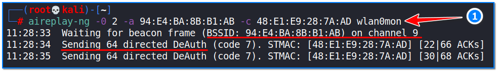

- [ ] Pasitikrinti ar viskas veikia

**Lab Objective:**

Learn how to capture the WPA handshake file of a network using Airodump-ng and Aireplay-ng.

**Lab Purpose:**

Airodump-ng is a part of the Aircrack-ng suite of utilities for analysing Wi-Fi networks for weaknesses. It is mainly used for Wi-Fi discovery.

Aireplay-ng is also part of the Airecrack-ng suite of utilities. It is used to inject frames with the goal of generating traffic for later use in Aircrack-ng when trying to crack the WEP and WPA keys.

**Lab Tool:**

Kali Linux

**Lab Topology:**

You can use Kali Linux in a VM for this lab.

**Lab Walkthrough:**

### Task 1:

This lab is a continuation of lab 52, where we discovered our target network usig airodump-ng.

Note: you will need a wireless network card capable of being placed in monitor mode to complete this lab.

We will be using the tool aireplay-ng for this lab. You can view the help screen for this tool by typing the following:

aireplay-ng –help

With airodump-ng still running from the previous lab and capturing information from our target network, open a new Kali terminal screen. Then, type the following command:

aireplay-ng -0 2 -a 94:E4:BA:8B:B1:AB -c 48:E1:E9:28:7A:AD wlan0mon

This command will tell the aireplay tool to deauthenticate the specified client from our target network. This will kick the client from the network. While this is happening, airodump-ng, which should still be running, will be listening for when the client attempts to connect back to the network. When the client does this, it will transmit the network password in encrypted form. We will be attempting to capture this encrypted password.

As you can see from the screenshot above, aireplay is broadcasting deauthentication packets to the target network, telling it to kick the specified client from the network. Thus, since the re-authentication process will take place, we would have caught a lot of valuable packages.

### Task 2:

Return to the window where airodump-ng is still running. If this attack worked correctly, you will notice in the top right of the window that there is now a section which shows you the captured WPA handshake.

Keep this information for the next lab, where we will cover how to crack this WPA handshake and obtain the password in cleartext.