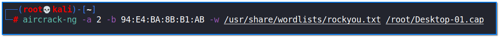

- [ ] Pasitikrinti ar viskas veikia

**Lab Objective:**

Learn how to crack a WPA handshake file using Aircrack-ng.

**Lab Purpose:**

Aircrack-ng is a set of utilities for analysing Wi-Fi networks for weaknesses. It can be used to monitor Wi-Fi security, capture data packets, and export them to text files for additional analysis.

**Lab Tool:**

Kali Linux

**Lab Topology:**

You can use Kali Linux in a VM for this lab.

**Lab Walkthrough:**

### Task 1:

This lab is a continuation of lab 53, where we managed to capture the WPA handshake for our target network. In this lab, we will now attempt to crack this WPA handshake and obtain the cleartext password for the network.

To begin, first locate the file containing the captured WPA handshake. If you followed the steps in lab 53, this file will be located in the home directory of “root” user and will be called “Desktop-01.cap”. This is the file we will be cracking.

We will be using the tool aircrack-ng for this lab. We can view the help screen for this tool by typing the following:

aircrack-ng –help

### Task 2:

We will not need any wireless interface card for the next steps as this process involves using your machine’s resources in an attempt to crack the password encryption. We can attempt to crack the password using the following command:

aircrack-ng -a 2 -b 94:E4:BA:8B:B1:AB -w /usr/share/wordlists/rockyou.txt /root/Desktop-01.cap

Let’s break this command down:

- -a is the method Aircrack will use to crack the handshake. 2 means that the file is encrypted with WPA encryption
- -b is the BSSID of the target network
- -w is the wordlist we will use to attempt to crack the handshake file (if it is compressed, gunzip first before use)

The following screenshot is what our full command looks like:

Hit enter when you have this command typed out. Our screen will clear, and we will be presented with the aircrack-ng screen as it attempts to crack the handshake file (Desktop-01.cap). We have used the “rockyou.txt” file as our wordlist, so Aircrack will now attempt over 14 million passwords against the captured handshake file. This is a dictionary attack. Depending on the resources available to your machine, this attack may take a while to complete.

You can find many ready-to-crack cap files on dictionaries in aircrack’s github repository:

[https://github.com/aircrack-ng/aircrack-ng/tree/master/test](https://github.com/aircrack-ng/aircrack-ng/tree/master/test)