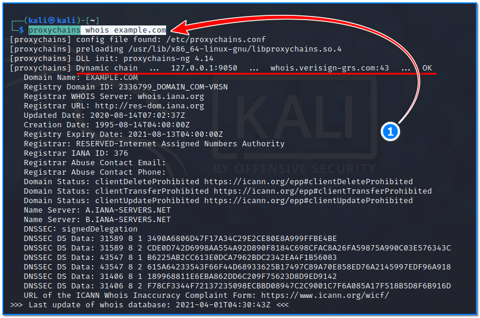

- [ ] Pasitikrinti ar viskas veikia

**Lab Objective:**

Learn how to use proxychains for anonymous hacking.

**Lab Purpose:**

Proxychains is an open-source software which comes pre-installed in Kali Linux. This is a useful tool for redirecting TCP connections through proxies such as SOCKS4, SOCKS5 and Tor. It allows us to chain proxy servers together for the purpose of hiding the source address of our traffic and evading IDS and Firewalls.

**Lab Tool:**

Kali Linux

**Lab Topology:**

You can use Kali Linux in a VM for this lab.

**Lab Walkthrough:**

### Task 1:

While proxychains comes pre-installed in Kali, you should run the following command to ensure it is the most up to date version before beginning this lab:

sudo su –

apt install proxychains

Once this is done, we can view the help screen for the tool by typing the following command:

proxychains –help

### Task 2:

In this lab, we will be using proxychains to redirect our traffic through Tor. Tor works by bouncing our traffic around a number of servers, using the proxychain software in Kali, which helps keep our IP address anonymous. We can download the Tor software in Kali using the following command:

apt install tor

### Task 3:

The next step is to edit the proxychain’s configuration file so that we specify to the tool that we want to redirect our traffic through Tor. To do this, we must first open the config file with the nano editor:

nano /etc/proxychains.conf

Once the file is open, we want to enable some functionality in the tool by removing the # at the beginning of that line. To disable some functionality, we can add a # at the beginning of that line.

1. First, we want to look for the line with “dynamic_chain” and enable this by removing the #.
2. Next we want to look for the line with “strict_chain” and disable it.
3. Then, look for the line with “proxy_dns” and enable it.
4. Finally, go to the very bottom of the file and change “Socks4” to “Socks5” in the last line:

“Socks5 127.0.0.1 9050”

Once these changes are made, save the changes and close the file. Then, type this command:

grep -v “^#” /etc/proxychains.conf

Here is a screenshots of my config file, so you can see what the final configurations should look like:

### Task 4:

Open a terminal in Kali and type the following to start and check status of  the Tor service:

service tor start  
service tor status

First of all, let’s determine our IP address before using a proxy. Open a browser and navigate to this site:

[https://dnsleaktest.com](https://dnsleaktest.com/)

Then, close the browser and run the following command on the terminal screen:

proxychains firefox [https://dnsleaktest.com](https://dnsleaktest.com/)

This site will test our setup and show you your current location and the servers your traffic is flowing through. The location should not be in our home country!

### Task 5:

Similar to browser usage, we can collect information anonymously by typing the proxychains command in front of other commands:

proxychains whois example.com

