- [ ] Pasitikrinti ar viskas veikia

**Lab Objective:**

Learn how to use MD5 checksums to determine if a file contains malware.

**Lab Purpose:**

MD5 checksums are often used in the malware community as a means of determining if a file contains malware, and, if so, what kind of malware it contains.

**Lab Tool:**

Windows

**Lab Topology:**

You can use a Windows and Kali Linux machine for this lab.

**Lab Walkthrough:**

### Task 1:

The first step to finding the MD5 checksums of a file is to download the Hashtab tool via the following link:

[http://implbits.com/products/hashtab/](http://implbits.com/products/hashtab/)

This tool will calculate the MD5 checksum for every file on our PC. We are able to view these checksums by right-clicking on a file and selecting Properties. Once you have this tool installed, you will notice a new tab on this window called File Hashes, where we can view the different hashes for this file. Download the free tool from the link above before moving on to the next steps.

### Task 2:

Once we have this tool installed, we can begin checking files on our Windows machine to determine if they contain any malware. To do this, we will right-click on a target file, select properties, and, in the new window that pops up, click on the File Hashes tab.

Here, we can view the CRC32, MD5, and SHA1 hash for the file in question.

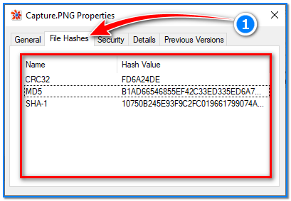

### Task 3:

This program can also support some other hash mechanisms. Now, let’s add SHA-256 and SHA-512 support to our program.

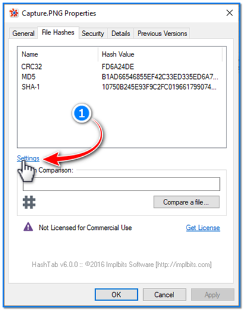

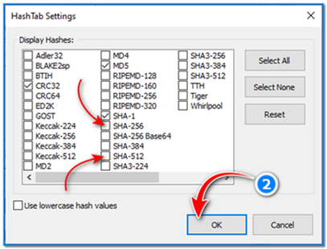

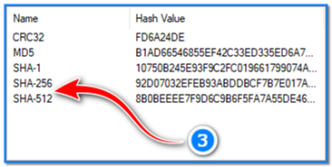

### Task 4:

Open a random file, then right-click on the MD5 hash and copy it to your clipboard.

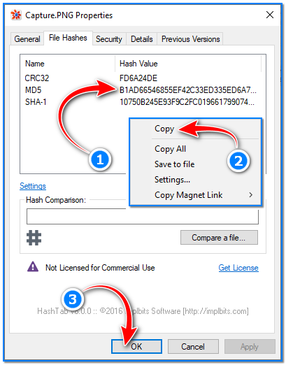

Once this is done, navigate to the following site:

[https://www.virustotal.com/gui/home/search](https://www.virustotal.com/gui/home/search)

Paste the hash file into the search box here and hit enter. This site will now run the MD5 hash through a number of different Antivirus libraries containing the most common MD5 checksums for known malware.

If we picked a random file from our PC, we likely receive no response from the webpage, indicating that there is no malware in the file selected.

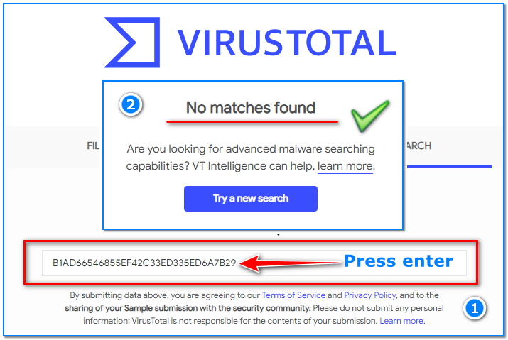

### Task 5:

Now, copy this MD5 hash below and paste it into the same search box:

9498FF82A64FF445398C8426ED63EA5B

This is the MD5 checksum for a common piece of Trojan malware. You will notice a number of alerts on the webpage this time.

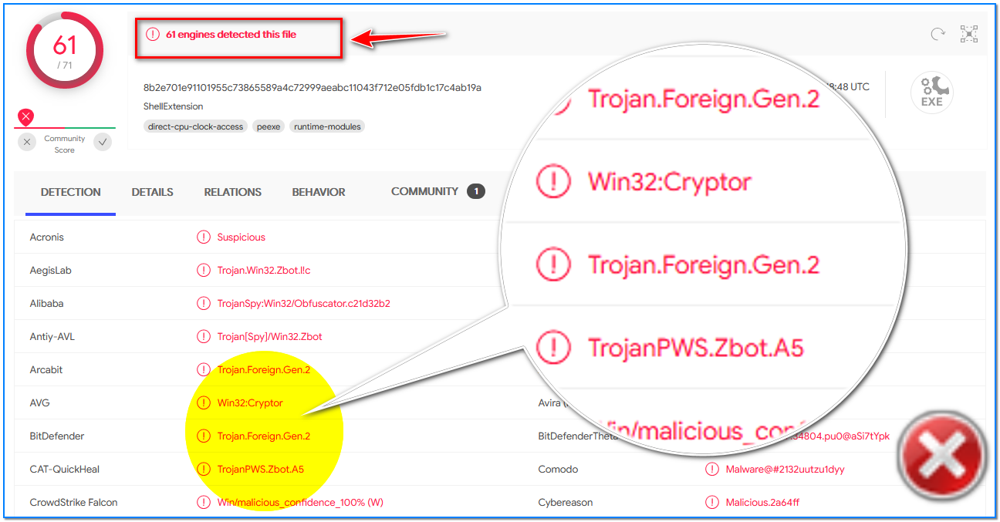

This is an example of how to test a random file to see if it has malware. This is also one of the first steps an Antivirus will take when scanning a fie. It will create the MD5 Checksum of the file in question and compare it to a massive database of known MD5 checksums of malicious files.

### Task 6:

Let’s work on a real case. We will download a malware to our Kali Linux machine and compare its MD5 hash from VirusTotal database:

First of all, let us remind you that such files are shared for educational purposes and should not be copied to production machines.

Open a browser on your Kali machine and go to the following address: https://dasmalwerk.eu/

Here, countless real malware is shared as zipped files for educational purposes. Each zip file is protected with a password to prevent accidental opening, which is by default: “infected”.

Let’s pick a random Trojan on this page; “Dropped: Trojan.AgentWDCR.PZW” is the one we selected. Download this file to the “Downloads” directory on our Kali machine by clicking the download link.

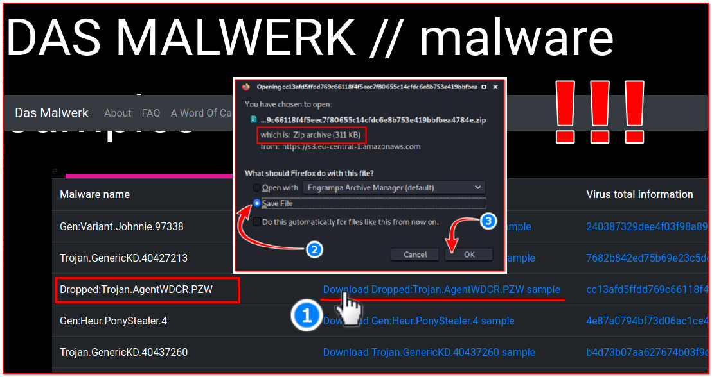

Now, we will unzip the downloaded file. Open a terminal screen then type these commands:

cd Downloads  
unzip cc13afd5ffdd769c66118f4f5eec7f80655c14cfdc6e8b753e419bbfbea4784e.zip

When asked for a password, enter word: infected

Now, we have a malicious windows executable file. We can get more details about this file with the “file” command:

file cc13afd5ffdd769c66118f4f5eec7f80655c14cfdc6e8b753e419bbfbea4784e

PE32 executable (GUI) Intel 80386, for MS Windows, UPX compressed

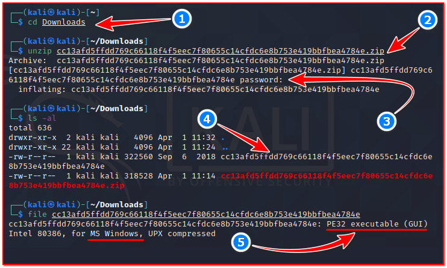

Now, we will calculate the MD5 hash of our unzipped file and query it in VirusTotal:

md5sum cc13afd5ffdd769c66118f4f5eec7f80655c14cfdc6e8b753e419bbfbea4784e

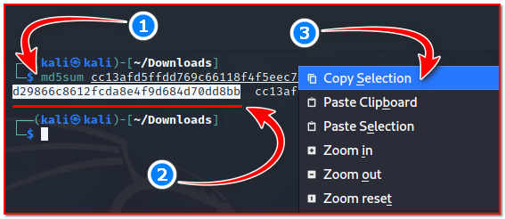

Paste this MD5 hash to VirusTotal’s query page.

[https://www.virustotal.com/gui/home/search](https://www.virustotal.com/gui/home/search)

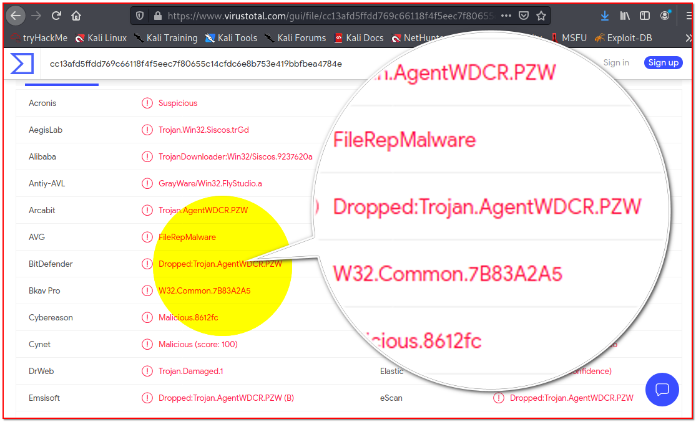

Now, if we find a suspicious file in our system, we know how to query if it is harmful. Moreover, we do not need to export this file or run an antivirus. In databases such as VirusTotal, it is possible to query against more than one antivirus library at once.