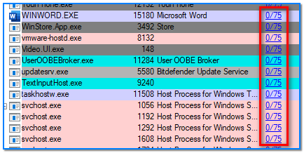

- [ ] Pasitikrinti ar viskas veikia

**Lab Objective:**

Learn how to use Process Explorer to find and scan suspicious processes for malware in Windows.

**Lab Purpose:**

Process Explorer is a tool which is part of the Microsoft Windows Sysinternals suite. This is a set of more than 70 free tools used to monitor, manage, and troubleshoot the Windows operating system. Process explorer is used as a free advanced task manager and system monitor.

**Lab Tool:**

Windows

**Lab Topology:**

You can use a Windows machine for this lab.

**Lab Walkthrough:**

### Task 1:

The first step for this lab is to download the Process Explorer tool. This can be done from the following link:

[https://docs.microsoft.com/en-us/sysinternals/downloads/process-explorer](https://docs.microsoft.com/en-us/sysinternals/downloads/process-explorer)

We will use this tool to analyse the process running on our Windows machines. I will then demonstrate how you would scan a suspicious process using VirusTotal to determine if it is malicious. Open Process Explorer and we can begin.

### Task 2:

When you first open the tool, you will see every process currently running on your system.

You can set the level of priority your system places on a particular process by right clicking on the process and navigating to the Set Priority section. Be careful when doing this, as setting a process to be considered as a low priority when it should be a high priority process could cause performance issues in your machine.

### Task 3:

We can search for the name of a particular process by right clicking on the process and navigating to the Search Online section at the bottom. This will open your default browser and search for the name of the process.

### Task 4:

If you have identified a process which looks suspicious, we can scan Virus Total for this process to determine if it is in fact malicious. We can do this by right clicking on the process and navigating to the Check VirusTotal section.

You will then be presented with the VirusTotal terms of service. Simply accept the terms and this window will close.

You may now notice that there is a new heading at the top of this tool called Virus Total. This heading will show the number of antivirus services that have flagged that particular process as a potential virus. Ideally, you want every process to return as 0/74.

As you can see from the screenshot above, I scanned the “explorer.exe” process with Virus Total. The result returned shows that 0 out of the 74 Antivirus engines categorised this process as malicious. If a process returns with a number of Antivirus engines flagging it as malicious, this should be cause for further investigation.

### Task 5:

If we want to check all process running on our system for potential malicious processes, we can navigate to the top of the tool and click on the Options tab. From here, select the VirusTotal.com tab and then select the Check VirusTotal.com.

This will submit the hash of every process running on the system to Virus Total and will check for any malicious processes.

### Task 6:

Finally, we can verify all image signatures for each process. We can do this by navigating to the Options tab at the top of the tool and selecting the Verify Image Signatures section.

This is a good next step to take if you have a process which was flagged as malicious by Virustotal, so that you can better determine if the process really is malicious. When this is done, a new column will appear to the right, telling you if each process image is verified or not.