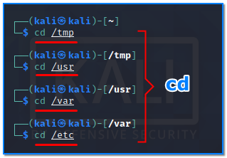
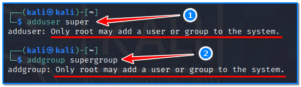
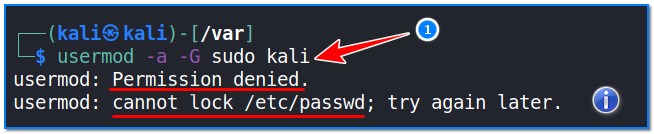
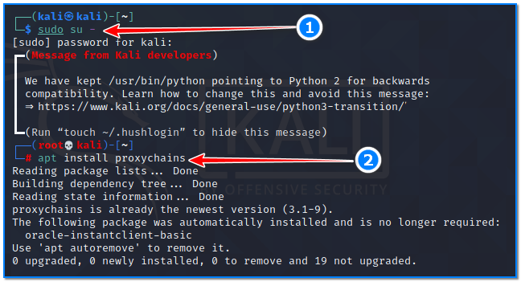
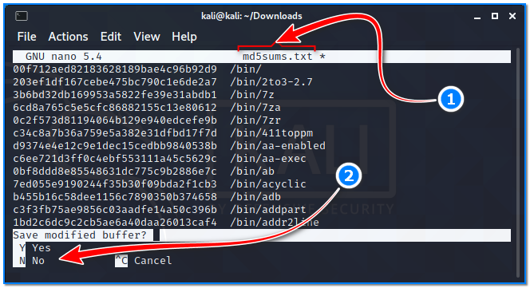

- [ ] Pasitikrinti ar viskas veikia

**Lab Objective:**

Learn how to use some fundamental Linux concepts.

**Lab Purpose:**

Some of the fundamental Linux concepts included in this lab are: adding users and groups, using nano, installing packages, and important files and directories.

**Lab Tool:**

Kali Linux

**Lab Topology:**

You can use Kali Linux in a VM for this lab.

**Lab Walkthrough:**

### Task 1:

The first step is to open a terminal in Kali Linux. All of the tools in this lab are command line tools. We will begin by covering some of the most important files and directories in this Linux OS. These files and directories are typical locations you may want to look into when on a server or machine, especially when in a CTF (Capture The Flag) competition.

You can navigate to any of the directories or files included in this section by opening a terminal and typing:

cd /

- /tmp – This is a directory which contains temporary files which are deleted when the machine is shut down
- /root – This is the root user’s home directory
- /usr – This is where all software is installed
- /var – This is the Linux miscellaneous directory
- /sbin and /bin – This directory stores critical executable binaries; you should be very careful when dealing with this folder as any changes could permenantly ruin your Linux OS
- /etc/passwd – This file stores all user information and is often used to see all the users on a system
- /etc/shadow – This file contains password hashes of all users on the system and is only viewable by the root user
- /etc/sudoers – this file is used to control the super user permissions of every user on the system
- /proc, /sys, /dev – These directories are populated by the linux kernel every time a file system is mounted.

### Task 2:

This next task will cover how to add users and groups on a Linux system. This process can sometimes be manipulated to escalate privileges on a system. We can add users and groups using the following commands:

adduser

addgroup

Only the root user will have permission to add users and groups, unless there is an exploit for the system you are on. We can also add a user to a group using the following command:

usermod -a -G

### Task 3:

We will now cover installing packages on Linux, which is very important when installing various tools on the OS. We will be using a packet manager called apt, which is the most popular package manager in Debian-based Linux distros. We can install any packet on Kali using the following command:

sudo su –

apt install

This command, for example, will download the package from a repository and install it before then returning to the terminal.

It is possible to run programs that require high privileges without switching to the root user. For this, it is necessary to write “sudo” before using each command. Kali will ask normal users for a password:

sudo apt install proxychains

In this case, we will be asked to enter the password of the logged-in “kali” user, not the “root” user.

### Task 4:

The final tool we will be covering in this lab is nano. Nano is a text editor which is based in the terminal. We can open any file for editing by typing the following:

nano md5sums.txt

You can move the cursor with the arrow keys in the nano text edit interface. Use the ctrl + x key combination to exit nano. If you have made any changes to the file, it will ask if you want to save it.

Press Y to save and exit.