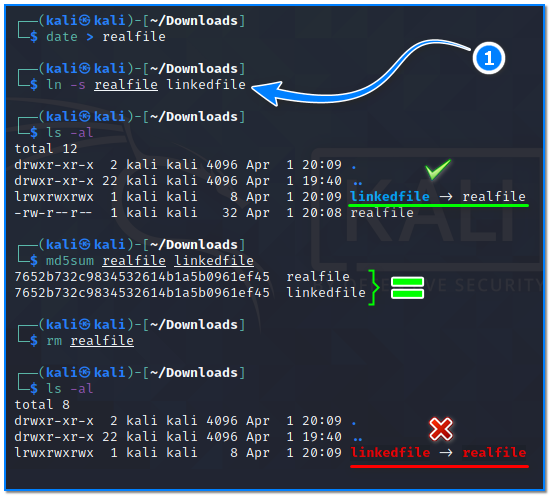

- [ ] Pasitikrinti ar viskas veikia

**Lab Objective:**

Learn how to use some basic fundamental Linux operations.

**Lab Purpose:**

In this lab, we will be running through some of the basic, fundamental Linux tools. In this lab we will cover tools such as find, grep, ln, cp and mkdir.

**Lab Tool:**

Linux

**Lab Topology:**

You can use Kali Linux in a VM for this lab.

**Lab Walkthrough:**

### Task 1:

The first step is to open a terminal in Kali. All of the tools in this lab are command line tools. We will begin with a simple but useful tool, cp. The cp function is an advanced file operation which mainly does the same thing as mv, except cp will duplicate a file instead of moving it. The syntax looks like the following:

cp md5sums.txt md5sums.txt.old

Task 2:

The next tool we will be using is mkdir. This tool allows you to make a new directory to store files in. This operation is done using mkdir and the syntax looks like the following:

mkdir ExamNotes examNotes

Let us remind you that the Linux file system is case sensitive. In fact, in this example,

ExamNotes and examNotes are completely separate directories.

### Task 3:

Suppose that we have a file and that we want to confirm that this file is the same as the original (ie: it has not been altered in any way) using hashing.

Take the “/etc/passwd” file as an example. To make changes on this file, we copy it to our home directory:

cp /etc/passwd  ~/passwd

Now, we have a copy of the passwd file. Calculate md5 checksums of both files:

md5sum /etc/passwd ~/passwd

As we can see, both files have same size and hash values. Now, let’s change and save only one character in this cloned file:

nano ~/passwd

In this file, we just replaced 8 with 0. Save and exit from nano. Next, let’s compare the sizes of both files. Same size. So, what about hash values? We have saved these values before. Let’s check it with the builtin -c parameter of the md5sum command:

md5sum -c md5sums.txt

The output of md5sum command indicated that a cloned copy has been changed!

Let’s calculate the hash values of both files as follows:

A regular file on the file system, regardless of size, has a unique 32-byte digest. That’s what we call a hash. Even if a single character changes in this file, the entire hash value will be completely different.

### Task 4:

The next tool we will cover is ln. ln is used in Linux for two different purposes: hard linking and symbolic liking.

Hard linking completely duplicates the file and links the duplicate to the original copy. This means that whatever is done to the created link is also done the the original file. The syntax for this looks like the following:

ln

When the content of the target file changes, the source file is changed in the same way.

However, even if one copy is deleted, the information remains in the others, undeleted.

Symbolic linking basically just references a file. The symbolic link itself has no actual data in it at all and simply references another file. It is essentially the same as a shortcut to a file on Windows. The syntax for a symbolic link looks like the following:

ln -s

If the original file is deleted, the link will be broken and there will be no reference anywhere.

### Task 5:

The next tool we will cover is find. This is an incredibly useful tool that is also simple to use. It allows you to find files. This tool is especially useful if you are partaking in CTF competitions or hacking servers and you have to find a file with the flag in it. Using find, this can be done in seconds. This tool can be used in a number of ways.

We can list all the files in a directory by typing the following:

find

If it is necessary to search within the whole filesystem, use /.

If you want to search for files owned by a certain user, the example usage would be as follows:

find /tmp -user kali

If we want to search directories that we do not own, the find command will give many error messages. To suppress this, it is enough to append “2>/dev/null” at the end of the command:

find /tmp -user kali 2>/dev/null

We can also list every file owned by a specific group using the following command:

find /tmp  -group root 2>/dev/null

It is also possible to search by referring to the opposite of a criterion. For this, we put an exclamation mark just before writing the criteria:

find /etc ! -group root 2>/dev/null

In the above example, we wanted it to find files and directories that are not under root group ownership.

We can use each file as a parameter to another command. In the example below, the files that are not in the “root” group are displayed in detail with the help of the “ls -al” command:

find /etc ! -group root -type f -exec ls -l {}    ; 2>/dev/null

Finally, we can search for a specific filename in a directory by typing the following:

find /etc  -iname “*.conf”

It is worth noting, however, that find can only show you the files which you have permissions to view. If you don’t have admin privileges, you will be unable to view files requiring those privileges.

### Task 6:

The final tool we will be looking at is grep. This is one of the most useful commands on Linux. Grep allows you to find data within data, which is very useful when working with large files or large outputs. The typical syntax for this tool looks like the following:

grep

grep -R -i “qwe123” /usr/share/wordlists/ 2>/dev/null

In the above example, the string “qwe123” has been searched regardless of case, in all files in all sub-directories of the indicated path.

We can search for a string (for example, a password) in a file with a lot of data and display the line number this string is at using the following command:

grep -n -R -i “1q2w3e4r” /usr/share/wordlists/ 2>/dev/null

### Latest Post

-