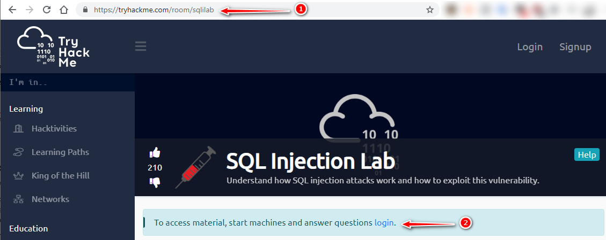
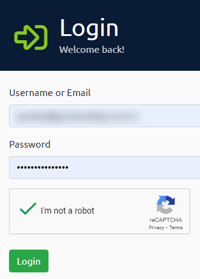
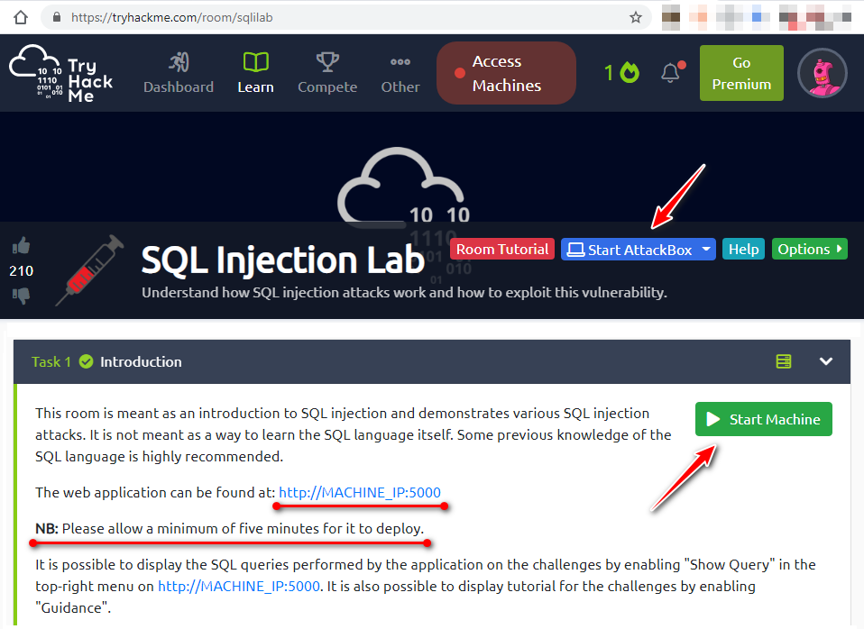
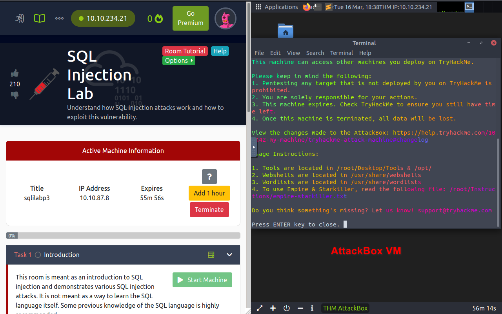
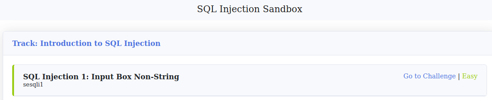
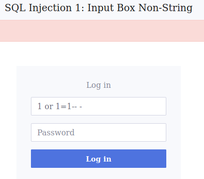
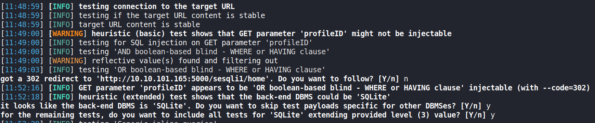
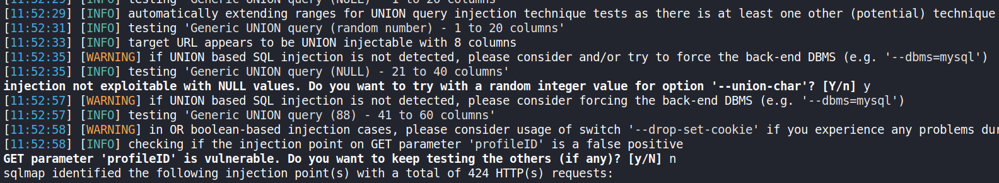
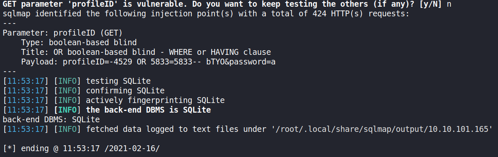

- [ ] Pasitikrinti ar viskas veikia

**Lab Objective:**

Learn how to automate SQL injection using SQLmap.

**Lab Purpose:**

SQLmap is an open-source tool used as part of a penetration test to detect and exploit injection flaws. SQLmap is particularly useful as it saves time by automating the process of detecting and exploiting SQL injection.

**Lab Tool:**

Reliable internet connection and a modern browser to connect https://tryhackme.com/room/sqlilab

**Lab Topology:**

We will not use Kali Linux for this lab.

tryhackme.com offers virtual Linux node (AttackBox) to access their target systems. Also, OpenVPN connection is available. For simplicity in this lab, we will use AttackBox. AttackBox also contains SQLmap and any other necessary tools that we will need during this lab.

**Lab Walkthrough:**

### Task 1:

In order to use AttackBox, tryhackme.com requires membership login. Membership is free and very simple to set up. All that is required is an email address and a password.

We select Task “1” in the list that appears after login. In this task, the most basic SQL injection attack is presented. Press the blue colored “AttackBox” button, and then press the “Start Machine” button (which is green in this picture). It is recommended that you wait for 5 minutes for the lab to be

ready.

### Task 2:

Once you are on the AttackBox, open the web page with IP address and port number, which is provided on the left panel. In this case, [https://10.10.87.8:5000](https://10.10.87.8:5000/) is ours.

You will be presented with a webpage containing several labs with different SQL injection vulnerabilities. We will be focusing on the first one for this lab, so click on “go to challenge”.

You will be navigated to a sample login page which is vulnerable to SQL injection. We can test its vulnerability to SQL injection by inputting the following into the Profile ID text box:

“1 or 1=1– -“

Type the above string exactly, but without inverted commas.

Enter any random value into the password field and submit.

We will then be logged into the application, and you should be able to see the flag for this challenge here.

So, we know this login form is vulnerable to SQL injection, but we want to know how to automatically test this using SQLmap. To do this, copy the link for the login page. Then, open a terminal in AttackBox and type the following:

sqlmap -u ‘http://10.10.101.165:5000/sesqli1/login?profileID=q&password=a’ -p ‘profileID’ –level=3 –risk=3

-u tells sqlmap the target URL

-p tells the tool which parameter in the URL we want to test for SQL injection

–level=3 will tell the tool to use more detailed and comprehensive SQL injection techniques

–risk=3 will tell the tool not to be subtle about its SQL injection attempt

Once this command is ran, you will notice SQLmap attempting a huge amount of SQL injection techniques against the target.

When the tool is finished, we can see that SQLmap discovered that the parameter ‘profileID’ is vulnerable. We are also presented with information about the backend database version, allowing us to craft more specific and detailed SQL injection techniques for further exploitation.

