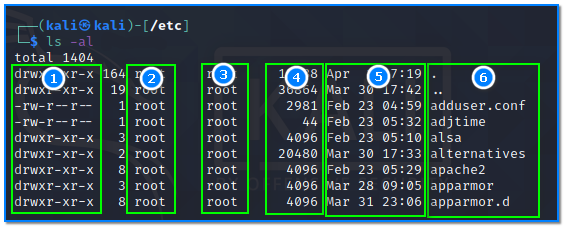
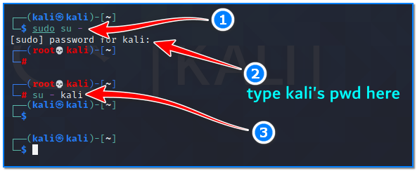

- [ ] Pasitikrinti ar viskas veikia

**Lab Objective:**

Learn how to use some basic file operations in the Linux OS.

**Lab Purpose:**

File operations in Linux are used to modify file attributes such as permissions, which allow users to read files, write to files, and execute certain files.

**Lab Tool:**

Linux

**Lab Topology:**

You can use Kali Linux in a VM for this lab.

**Lab Walkthrough:**

### Task 1:

The first step is to open a terminal in Kali. All of the tools in this lab are command line tools. We will begin with one of the most fundamental commands in the Linux OS, ls. This command can be used to list information about every file and directory in a directory. To do this, open a terminal in Kali and type the following:

ls

You will notice that all files in your home directory are listed in the terminal. We can add some flags to this command to show us more information about the contents of a directory. These flags can be found on the help page for this command, which can be found by typing the following:

ls –help

For example, the following command will show us all files and directories in a directory, including the ones which start with:

ls -al

In the figure above;

Permissions are in column 1,  
User ownership in column 2,  
Group ownership in column 3,  
File size in column 4,  
Date information in column number 5, and  
Column number 6 contains the file / directory name.

### Task 2:

The next command is a very simple one. You can create zero-sized files using the touch command. Open a terminal and type the following to create an empty file in the root directory called example.txt:

touch /root/example.txt

### Task 3:

The next command we will be using is called cat. Cat is short for concatenate, which means this command will output the contents of files to the console. For example, we can output the contents of the “example.txt” file we created in the task above, by typing the following:

cat /root/example.txt

### Task 4:

In order to run a binary file in Linux OS, this attribute must be defined in that file. Unlike Windows, extensions do not determine the executable attribute of the file. When you need to give an attribute to a file that you know is executable, the following sample command can be written:

chmod +x ~/file

These files can be executed by providing the absolute path. For example, if you saved an executable binary file to the home directory of kali user, this would be the command to execute this file:

~/file  or calling with full path  /home/kali/file

### Task 5:

This final command allows us to change the user without having to log out and log back in again. For instance, if we are logged in as the “kali” user and want to change to “root”, we would run the following command:

sudo su –

When asked, enter “kali” as default password if it has not been changed before.

Then, change to “kali” user again:

su – kali

There’s no need to input password when changing from “root” user to any unprivileged user like “kali”.