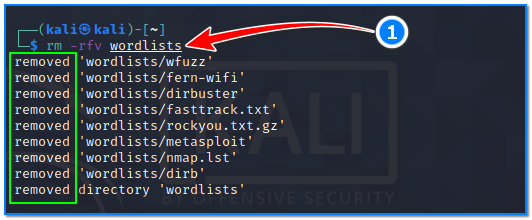

- [ ] Pasitikrinti ar viskas veikia

**Lab Objective:**

Learn how to use some advanced file operations for easier file manipulation.

**Lab Purpose:**

File operations are used in Linux to create, read, write, reposition, delete, and truncate files.

**Lab Tool:**

Kali Linux

**Lab Topology:**

You can use Kali Linux in a VM for this lab.

**Lab Walkthrough:**

### Task 1:

The first step is to open a terminal in Kali. All of the tools in this lab are command line tools.

We will begin this lab by covering the file operation chmod. This operation allows you to set different permissions for a file and control who can read it. These permissions are set using a three digit number. Each digit controls a specific permission. The first digit covers the permissions for a user, the second covers permissions for a group, and the third covers permissions for everyone who is not a user or part of a group.

How permission works is summarized in the figures below:

Each permission section has (r, w, x) attributes. According to the purpose, the decimal number corresponding to each section is calculated. For example, if you want to give only read and write permission for a file’s users section, its numerical equivalent will be 6. If you want to give only reading privilege to group sections, its numerical equivalent will be 4. If you want to give read and execute authority to the others section, the numerical equivalent of this will be 5.

When we write them side by side, the permission string looks like this: 645

The syntax for this command looks like the following:

chmod 645 filename

These digits are typically used together to form a set of permissions for a file.

If we want to allow everyone on the system to read, write, and execute a file, we can specify the following command:

chmod 777 file.bin

To revoke all accesses from same file, the command would be:

chmod a-rwx file.bin

### Task 2:

The next command we will cover is chown. This command is used to change the attributes of a file to different users and groups. For example, we could change ownership of file.bin to “kali” and group “kali” with the following command:

chown kali:kali file.bin

Note: this is only possible if you have greater permissions than the other user. This tool is therefore best used as the root user. This tool can also be used to change the group owner of a file without changing the user, which can be done with the following command:

chown :root file.bin

### Task 3:

The next command we will cover is mv. This command allows you to move files from one place to another. The syntax for this command looks like the following:

mv file.bin /tmp/

This command can be use for renaming a file.

### Task 4:

The final command we will cover in this lab is rm. This command is used to remove files and directories from your system. You should be very careful when using this command as removing a critical file or directory from your system could cause irreversible damage! The syntax for this command looks like the following:

rm -rfv wordlists

