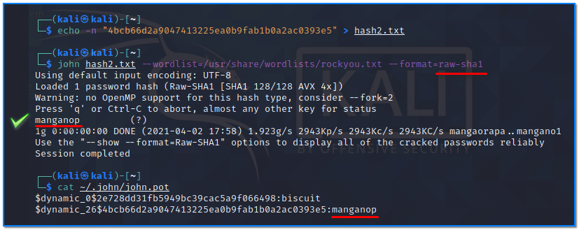

- [ ] Pasitikrinti ar viskas veikia

**Lab Objective:**

Learn how to use John the Ripper to crack password hashes.

**Lab Purpose:**

John the Ripper is a free password cracking software tool. It works by using the dictionary attack method to crack passwords.

**Lab Tool:**

Kali Linux

**Lab Topology:**

You can use Kali Linux in a VM for this lab.

**Lab Walkthrough:**

### Task 1:

This tool comes pre-installed on Kali. If, for some reason, it is not installed on your OS, you can install is using the following command:

sudo apt install john

We will begin by looking at the help screen for this tool. We can do this by typing the following:

john

The basic syntax for this tool looks like the following:

John

When using formats with john, you can use all the available formats by typing the following command:

john –list=formats

We will be covering this in more detail later in the lab.

### Task 2:

John has a useful function. When we provide a hash file for John to crack, it will attempt to guess the hash type before attempting to crack it. To begin, copy and save the following hash to a text file:

2e728dd31fb5949bc39cac5a9f066498

Once this is done, type the following to provide John with the file to crack:

john hash1.txt

As you can see, John will attempt to guess the type of hash, but it is not always accurate. It is better if we first analyse the hash type ourselves before telling John which hash we are trying to crack. We can do this by visiting the following site:

[https://gchq.github.io/CyberChef/](https://gchq.github.io/CyberChef/)

This tool can be used to analyse any hash we provide and tell us the type of hash it is. Copy the hash above and paste it into the Input section. Type “analyse” in the search box on the left hand side, then drag the “Analyse Hash” box into the Recipe section.

The site will then analyse the hash and tell us its format. We can see that this hash could be one of seven options.

### Task 3:

Now that we have this information, we can return to John and attempt to crack this hash. Open a terminal and type the following command:

john hash1.txt –wordlist=/usr/share/wordlists/rockyou.txt –format=raw-md5

Let’s break this command down:

- The –format section tells John the format of the hash we are trying to crack. In this case, the format is MD5. The word “raw” before the format type indicates to John that there is no salt being used in the hash.
- The –wordlist section tells John the wordlist we will be using to crack the hash. You must uncompress first if this file has .gz tail.

Finally, we need to specify the path to the file to be cracked.

To learn what we got, just type this command:

cat ~/.john/john.pot

You will see your plain password near to hash value which is “biscuit” in this case.

### Task 4:

Let’s crack a hash with a different format. Use the following hash and determine its hash type and crack it with John.

4bcb66d2a9047413225ea0b9fab1b0a2ac0393e5

We will first go to the site above and analyse the hash again.

Once this is done, we can take this information and return to John. We can craft the following command to crack the hash:

john hash2.txt –wordlist=/usr/share/wordlists/rockyou.txt –format=raw-sha1

### Task 5:

We will now use John to crack an NTLM hash. This type of hash is how Windows stores user and service passwords. It is useful to know how to obtain and crack these types of passwords for penetration tests. Copy the hash below and save it to a text file:

5460C85BD858A11475115D2DD3A82333

Then, open a terminal and type the following in an attempt to crack the hash:

john hash3.txt –wordlist=/usr/share/wordlists/rockyou.txt –format=nt

### Task 6:

You can create your own hash files and try to hack them with various word dictionaries. Here are some usage samples:

echo -n “secret” | md5sum | cut -f 1 -d ” ” > hash1.txt

echo -n “secret” | sha1sum | cut -f 1 -d ” ” > hash2.txt

echo -n “secret” | sha256sum | cut -f 1 -d ” ” > hash3.txt

echo -n “secret” | openssl dgst -sha512 | sed “s/(stdin)=//” > hash.txt

To create Windows NTLM hash:

iconv -f ASCII -t UTF-16LE <(printf “mushroom”) | openssl dgst -md4 | sed “s/(stdin)=//”  > hash.txt

You can learn which hashing mechanisms are supported by openssl by typing this command;

openssl dgst -list