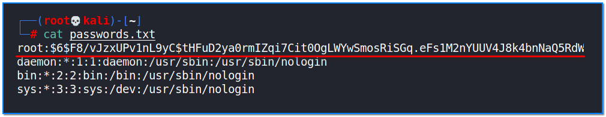
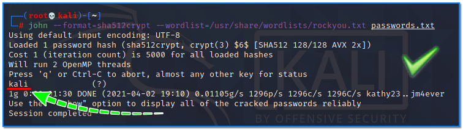
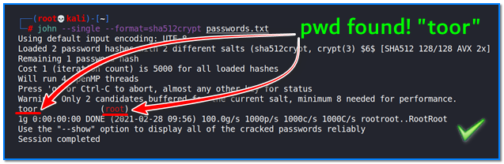
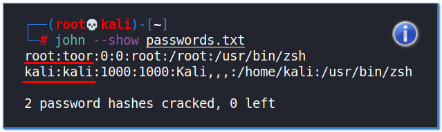

- [ ] Pasitikrinti ar viskas veikia

**Lab Objective:**

Learn how to use John the Ripper to crack more advanced password hashes.

**Lab Purpose:**

John the Ripper is a free password cracking software tool. It works by using the dictionary attack method to crack passwords.

**Lab Tool:**

Kali Linux

**Lab Topology:**

You can use Kali Linux in a VM for this lab.

**Lab Walkthrough:**

### Task 1:

In the previous lab, we cracked an NTLM hash. This is a type of hash used by Windows OS for authentication purposes. In this lab, we will be cracking the hashes contained in the “/etc/shadow” file on Linux OS. This requires a few extra steps.

The /etc/shadow file contains password hashes for all users and services on a system. The /etc/passwd file contains details about each user on a Linux OS. In order to use John to crack the hashes in the shadow file, we need to combine both of these files so that John can make sense of the information we are providing it with. To do this, we need to use the “unshadow” tool that comes built-in with the John package. The syntax for this tool looks like the following:

unshadow /etc/passwd /etc/shadow > passwords.txt

Then, once we have this information, we can use this file to crack the passwords for all users on the system with the following command:

john –format=sha512crypt –wordlist=/usr/share/wordlists/rockyou.txt passwords.txt

Depending on the strength of your passwords, you may or may not find the cleartext password for the users on your system.

### Task 2:

We will now look at a different function for password cracking in John called single mode. This mode doesn’t use a wordlist in an attempt to crack hashes. Instead, it uses information such as the username of the user or the service a user is logged into. It takes this information and trys to work out the passwords by slightly changing the numbers and letters contained in the username. For example, if the username is John, the tool will try John1, John123, JOhN! etc. This process is known as word mangling, and can be very effective when attempting to crack a user’s password.

For this task, use the same passwords.txt file as the previous task. Open a terminal and type the following:

john –single –format=sha512crypt passwords.txt

The –single section tells john to use single crack mode.

As you can see, we have found the password for root, toor, which is simply root spelled backwards.

### Task 3:

To see all cracked passwords for a file, simply type the following:

john –show passwords.txt

As you can see, using the commands covered in this lab, we have managed to crack the passwords for both the user kali, which is “kali”, and the root user, whose password is “toor”.