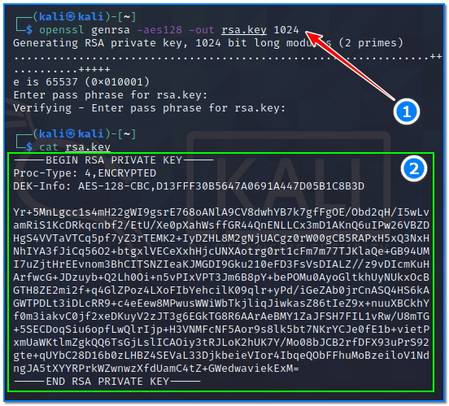
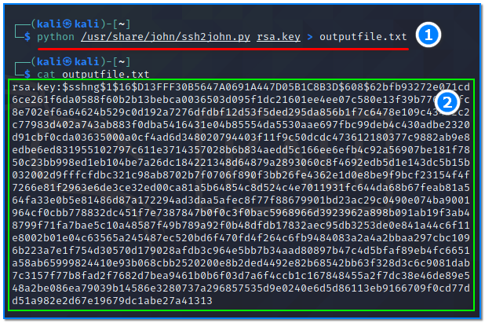
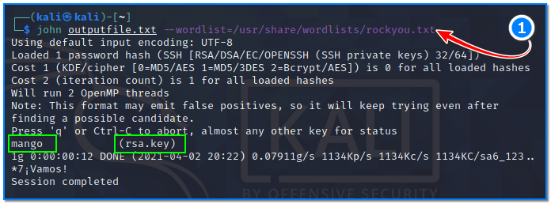
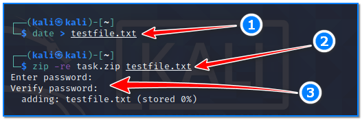
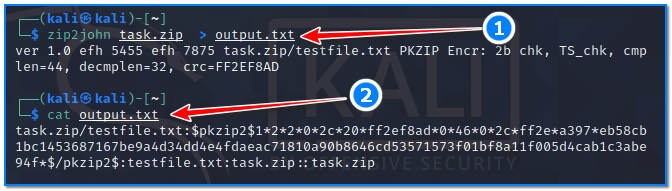
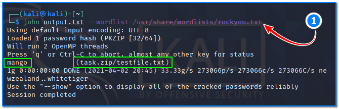

- [ ] Pasitikrinti ar viskas veikia

**Lab Objective:**

Learn how to use John the Ripper for more advanced password cracking techniques.

**Lab Purpose:**

John the Ripper is a free password cracking software tool. It works by using the dictionary attack method to crack passwords.

**Lab Tool:**

Kali Linux

**Lab Topology:**

You can use Kali Linux in a VM for this lab.

**Lab Walkthrough:**

### Task 1:

In the previous lab, we looked at cracking the password hashes contained in the /etc/passwd file in Linux OS. In this lab, we will be covering how to crack SSH keys using John, as well as how to crack password protected file archives. Both of these techniques are often used as part of CTF (Capture The Flag) competitions as well as penetration tests.

We will begin by looking at cracking SSH keys. Let’s create a protected SSH key whose password is “mango”. Type this command on the terminal screen:

openssl genrsa -aes128 -out rsa.key 1024

When asked for the password, type “mango” twice. Our SSH key file was created as rsa.key.

SSH keys are used to login to a device through SSH. This key will require a password for authentication before allowing the user to use their SSH key to login. We will be attempting to crack this password.

In order to do this, we need to convert the private key which is used to login to the SSH session into a type of hash format which John can understand. We will be using the “ssh2john” conversion tool to achieve this.

### Task 2:

We will convert this file using the following command:

ssh2john >

The ssh2john tool can be found in the following directory:

/usr/share/john/ssh2john.py

This means, that when using this tool, we will have to include the path to this directory in the command. Note: Do not use python3 with the following command as it will not work.The command will look like the following:

python /usr/share/john/ssh2john.py rsa.key > outputfile.txt

This is what the resulting file will look like:

Once this is done, we can run a very simple command using John to display the SSH password for this user in plaintext:

john outputfile.txt –wordlist=/usr/share/wordlists/rockyou.txt

We can see in the screenshot above that the password is “mango”, as expected.

### Task 3:

The itfinal task we will be performing with John will be cracking a password protected Zip file. To do this, we will first have to create our own password protected zip-file. This can be done by creating a text document and then typing anything you like in the document. Save the file, zip it, and set the password as “mango” without the quotes, by typing the following command:

date > testfile.txt  
zip -re task.zip testfile.txt

You will then be asked to enter a password, set it as mango.

Once this is done, you should now be able to see a zipped file on your Linux system. We will now be using the “zip2john” tool to crack this password. This can be done using the following command:

zip2john task.zip  > output.txt

This will create a hash of the zipped folder which John is able to crack.

We can use John to crack this hash by typing the following:

john output.txt –wordlist=/usr/share/wordlists/rockyou.txt

You will see John come up with “mango” as the password for the zipped file.