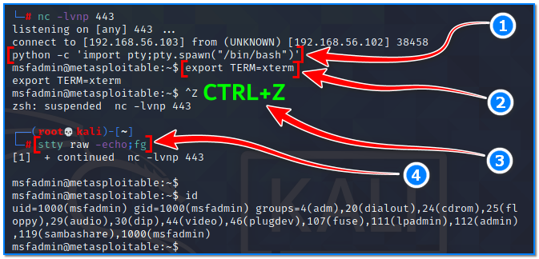

- [ ] Pasitikrinti ar viskas veikia

**Lab Objective:**

Learn how to use various methods to stabilise netcat shells on a target machine.

**Lab Purpose:**

Netcat is a computer networking utility for reading from and writing to network connections using TCP or UDP.

**Lab Tool:**

Kali Linux and Metasploitable VM.

**Lab Topology:**

You can use Kali Linux in a VM for this lab.

**Lab Walkthrough:**

### Task 1:

In this lab, we will be using netcat to create a reverse shell on a metasploitable machine. If you are unfamiliar with metasploitable, it is an intentionally vulnerable machine which can be loaded in VMware or VirtualBox, the same as Kali Linux. You can download the Metasploitable ISO file here: [https://docs.rapid7.com/metasploit/metasploitable-2/](https://docs.rapid7.com/metasploit/metasploitable-2/)

You can find a lot of material on this page on how to download and setup the Metasploitable VM.

We will use both Kali Linux and Metasploitable for this lab. Remember to put both machines on the same isolated host-only network to talk to each other. When login is required, you will enter “**msfadmin**” as username and password.

### Task 2:

If your are unsure how to establish a reverse shell on a target machine, please revisit the previous lab which details how to do this. In this lab, we will be using a number of techniques to stabilise our established shell. Note: this works for other shells and not just shells gained through netcat, so these techniques are both important and useful to know.

Begin by establishing a reverse shell between your Kali VM and your Metasploitable VM.

You may notice that this is quite an unstable shell. For instance, it is simple to completely kill the shell by pressing ctrl + c. You may also notice that the shell is non-interactive. This means that we cannot interact with programs after executing them. For example, when launching SSH, it asks you if you are sure you want to connect to a host and requires us to type Yes. We cannot do this with a non-interactive shell, as we are limited to using programs which do not require user interaction in order to run properly.

The reason for this is because netcat shells are actually processes running inside a terminal, rather than actually being a terminal itself. This lab will focus on getting us out of the process and into the raw terminal.

### Task 3:

With your reverse shell established between your Kali VM and your Metasploitable VM, we will attempt the first stabilisation technique using Python. This technique typically only works on Linux machines as Python is installed by default.

**Step 1** – This entire process will be done using the shell connecting our Kali VM to our Metasploitable machine. The first thing to do is to type the following into our shell:

python -c ‘import pty;pty.spawn(“/bin/bash”)’

This command uses python to spawn a bash shell which contains better features. Some targets may need you to specify Python2 or Python3, depending on the version installed on the system. Our shell will now look more like a fully featured shell, but we still wont be able to use features such as autocomplete or the arrow keys, and ctrl + c will still kill it.

**Step 2** – For the next step, we will type the following:

export TERM=xterm

This command wil give us access to terminal commands such as clear.

**Step 3**– Now, press the ctrl + z key combination. Don’t be afraid if the shell breaks, we’ll get it back on next step.

**Step 4** – Finally, in our normal Kali terminal, we will now type the following commands:

stty raw -echo  
fg

This command will turn off our own terminal echo, which will give us access to autocompletes, arrow keys, and ctrl + c to kill processes. The fully functioning shell will then be brought back to the foreground and the screen will be cleared after reset command:

reset

You can see a demonstration of the full technique here:

You can exit this shell and return to your Kali terminal by typing exit. You can also reset the echo that we turned off earlier, by typing “reset” in your terminal. Do this if you think your terminal looks strange.