- [ ] Pasitikrinti ar viskas veikia

**Lab Objective:**

Learn how to use Burp Suite to intercept client-side requests.

**Lab Purpose:**

Burp Suite is an especially useful tool when testing web applications. Burp Suite has many uses, but for this lab, we will be focusing on the local proxy feature, which allows us to intercept the requests being sent from our machine to a server. This provides us with the ability to alter the requests being sent the server.

**Lab Tool:**

Kali Linux.

**Lab Topology:**

All we need is Kali Linux amd64 version VM for this lab.

**Lab Walkthrough:**

### Task 1:

Run “burpsuite” command in Kali terminal screen as “kali” user. Accept and update as

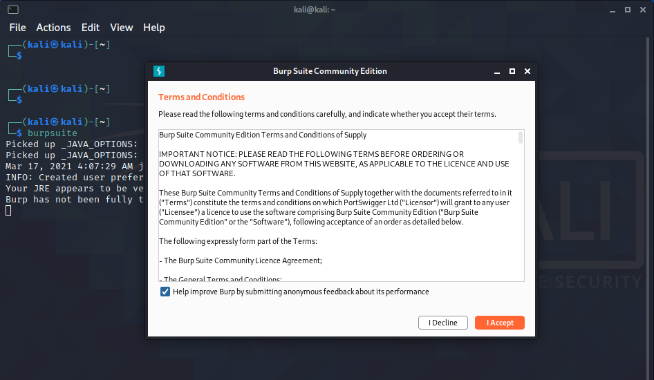

required.

Once Burp is opened, choose “Temporary Project” from the list of options and click next.

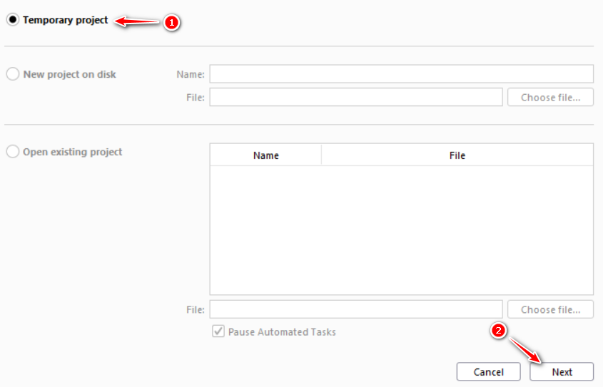

In the next screen, choose the option to setup Burp using Burp defaults, and then press “Start Burp”.

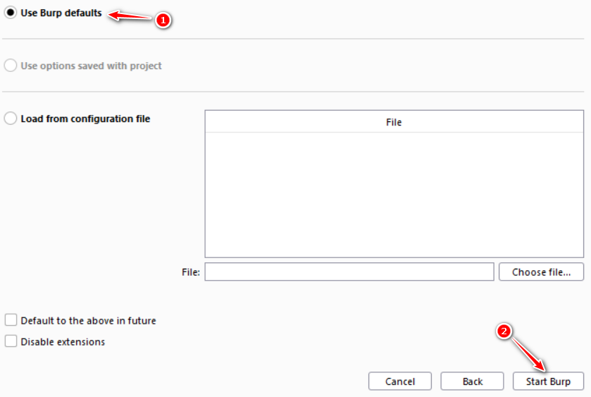

### Task 2:

Once Burp Suite is opened, you will see a lot of tabs and other information. For now, all we will be worrying about is the Proxy tab, so you can navigate there now.

Burp Suite recently updated to include its own built-in browser for using the local proxy with, which means we no longer must configure our browser to work with Burp manually. However, we will also consider the use of an external browser in this lab.

Notice that colored button which says, “intercept is on”. This means that Burp is currently intercepting traffic sent from our Kali machine to any server. For now, we can press this button to

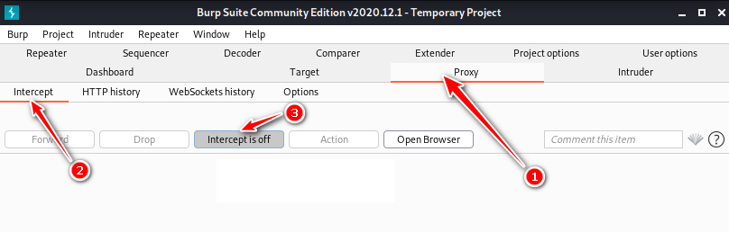

turn intercept mode off.

### Task 3:

We will begin by learning how to use Burp with Firefox. Navigate to the proxy tab, and then to the options tab. Then, click on “Import/export CA Certificate”. This is the certificate which will allow our

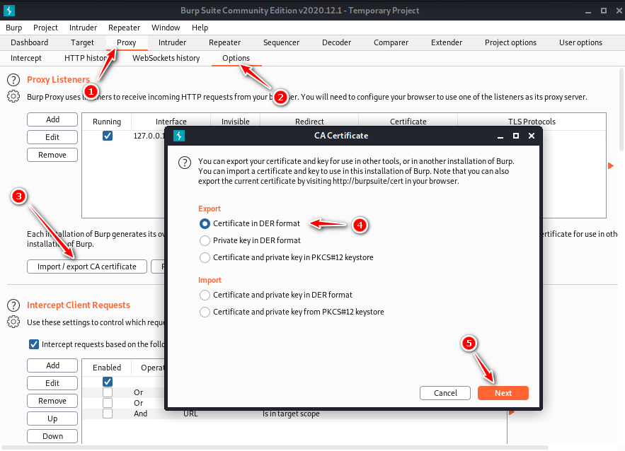

browser to trust Burp Suite.

Then, browse to a location on your Kali VM where you want to save the file. It is important that, when you are saving the file, you save it with a .der extension, otherwise the file won’t import

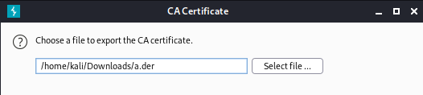

correctly into Firefox.

### Task 4:

Once this is done, open Web Browser (Firefox) in Kali and navigate to the options. Find “proxy” in Preferences’ search box. Click on the button called “Settings” under Network Settings.

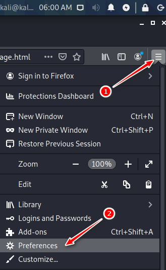

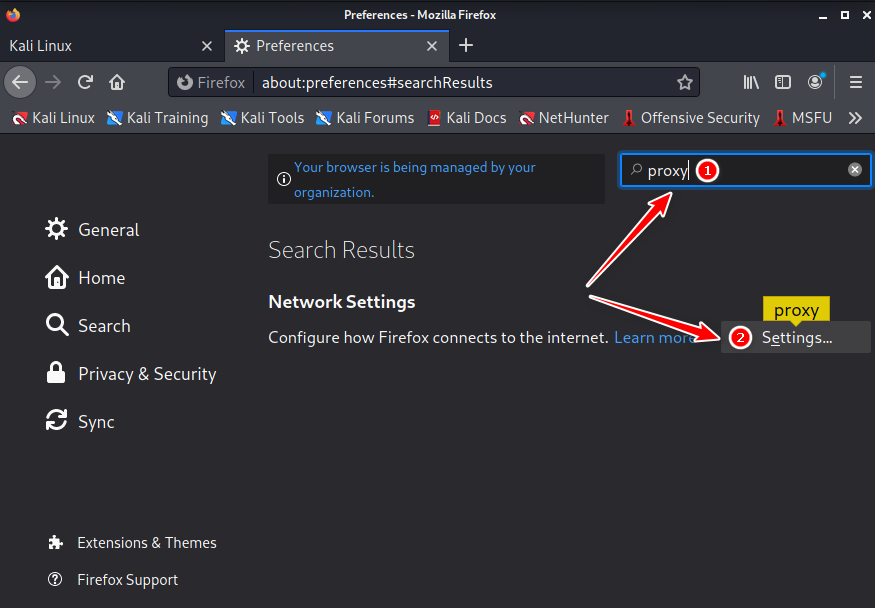

Then, click Manual Proxy Configuration and enter the following details:

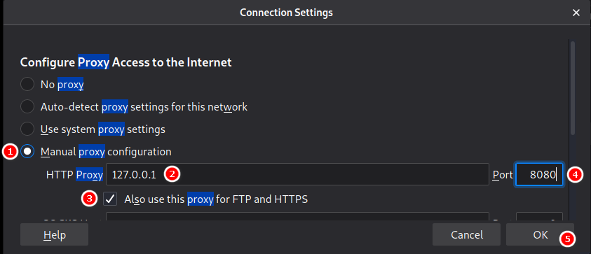

### Task 5:

Once this is done, navigate to the Privacy & Security tab and then to the Certificates section. This is where we will import the certificate from Burp we saved earlier. To do this, press on “View

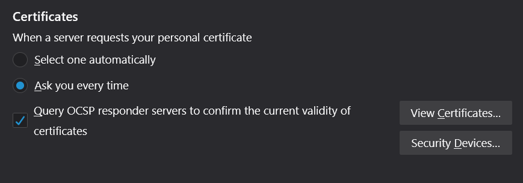

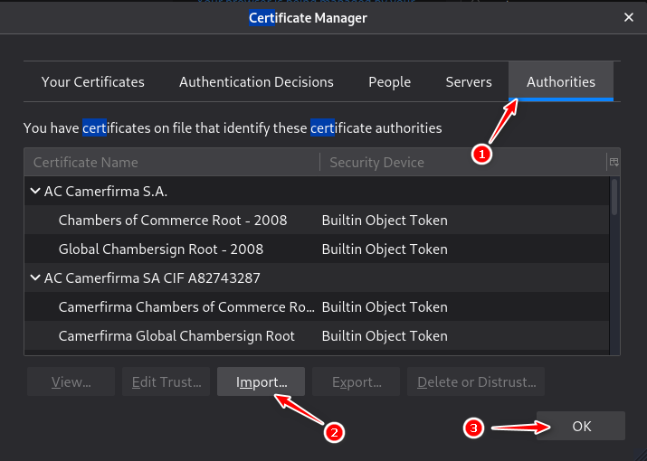

Certificates” and click on “Import”.

Navigate to the .der file that we saved earlier. Once selected, a box will pop up asking if you would like Burp Suite to be able to intercept emails and connections to websites. Select both options and

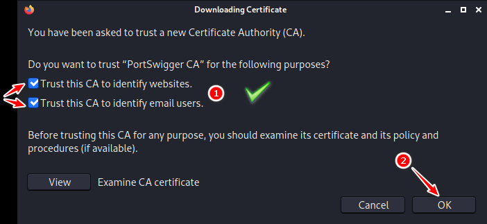

click “Ok”.

Great, Firefox is now configured to work with burp! To test it out, open Burp and Firefox. Ensure Intercept mode is turned ON, and search something in Firefox. If Burp Suite is not intercepting requests, you may have to navigate back to the proxy page. A pop-up might appear asking you to set up a listener. Simply press enable and Burp should then work properly.

Your request should be captured in Burp Suite for you to manipulate or examine.

### Task 6:

Now, we will learn how to use Burp to intercept browser network traffic.

Once the web browser opens, navigate to the following site:

[http://testasp.vulnweb.com/Login.asp?RetURL=%2FDefault%2Easp%3F](http://testasp.vulnweb.com/Login.asp?RetURL=%2FDefault%2Easp%3F)

Once there, go back to Burp and turn ON intercept mode. Then, enter any username and password combination into the site and click “Login”. As you will see, the page will remain in a loading state. This is because Burp has now intercepted the request we sent to the server, and is holding it for us to manipulate.

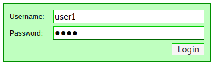

Go back to Burp and you will find the intercepted request, along with the username and password data that we entered. To navigate through the different requests Burp is intercepting, simply press the “Forward” button to send the request to the server and view the next request.

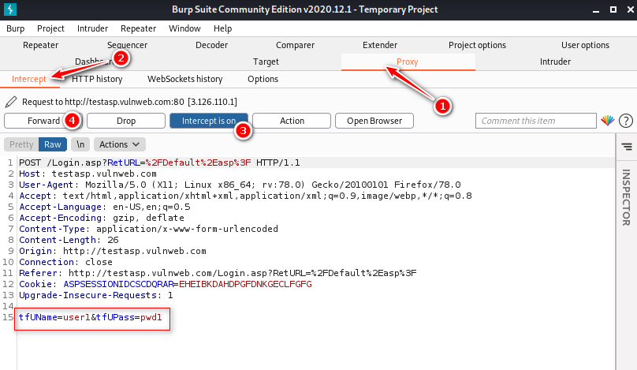

### Task 7:

You can also alter any text portion of web traffic when Burb interception mode is ON. Try to change “tfUName=admin” and “tfUPass=none” and press the “Forward” button. Those are valid credentials for the green-colored page, and you will be granted access to the next page.

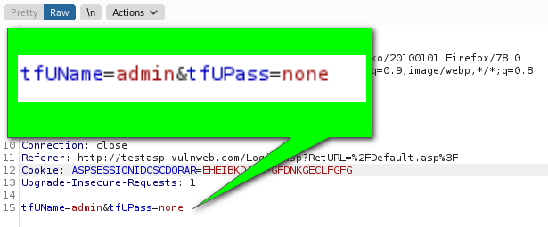

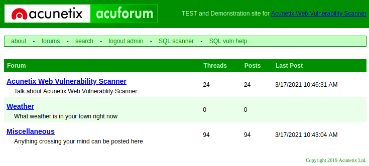