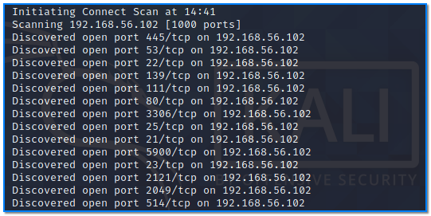
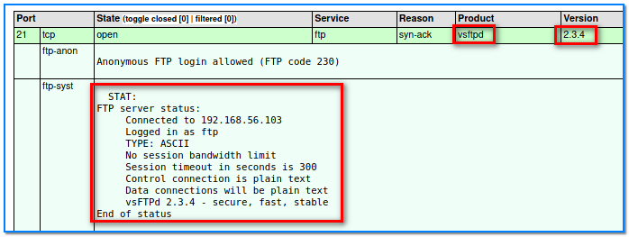
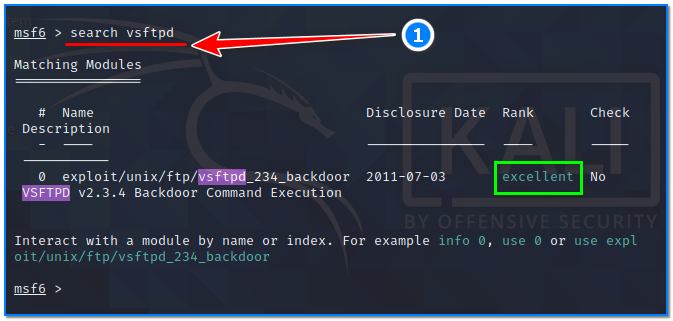
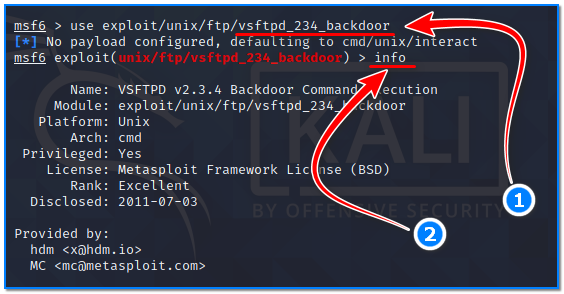
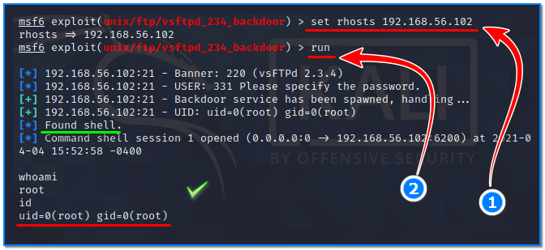

- [ ] Pasitikrinti ar viskas veikia

**Lab Objective:**

Learn how to exploit a vulnerable FTP service to gain a shell using Metasploit.

**Lab Purpose:**

The Metasploit framework is a powerful tool which can be used to probe systematic vulnerabilities on networks and servers. It provides information about security vulnerabilities and aids in penetration testing and IDS signature development.

**Lab Tool:**

Kali Linux VM and Metasploitable VM.

**Lab Topology:**

You can use Kali Linux in a VM for this lab.

**Lab Walkthrough:**

### Task 1:

In this lab, we will be using Metasploit to create a stable shell on a metasploitable machine. If you are unfamiliar with metasploitable, it is an intentionally vulnerable machine which can be loaded in VMware, the same as Kali Linux. You can download the metasploitable iso file here: [https://docs.rapid7.com/metasploit/metasploitable-2/](https://docs.rapid7.com/metasploit/metasploitable-2/)

You can find a lot of material on this page on how to download and setup the Metasploitable VM.

We will use both Kali Linux and Metasploitable for this lab. Remember to put both machines on the same isolated host-only network to talk to each other. When login is required, you will enter “**msfadmin**” as username and password.

### Task 2:

Metasploit comes pre-installed on Kali Linux. In this lab, we will be establishing a shell on our Metasploitable VM by exploiting a vulnerable FTP service. The objective of this lab is to highlight the importance of enumeration and to show you how a vulnerable service can be exploited using Metasploit.

To begin, we will first scan our target with nmap using the following command within Kali:

nmap -v -sC -sV 192.168.56.102 -oX Metasploitable.xml

192.168.56.102 is the IP address of our Metasploitable VM in this instance. You can find out the IP address of your own Metasploitable VM by typing “ifconfig” in its console.

This will run a comprehensive scan on our Metasploitable machine. The -oX command will save the output of this command to an XML file. Once the scan is done, we can convert this xml file to a html file and then open it in Firefox, making the results of the scan much easier to read. Use the following command to do this:

xsltproc Metasploitable.xml -o Metasploitable.html

Once this is done, open this file in Firefox by typing the following command:

firefox Metasploitable.html

### Task 3:

With the file open in Firefox, we can easily see what services are running as well as their version. We are going to focus on port 21, where FTP is running for this lab. We can see that there is a product called vsftpd running on this port.

The next step is to open Metasploit in a new tab in Kali VM by typing the following:

sudo msfconsole

We will now search the Metasploit database for any exploits related to this vsftpd product by typing the following:

search vsftpd

You will notice that one exploit shows up with the rank of excellent. We will use this exploit to get a shell on our Metasploitable VM.

### Task 4:

Type the following to use the exploit:

use exploit/unix/ftp/vsftpd_234_backdoor

Once this is done, type “info” to see how this exploit is used and what it does. This is a useful resource for learning about different exploits.

Then, type the following to complete the exploit:

set rhosts 192.168.56.102

run

This will run the exploit and will provide you with a shell on the Metasploitable VM. We can see that we are also the “root” user on the Metasploitable VM. This is an example of why enumeration is so important in finding any vulnerable services, and discovering how to take advantage of vulnerable services using Metasploit.