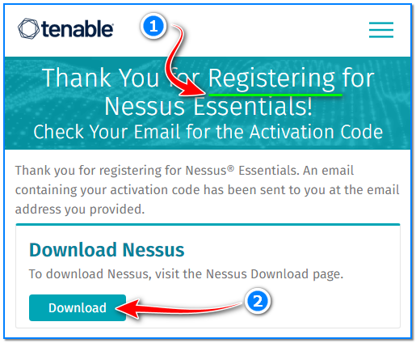
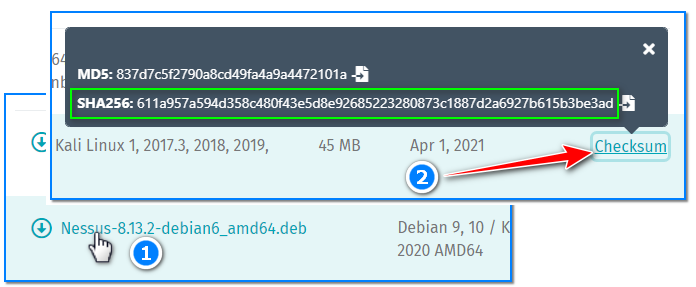
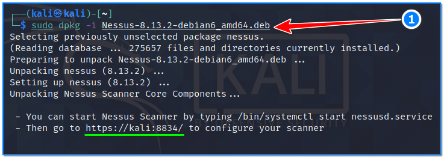
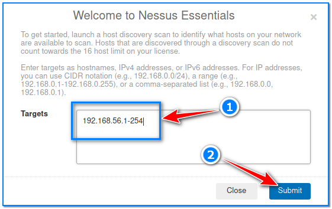
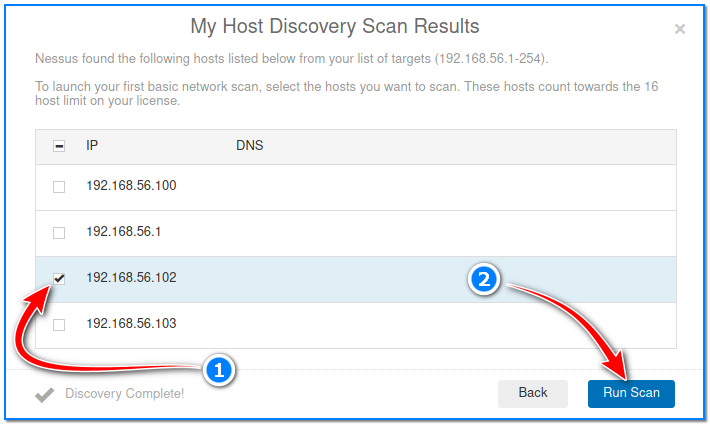
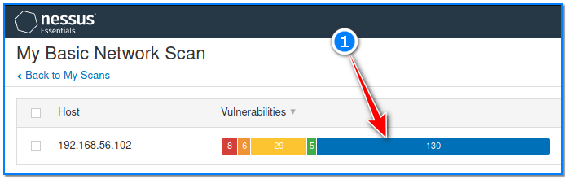
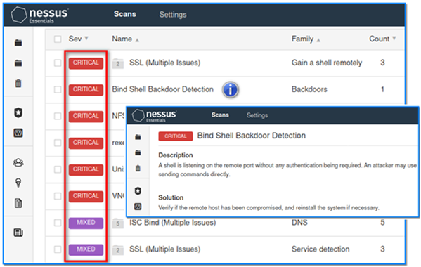
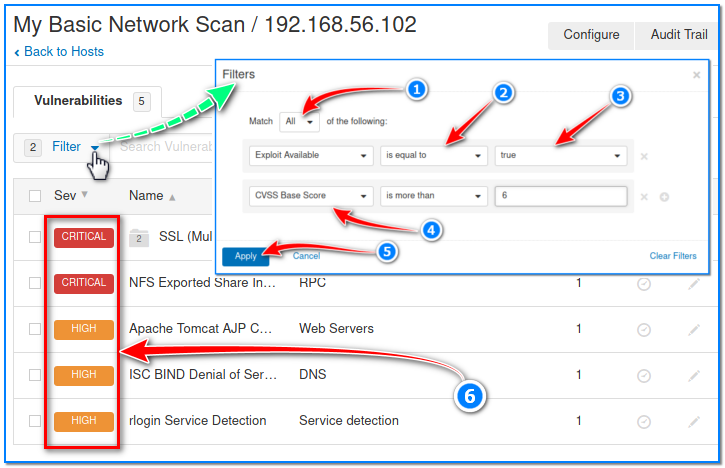

- [ ] Pasitikrinti ar viskas veikia

**Lab Objective:**

Learn how to run a comprehensive vulnerability scan with Nessus.

**Lab Purpose:**

Nessus is a proprietary vulnerability scanner developed by Tenable Inc. The tool allows security professionals to perform high-speed asset discovery, target profiling, configuration auditing, malware detection, sensitive data discovery, and more.

**Lab Tool:**

Kali Linux and Metasploitable VM.

**Lab Topology:**

You can use Kali Linux in a VM for this lab.

**Lab Walkthrough:**

### Task 1:

If you are unfamiliar with metasploitable, it is an intentionally vulnerable machine which can be loaded in VMware, the same as Kali Linux. You can download the metasploitable iso file here: [https://docs.rapid7.com/metasploit/metasploitable-2/](https://docs.rapid7.com/metasploit/metasploitable-2/)

You can find a lot of material on this page on how to download and setup the Metasploitable VM.

We will use both Kali Linux and Metasploitable VM for this lab. Remember to put both machines on the same isolated host-only network to talk to each other. When login is required, you will enter “**msfadmin**” as username and password.

### Task 2:

First, put the Kali VM temporarily on “Bridged Network”, as we will download Nessus tool from the internet. To install Nessus, we will have to visit their site and first register for an activation code at the following link:

[https://www.tenable.com/products/nessus/nessus-essentials](https://www.tenable.com/products/nessus/nessus-essentials)

Enter your name and email here to receive the code. Once this is done, you will be redirected to the

download page for Nessus Essentials, which is the free version.

We are installing the tool on Kali, so we want to pick the version called:

Nessus-8.13.2-debian6_amd64.deb

The numbers may change as the version of nessus is updated, the important point is that you download the .deb package. Click the Checksum link on the right hand and copy and paste the SHA256 string someware . Now, we will calculate and check integrity of the downloaded file against the checksum which is displayed on the web page. Open a Kali terminal screen, locate the downloaded file, then type this command:

sha256sum Nessus-8.13.2-debian6_amd64.deb

Compare the calculated result with original hash value. If they match, we can continue to our next task.

### Task 3:

Once this is downloaded, navigate to your downloads folder and type the following:

chmod +x Nessus-8.13.2-debian6_amd64.deb

This will allow us to execute the file. Then, type the following into your terminal to unpack the tool:

sudo dpkg -i Nessus-8.13.2-debian6_amd64.deb

Once this is done, we then need to enable the Nessus service by typing the following command:

sudo /bin/systemctl start nessusd.service

We will now be able to access the Nessus tool in our browser by navigating to the following link:

[https://kali:8834](https://kali:8834/)

Once here, you will be asked for your activation code as well as your name and email that you entered on the Tenable site.

Once you enter these, you will be asked to set a username and password. Once this is entered, we are now able to use the Nessus tool after a very long initialization process. Be patient!

### Task 4:

To begin, Nessus wants us to input a range of IP addresses so that we can discover some targets to scan. Be sure your Kali VM is in “Host-only Network” before starting the scan, so you can communicate with your target Metasploitable VM.

Select Metasploitable VM as a target victim from this list.

Then, hit the “Run Scan” button in the bottom right of the screen to start scan.

### Task 5:

The scan will take a few minutes to run as it discovers the numerous vulnerabilities available on the Metasploitable machine. When finished, you will be presented with a colour-coded bar of the

different vulnerabilities Nessus has found.

If you click on the IP address, you will be presented with a more detailed overview of the vulnerabilities discovered with the most severe vulnerabilities at the top of the list.

You can click on any of these vulnerabilities to discover why it is a vulnerability and how it can be exploited.

### Task 6:

We can filter the discovered vulnerabilities to focus on the vulnerabilities which have known exploits available, which allows us to take advantage of this information. This can be done by clicking the Filter button just below the Vulnerabilities tab.

Once here, click on the first drop down menu and select Exploit Available from the list. Once this is done, click on the plus sign to the far right of the last drop down menu. Then, in the first drop down menu in the second column, select CVSS Base Score; in the middle drop down menu select Is More Than; and in the final text box, enter the value 6.

Click the Apply button on the bottom right to then see the list of vulnerabilities discovered with exploits available where the exploit has a CVSS Base Score of over 6.

We are now left with a list of vulnerabilities which we are able to exploit. Click on the vulnerabilities to learn how they can be exploited and why they are vulnerabilities in the first place.