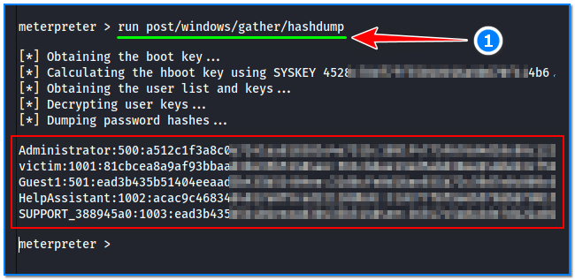
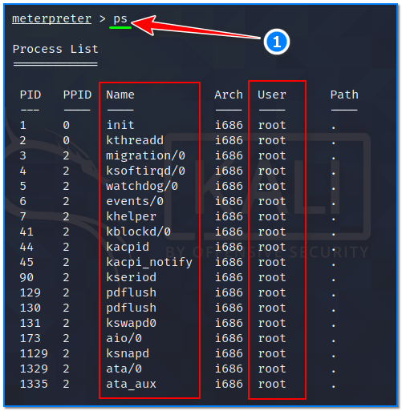
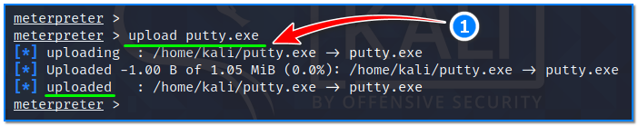
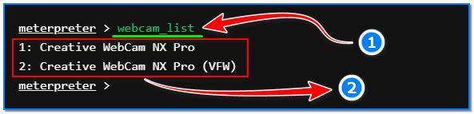
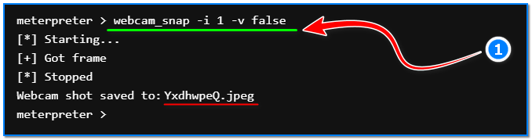

- [ ] Pasitikrinti ar viskas veikia

**Lab Objective:**

Learn some more advanced Meterpreter commands which can be used once a shell has been established on our target.

**Lab Purpose:**

Meterpreter is a Metasploit attack payload that provides an interactive shell from which an attacker can explore the target machine and execute code.

The Metasploit framework is a powerful tool which can be used to probe systematic vulnerabilities on networks and servers. It provides information about security vulnerabilities and aids in penetration testing and IDS signature development.

**Lab Tool:**

Kali Linux and Metasploitable VM

**Lab Topology:**

You can use Kali Linux in a VM for this lab. Since this lab requires active Meterpreter command shell access, it should be studied immediately after the end of lab 75 or lab 76.

**Lab Walkthrough:**

### Task 1:

If you are unfamiliar with metasploitable, it is an intentionally vulnerable machine which can be loaded in VMware the same as Kali Linux. You can download the metasploitable iso file here: [https://docs.rapid7.com/metasploit/metasploitable-2/](https://docs.rapid7.com/metasploit/metasploitable-2/)

You can find a lot of material on this page on how to download and setup the Metasploitable VM.

We will use both Kali Linux and Metasploitable for this lab. Remember to put both machines on the same isolated host-only network to talk to each other. When login is required, you will enter “**msfadmin**” as username and password.

### Task 2:

In this lab, we will be learning about the post-exploitation tool, Meterpreter. We will be covering some of the more advanced commands associated with this tool.

When we have established a Meterpreter shell on a Windows machine, we are able to dump the contents of the Security Accounts Manager (SAM) database using the following command:

run post/windows/gather/hashdump

The SAM will contain hashes of the Windows machines passwords.

### Task 3:

We can use the following command to display the local working directory:

lpwd

The local working directory is the location where the Metasploit console was started on our target.

### Task 4:

We can change the local working directory using the following command:

lcd /tmp

This will give our Meterpreter session access to files located in this folder.

### Task 5:

When we establish a Meterpreter shell on the target, we are starting the shell on a process which is running on the target. We can migrate the shell to another process on the target machine using the following command:

run post/windows/manage/migrate

This will help with evading detection as well as establishing persistence.

### Task 6:

We can display a list of the running processes on the target using the following command:

ps

This is useful when deciding which process to migrate the Meterpreter shell to.

### Task 7:

We can use the following command to execute Meterpreter instructions located inside a text file:

resource

The resource command will execute Meterpreter instructions located inside a text file. Containing one entry per line, resource will execute each line in sequence. This can help automate repetitive actions performed by a user.

### Task 8:

We can use the following command to upload files to the target system:

upload

We will need to use double-slashes with this command if remote target is a windows machine.

### Task 9:

We are able to display all currently available webcams on the target host using the following command:

webcam_list

### Task 10:

Finally, we are also able to grab a picture from a connected web cam on the target system and save it to disc as a JPEG file:

webcam_snap

By default, the save location is the local current working directory with a randomized filename.