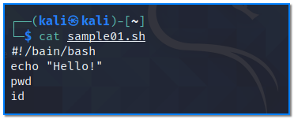
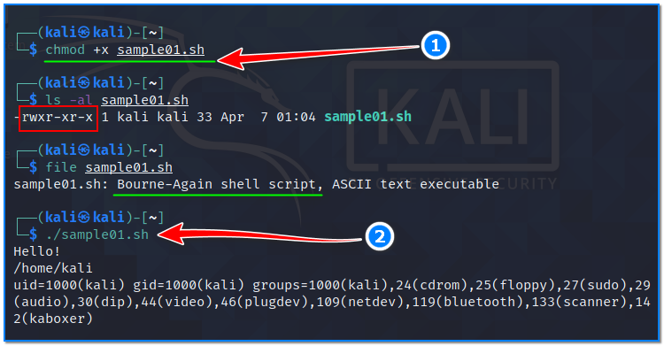
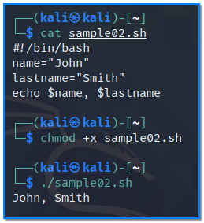
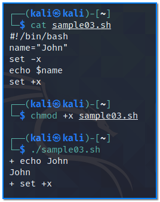

- [ ] Pasitikrinti ar viskas veikia

**Lab Objective:**

Learn some basic bash scripting.

**Lab Purpose:**

Bash is a Unix shell and command language. It is a free software replacement for the Bourne Again Shell. It is used as the default login shell for most Linux distributions.

**Lab Tool:**

Kali Linux

**Lab Topology:**

You can use Kali Linux in a VM for this lab.

**Lab Walkthrough:**

### Task 1:

In this lab, we will be running through a basic introduction to scripting with Bash.

To begin, we will create a very simple bash script. You should know that every bash script will always begin with the following line of code at the top:

#!/bin/bash

This code is used to tell your shell that it needs to use bash to run the file.

With this established, let’s write our first very basic script which is called, for example, “sample01.sh”. We can do this by copying the following and pasting it into a new file in Kali VM:

|   |
|---|
|#!/bin/bash   echo “Hello!”   pwd   id|

Make sure to include the first line of code at the top to tell our terminal to run this file using bash.

In order to run this file, we first need to make it executable on our system. We can do this by typing the following:

chmod +x sample01.sh

To execute the script, type the following:

./sample01.sh

As you can see, the commands we have entered in the script have executed in the console.

### Task 2:

We will now learn about variables in bash. A variable is a symbol which functions as a placeholder for varying expressions or quantities. Variables are often used to store numbers as well as vectors, metrics, and functions. Essentially, they are used to store information.

Create a new script which is named “sample02.sh”. Note that we will need to type a dollar sign before the variable when calling it in order to use it. We will now edit our script to include two variables by typing the following:

|   |
|---|
|#!/bin/bash  name=”John”   lastname=”Smith”   echo $name,$lastname|

chmod +x sample02.sh

Then, execute your script by typing:

./sample02.sh

As you can see, using variables and then calling them using echo is the same as typing echo “John, Smith”.

### Task 3:

We will now learn about debugging the code in our script. We can perform debugging by adding the following into our code:

set -x

set +x

Debugging allows us to step through our code and determine if there are any mistakes. Now, create another script file with standard headline:

|   |
|---|
|#!/bin/bash  name=”John”   set -x   echo $name   set +x|

chmod +x sample03.sh

./sample03.sh

Save this file and run it. As you can see, this will output a + before every command as it is executed. If there was an error in one of the commands, it would output a – before the command. This makes it easy for us to find the error and correct it.