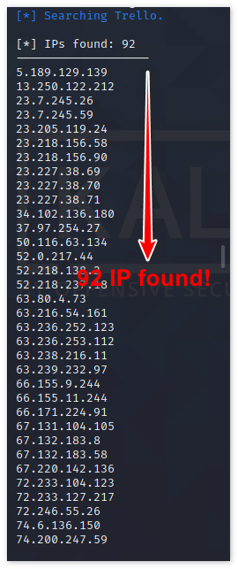

- [ ] Pasitikrinti ar viskas veikia

**Lab Objective:**

Learn how to gather information on a target site using theHarvester.

**Lab Purpose:**

Information gathering is often the first step of any penetration test. theHarvester is a very powerful OSINT (Open-Source Intelligence Tool) for finding information on a target URL. It searches multiple sites for information about the target URL and displays all the information it finds. It is particularly useful for finding names of people and their email addresses as well as subdomains of the target site.

**Lab Tool:**

Kali Linux

**Lab Topology:**

You can use either Kali Linux in a VM for this lab.

**Lab Walkthrough:**

### Task 1:

We can use theHarvester which is bundled in Kali, but this tool is updated frequently. We will download and use the latest version, in this lab.

To begin, boot up Kali Linux in your VM and open a terminal. Follow the steps below:

sudo apt-get install python3-pip  
sudo pip3 install virtualenv  
virtualenv venv

Clone the git repo:

git clone [https://github.com/laramies/theHarvester.git](https://github.com/laramies/theHarvester.git)  
cd theHarvester

pip3 install -r requirements.txt

Close this terminal and open a new one. Now, we are ready to use “theHarvester.py” in “kali” user’s home directory. Type:

cd /home/kali/theHarvester/  
./theHarvester.py -v

### Task 2:

To launch an information gathering campaign on a target, type the following:

./theHarvester.py -d hackaday.com -l 300 -b google

This will start theHarvester. It will begin searching Google for the top 300 results related to hackaday.com.

For this target, we could not find any information on Google. Let us dig deeper.

### Task 3:

If we want to gather even more information about our target, we can specify the following:

./theHarvester.py -d hackaday.com  
-l 300 -b all

The “-b all” tag will search all search engines available to theHarvester for information regarding hackaday.com. As you can see, it is an extremely useful tool for discovering email addresses, names of people associated with the target, sub-domain names and IP addresses.

### Task 4:

If we wanted to display this information in an easier to read format, we could add the -f tag at the end:

./theHarvester.py -d hackaday.com -l 300 -b all -f hackaday.com.results

This will save the information gathered in a HTML file called “hackaday.com.results.html” When this file is opened, it provides the information gathered in a layout which is much easier to read.

