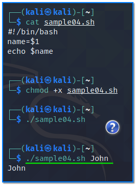
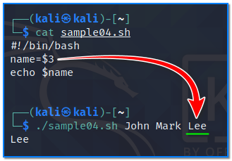
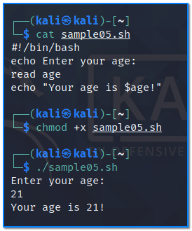
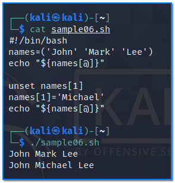

- [ ] Pasitikrinti ar viskas veikia

**Lab Objective:**

Learn some more bash scripting concepts.

**Lab Purpose:**

Bash is a Unix shell and command language. It is a free software replacement for the Bourne Again Shell. It is used as the default login shell for most Linux distributions.

**Lab Tool:**

Kali Linux

**Lab Topology:**

You can use Kali Linux in a VM for this lab.

**Lab Walkthrough:**

### Task 1:

In this lab, we will be running through some more concepts around scripting with Bash.

We will begin by looking at parameters. The official definition of a parameter is that a parameter is a special kind of variable in that it is used to pass information between functions or procedures.

We will begin by creating a new script file with nano editor. Enter the following:

|   |
|---|
|#!/bin/bash  name=$1   echo $name|

chmod +x sample04.sh

Once this is done, save the file and close it. Now, run the file:

./sample04.sh

You will notice that we receive no output. Now, type the following:

./sample04.sh John

We receive “John” as output. This is because, when using parameters, we need to supply them with information. Note: the information passed to a parameter is called an argument.

If we want to get the third argument (the third piece of information passed to the parameter), we will first need to change the code in our script. We will simply be replacing the $1 with $3, which should make our script look like the following:

Now, run the script with the following command:

./sample04.sh John Mark Lee

Note that we are now getting the third argument returned to us in the terminal.

### Task 2:

We can create another script file so that the user is prompted to enter a value when the script is run. We can do this using “read”. Read will cause the code to hand and wait for the user to input a value before continuing. Edit your script so that it looks like the following:

|   |
|---|
|#!/bin/bash  echo Enter your age:  read age  echo “Your age is $age!”|

chmod +x sample05.sh

Now run the script. Enter a number when prompted by the script.

You will notice that the script takes the number input by us and returns it in a sentence. Read is a very useful function in this regard.

### Task 3:

You may be asking, what if we wanted to store multiple values in one variable? We don’t need to create a variable for every piece of data we want to store as you may think. Instead, we can use arrays to store multiple values. We can then use an index to extract the pieces of data from the array. It is important to note that because arrays use indexing, the first value entered in an array will always start at zero. i.e if you input 1,2,3 into an array, the first number (1) will be located at index 0 in the array. The second number (2) will be located at index 1 in the array etc.

Let’s create our first array. Create a new script to include the following:

|   |
|---|
|#!/bin/bash  names=(‘John’ ‘Mark’ ‘Lee’)  echo “${names[@]}”|

Let’s break these two lines of code down:

The names = section specifies the array and stores the variables included.

The echo section calls each piece of data included in the array. Note the different brackets used to call the array contents. The @ will call every piece of data in the array. The [] are used to specify the index of the piece of data we are calling.

Run this code now and note the output.

Now, what if we wanted to simply return the value “Lee” from the array? We would edit our script to look like the following:

echo “${names[2]}”

### Task 4:

If we want to remove a value from our array, we can use the unset command:

|   |
|---|
|#!/bin/bash  names=(‘John’ ‘Mark’ ‘Lee’)  echo “${names[@]}”  unset names[1]  names[1]=’Michael’  echo “${names[@]}”|

unset names[1]

This will remove the name Mark from the array.

We can also swap out a value in our array using the following command:

names[1]=’Michael’

This will swap the name Mark with Michael in our array.