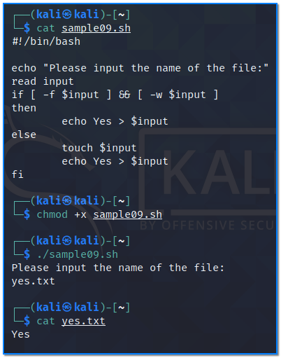

- [ ] Pasitikrinti ar viskas veikia

**Lab Objective:**

Learn some advanced bash scripting concepts.

**Lab Purpose:**

Bash is a Unix shell and command language. It is a free software replacement for the Bourne Again shell. It is used as the default login shell for most Linux distributions.

**Lab Tool:**

Kali Linux

**Lab Topology:**

You can use Kali Linux in a VM for this lab.

**Lab Walkthrough:**

### Task 1:

In this lab, we will run through some more advanced, but fundamental concepts behind bash scripting. Using these concepts when scripting with bash is what makes the language really useful.

We will begin by addressing conditionals. Conditionals are a piece of code which rely on a piece of code (a condition) being met. Whether the condition is met or not is usually determined using relational operators including: equal to, greater than, and less than.

To begin this lab, we will start by making a simple conditional statement to check if a variable is equal to a value. We will use an “if” statement to achieve this goal.

An if statement looks like the following:

if [ x compared to y ]

then

Some action

else

Some other action

fi

This is the syntax for every if statement in the bash language. If statements will always use a pair of brackets. When using bash, make sure to include a space between the brackets at either end in order for the command to work. We also need to ensure we end each if statement with fi, which is if backwards. Let’s construct an example:

|   |
|---|
|#!/bin/bash  number=5  if [ $number = 5 ]  then  echo true  else  echo false  fi|

The following is what this looks like in a text editor:

We can execute this script and we will be returned the value “true”.

Now, let’s create a script which will accept input and compare it to a value. This will look like the following:

|   |
|---|
|#!/bin/bash  echo “Enter a value between 1 and 10:”  read value  if [ $value -gt 5 ]  then  echo “$value is greater than 5”  else  echo “$value is less than or equal to 5”  fi|

Save this script file as “sample08.sh”, make executable then run;

Enter a number and see how the script responds.

### Task 2:

Finally, we will create a script which will perform an action on a file based on an if statement. To do this, we will need to use two conditions. Our script will check if a file exists on our system and then check if we are able to write to that file. If both conditions are true, we will write “Yes” to the file. If not, we will create a file and write “Yes” to it. The script will look like the following:

|   |
|---|
|#!/bin/bash  echo “Please input the name of the file:”  read input  if [ -f $input ] && [ -w $input ]  then  echo Yes > $input  else  touch $input  echo Yes > $input  fi|

Save this script file as “sample09.sh”, making it executable.

Now, run this script and see what happens.

Conditional statements can be extremely useful for automating tasks on a Linux system, such as checking to see if the system is up to date, if we are connected to a network, etc.

