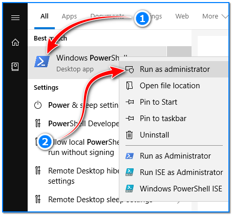
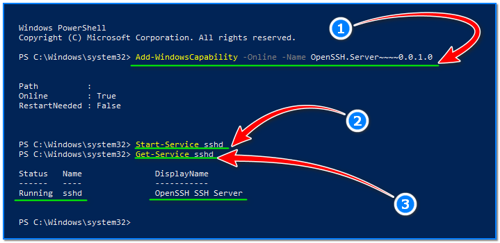
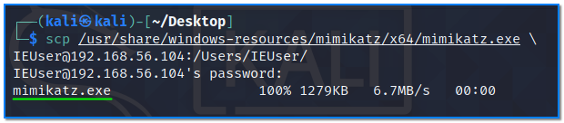
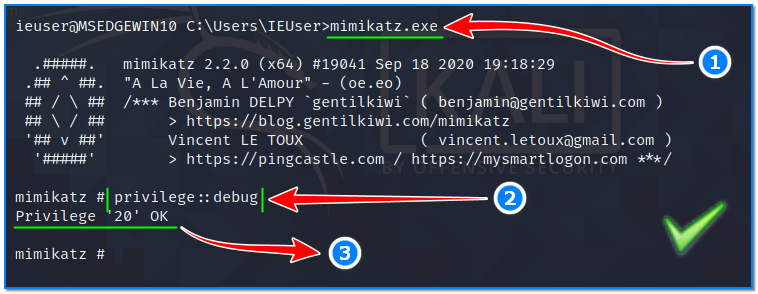
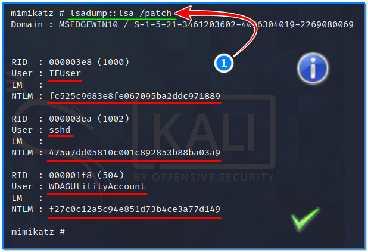

- [ ] Pasitikrinti ar viskas veikia

**Lab Objective:**

Learn how to use Mimikatz to get all passwords from a Windows machine.

**Lab Purpose:**

Mimikatz is an open-source application which allows users to view and save authentication credentials on Windows machines.

**Lab Tool:**

Kali Linux and Windows

**Lab Topology:**

You can use Kali Linux in a VM and a Windows machine for this lab.

**Lab Walkthrough:**

### Task 1:

In this lab, we will be using the Mimikatz tool to dump all of the NTLM hashes from a Windows machine. These hashes can then be cracked in a tool like John the Ripper to provide us with all cleartext passwords for the machine. To do this, we will need to establish a privileged shell on our Windows machine. I will be using SSH to achieve this.

To begin, we will first need to setup the SSH service on our Windows machine. This can be done through PowerShell. Open powershell as an Administrator by searching for PowerShell in the search box at the bottom left of your machine. Then, right-click on PowerShell and select “Run as Administrator”.

Once in powershell, we can install the SSH tools necessary by typing the following (1):

Add-WindowsCapability -Online -Name OpenSSH.Server~~~~0.0.1.0

Once this has downloaded, we can start the SSH service by typing the following (2-3):

Start-Service sshd

Get-Service sshd

The last two commands run SSH, then shows its status.

### Task 2:

Now, with the SSH server running on our machine, we can go ahead and connect to our Windows machine from our Kali machine with the following command:

ssh IEUser@192.168.56.104

192.168.56.104 is the IP address of our target Windows machine in this instance. Once connected, we will have Administrator shell access on our Windows machine.

### Task 3:

The next step is to transfer the Mimikatz file over to our Windows machine. The “mimikatz.exe” file can be found in the following directory in Kali VM:

/usr/share/windows-resources/mimikatz/x64/mimikatz.exe

Turn “Windows Defender’s real-time protection” off before starting to transfer. Then, copy this file to the Windows machine using scp command;

scp /usr/share/windows-resources/mimikatz/x64/mimikatz.exe [IEUser@192.168.56.104:/Users/IEUser/](mailto:IEUser@192.168.56.104:/Users/IEUser/)

Username “IEuser” and its home directory path might be different on your Windows environment.

### Task 4:

We can now execute the mimikatz application by navigating to the directory where the application was transferred, and then type the following in our SSH console (1):

mimikatz.exe

This will start the tool. From here, we will first ensure that mimikatz is running as an Administrator. If it is not running as an administrator, the tool wont run correctly. To check, we can type the following (2):

privilege::debug

The result of this command should be Privilege ‘20’ OK, which indicates that the tool is running as Administrator (3).

### Task 5:

The final step is to dump all NTLM hashes from the system. We can do this by typing the following:

lsadump::lsa /patch

All of the NTLM hashes for every service and use on the system will be displayed to us. We can copy these hashes and take them to John the Ripper, to crack them and obtain the clear text passwords to the system.