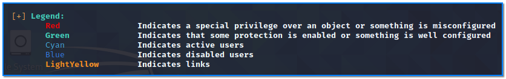

- [ ] Pasitikrinti ar viskas veikia

**Lab Objective:**

Learn how to use WinPEAS to enumerate for privilege escalation on a Windows target.

**Lab Purpose:**

WinPEAS is a script which will search for all possible paths to escalate privileges on Windows hosts.

**Lab Tool:**

Kali Linux and Windows

**Lab Topology:**

You can use Kali Linux in a VM and a Windows machine for this lab.

**Lab Walkthrough:**

### Task 1:

In this lab, we will be looking at how to use WinPEAS to enumerate a Windows target for all possible privilege escalation opportunities. We will download  PEAS (Privilege Escalation Awesome Scripts) from the internet. First, make sure that your Kali VM is currently connected to a network that has access to the internet. Now, open a terminal screen and type the following command in a single line:

git clone [https://github.com/carlospolop/privilege-escalation-awesome-scripts-suite.git](https://github.com/carlospolop/privilege-escalation-awesome-scripts-suite.git)

This will download all the scripts and tools you need. For this lab, we will be focusing on WinPEAS, which is the script for enumerating on Windows targets.

Once downloaded, navigate to the directory containing the file winPEASx86.exe (or WinPEASx64.exe  if you are running a 64 bit version of Windows). You can locate this file by typing the following into a terminal (1):

find . -iname “winPEAS*.exe”

This will show you the exact location of the files. We want to use the Release option for this lab. Choose proper file for your installed Windows platform (32bit|64bit) and copy this file to nginx web server document root, which is ”/var/www/html”:

sudo cp ./privilege-escalation-awesome-scripts-suite/winPEAS/winPEASexe/binaries/x86/Release/winPEASx86.exe /var/www/html

Then, start the nginx web server. To do this, open a terminal screen and type the following command:

sudo nginx

We are doing this because we will later download this file from the target Windows machine, just as we will pull the payload file. In a real life scenario, this would be done using a phishing email or some other form of social engineering. For this lab, simply transfer the file to your Windows machine.

### Task 2:

We will need to establish a basic shell on the target. First, put Kali VM into same “Host-Only Network” with Windows target machine again to isolate attacks/scans from your real network.

Then, create a reverse shell payload using msfconsole, transfer this to the Windows target, establish a Metasploit listener and execute the payload. Refer to lab 82 for more info.

So, we now have a meterpreter shell on our target.

### Task 3:

Switch to the console of your Windows machine and open a browser. Download the winPEASx86.exe file from the Kali VM by typing the following URL in the address line:

http://192.168.56.103/winPEASx86.exe

Ensure that “Windows Defender, realtime scan” is turned off before try to download. Otherwise, this file might be considered suspicious by Windows and can be destroyed immediately.

Once on the Windows machine, we can easily execute the script. In Meterpreter, type the following to get a shell on our Windows machine:

shell

Once interacting with the cmd shell, we can execute the script by navigating to the directory where we saved the file and then typing the following:

winPEASx86.exe > results.txt

After running command, WinPEAS goes through the entire system looking for various privilege escalation methods available and write all output to a text file, results.txt.

WinPEAS will look for a massive amount of information to provide us with a comprehensive list of options with regards to privilege escalation. Some of the information gathered include connections open, open ports, listeners, SSH keys, windows credentials in the Windows Vault, and Credential manager, etc. Let’s look at the content of this file now. Type this command in the same shell:

type results.txt

WinPEAS colour-codes the information it provides us, with items in red indicating the strongest possibility of privilege escalation.

