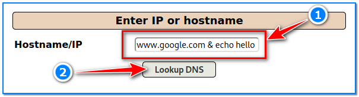

- [ ] Pasitikrinti ar viskas veikia

**Lab Objective:**

Learn how to perform command injection on a target site.

**Lab Purpose:**

Command injection is an attack which executes arbitrary commands on the host operating system via a vulnerable application.

**Lab Tool:**

Kali Linux.

**Lab Topology:**

You can use Kali Linux in a VM and Mutillidae 2 Tool for this lab.

**Lab Walkthrough:**

### Task 1:

In this lab, we will be using the OWASP Mutillidae II environment. First of all, we need to have this installed in Kali VM. Follow the steps below for installation:

Open a terminal screen in Kali VM and install the necessary packages by entering the commands below:

|   |
|---|
|sudo apt update  sudo apt install php-xml php-fpm libapache2-mod-php php-mysql php-gd  php-imap php-mysql php-curl php-mbstring -y  sudo a2enmod proxy_fcgi setenvif  sudo systemctl restart apache2  sudo a2enconf php7.4-fpm|

Start Apache and MariaDB services:

|   |
|---|
|sudo systemctl reload apache2  sudo systemctl restart apache2.service  sudo service php7.4-fpm restart  sudo systemctl restart mariadb|

Connect MariaDB as root user:

sudo mysql -u root

Then, paste the following commands to create new database, db user, and grant enough privileges to new db user:

|   |
|---|
|DROP USER IF EXISTS ‘mutillidae’;  CREATE USER ‘mutillidae’@’%’ IDENTIFIED BY ‘mutillidae’;  DROP DATABASE IF EXISTS mutillidae;  CREATE DATABASE mutillidae;  GRANT ALL PRIVILEGES ON mutillidae.* TO ‘mutillidae’@’%’;  FLUSH PRIVILEGES;  SHOW DATABASES;  exit;|

Get OWASP Mutillidae II codes from its git repository. Set the required permissions so that apache can serve these pages:

cd /var/www/html

sudo git clone https://github.com/webpwnized/mutillidae.git

sudo chown -R www-data:www-data /var/www/html/mutillidae

Open “mutillidae/includes/database-config.inc” file with an editor, then replace username ‘root’ with ‘mutillidae’ in DB_USERNAME variable:

Our system is almost ready. Open a browser in Kali, then type this URL in address: bar:[http://localhost/mutillidae](http://localhost/mutillidae)

Click where it says “setup / reset the DB” on the next page (1). Click OK when confirmation popup appears (2). Finally, OWASP Mutillidae II Environment is ready to use! (3)

### Task 2:

This lab will be covering topic A1 of the OWASP Top 10 – Injection. Considering that we have covered SQL Injection in another lab, in this lab, we will be looking at Command Injection and how it works.

In this lab, we will be using Mutillidae to demonstrate how command injection works. We will be using the DNS lookup page to demonstrate this.

Navigate to this page in your web browser to continue with the lab.

### Task 3:

Once on the page, we are presented with a text box in which we can lookup DNS information about a particular host. You can try this now by searching for the DNS information of a particular site.

This page is vulnerable to an injection vulnerability known as command injection. This means that we can submit commands through this application and execute them on the backend operating system. This is a serious vulnerability, as we can essentially control the entire operating system.

We can test this in a number of ways. The first step is to try and determine if the vulnerability exists. We can do this by typing the following:

www.google.com & echo hello

This will search for DNS information for google.com and will then “echo hello” back to us on the web page, indicating that the site is vulnerable to command injection.

### Task 4:

Now that we know we can perform command injection, we can execute more commands to take advantage of the OS. The first step here should be an attempt to determine the OS type, whether it is Linux or Windows. To do this, we should execute commands which would only work on Linux or Windows and note the results. Type the following two commands now:

www.google.com & uname -a

As you will find, the this command will return a result if we are working with a Linux OS, as the command will only work on Linux systems. To prove this further, we can type the following:

www.google.com & ls

As you will see, we have now listed the entire directory we are in.

### Task 5:

We can now move through the file system and look for interesting files. For example, we can change to the root directory by typing the following:

www.google.com & cd / && ls

This will change to the home directory and list all the files present in this directory.

From here, attackers can continue to gather information about the OS, establish a shell, transfer files, etc.