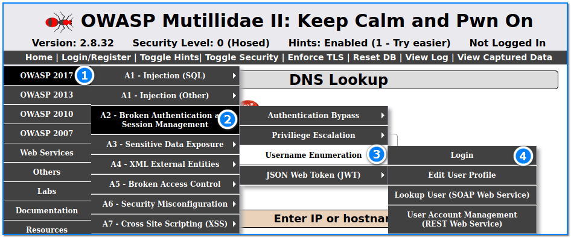
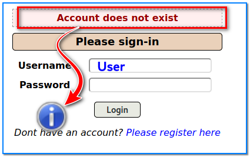
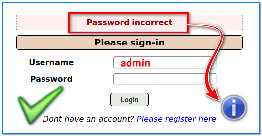
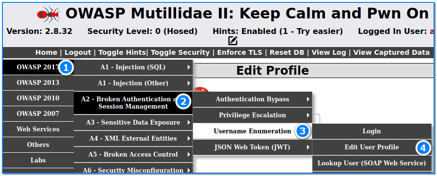
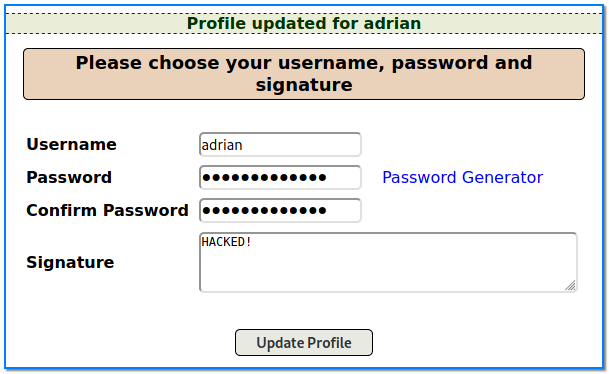

- [ ] Pasitikrinti ar viskas veikia

**Lab Objective:**

Learn how to perform username enumeration on a vulnerable site.

**Lab Purpose:**

Username enumeration is when an attacker can observe changes in the website’s behaviour to identify whether a given username is valid.

**Lab Tool:**

Kali Linux.

**Lab Topology:**

You can use Kali Linux in a VM and Mutillidae 2 Tool for this lab.

**Lab Walkthrough:**

### Task 1:

In this lab, we will be covering topic A2 of the OWASP Top 10 – Broken Authentication. In this lab, we will be performing username enumeration on a vulnerable site. I will be using Mutillidae 2 to perform this lab. This vulnerable page can be found at the following location in the menu of Mutillidae 2:

### Task 2:

This is a very straightforward vulnerability. Essentially, it involves entering usernames into the Username text box and submitting these values to determine how the site reacts. Depending on the sites reaction, we can determine whether that username exists or not.

To see this vulnerability in action, enter the username “User” into the text box and press login. Server provides the response “Account does not exist” indicating that this username does exist.

Now, enter the username “admin” into the text box and press login. Note that the server provides the response “Incorrect Password”, indicating that this username exist but the password is incorrect! Using this information, we can perform brute forcing using this username in an attempt to guess this user’s password.

This may be a simple version of username enumeration, but in reality, you may have to pay attention to things like error messages, response times, and status codes to provide indications of existing usernames on a site.

### Task 3:

We can now use this information to change the password and signature of another user’s account. If you type “adrian” into the box above, you will find that this username exists. We can take this information now and navigate to the “Edit Profile” page.

This page has no user authentication or session management implemented. This page allows us to change the password and signature for our logged in user. To access this page, login as the admin with the username “admin” and password “adminpassword”.

Once at the page, replace the username admin with adrian, and type any password and signature. You will notice that the profile for adrian becomes updated even though we are not logged in as adrian. This is a clear example of poor session management.

