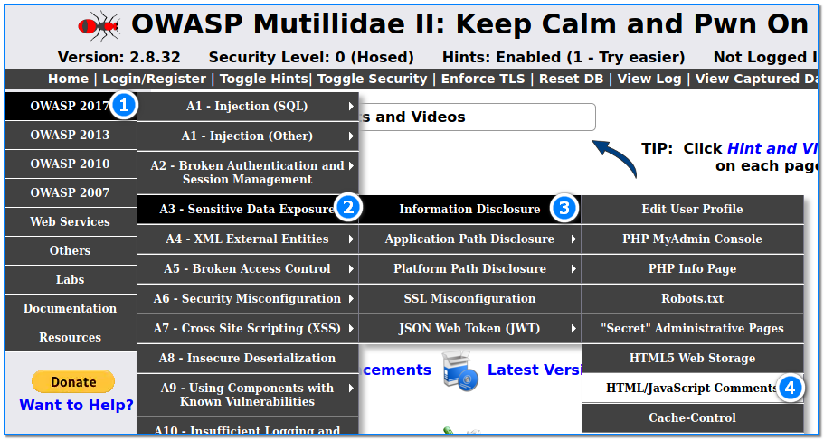
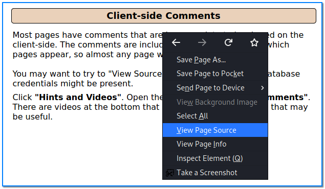
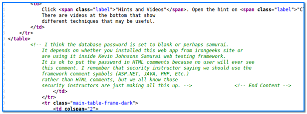

- [ ] Pasitikrinti ar viskas veikia

**Lab Objective:**

Learn how to take advantage of a sensitive information disclosure vulnerability.

**Lab Purpose:**

Sensitive information disclosure is when a site unintentionally reveals sensitive information to users.

**Lab Tool:**

Kali Linux.

**Lab Topology:**

You can use Kali Linux in a VM and Mutillidae 2 Tool for this lab.

**Lab Walkthrough:**

### Task 1:

In this lab, I will be using Mutillidae to demonstrate an example of information disclosure. How to install this environment in Kali VM is explained in detail in lab 87.

Information disclosure is also referred to as information leakage, and can refer to several things, including:

- Unnecessarily exposing sensitive information, such as credit card details
- Hard-coding API keys, IP addresses, database credentials, and so on in the source code
- Hinting at the existence or absence of resources, usernames, and so on via subtle differences in application behaviour
- Revealing the names of hidden directories, their structure, and their contents via a robots.txt file or directory listing
- Providing access to source code files via temporary backups
- Explicitly mentioning database table or column names in error messages

In this lab, I will be using the Client-side Comments page to demonstrate a hard coded credentials vulnerability. To begin, navigate to the Client-side Comments page which can be found at the following place in the menu:

This page is vulnerable and includes some credentials hard-coded into the comments section of the source code.

### Task 2:

We can view the source code for this page by right-clicking on the page and clicking on the “View Page Source” option from the menu.

The hard-coded credentials can be found in a comment at the end of the page containing the source code.

This is an example of information disclosure, or information leakage, as any user of this site can access this information.