- [ ] Pasitikrinti ar viskas veikia

**Lab Objective:**

Learn how to use airgeddon to create an evil twin and capture login credentials.

**Lab Purpose:**

Airgeddon is a Wi-Fi auditing script. It is very useful, and employs a lot of tools in the one script. This means that the script will launch the tools for us using our given settings, as opposed to us having to manually set up each of the tools separately.

**Lab Tool:**

Kali Linux, an external wireless card

**Lab Topology:**

You can use either Kali Linux in a VM for this lab.

Note: to perform this lab, you will also need an external wireless card which can be connected to your VM through USB. This wireless card should also be put into “monitor mode”, which allows it to monitor all traffic on a Wi-Fi network.

There are numerous Wi-Fi adapters in the market that support Wi-Fi hacking. In this page, you can find some of them:

[https://www.ceos3c.com/security/best-wireless-network-adapter-for-wifi-hacking-in-2019/](https://www.ceos3c.com/security/best-wireless-network-adapter-for-wifi-hacking-in-2019/)

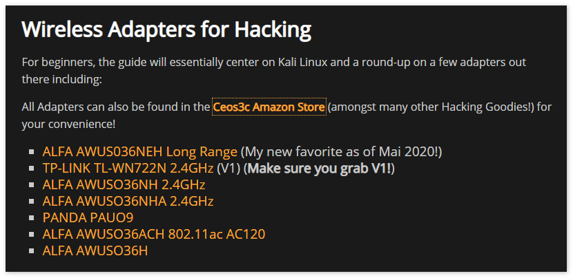

**Lab Walkthrough:**

### Task 1:

The first step is to open Kali Linux in your VM and then open a terminal. This is the Github page for the airgeddon script:

[https://github.com/v1s1t0r1sh3r3/airgeddon](https://github.com/v1s1t0r1sh3r3/airgeddon)

To download the script for your Kali machine, simply type the following:

sudo git clone [https://github.com/v1s1t0r1sh3r3/airgeddon.git](https://github.com/v1s1t0r1sh3r3/airgeddon.git)

A prompt may pop up, telling you that _x_ amount of space will be used to download the script. Simply type “y” and the script will download.

Once the script is downloaded, type “ls” into the terminal. You should see a file called “airgeddon”. Type “cd airgeddon” to change the directory to this file. Type “ls” again and you should see a file called “airgeddon.sh”. Type “./airgeddon.sh” to run the script.

### Task 2:

The script will run a number of checks to determine if you have the correct tools installed. Simply follow the on-screen prompts. It will also give you the option to install any tools which you are missing. You should press “y” when given this option to get the full capacity of airgeddon’s tools.

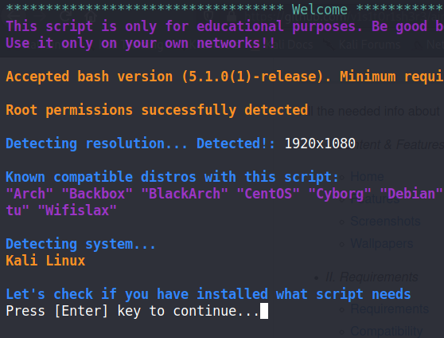

The next screen will ask you to choose which interface you want to use with the tool. It is important you choose your wireless card and not your machine’s connection here. My wireless card is called “wlan0” on this screen.

Once at the main menu, the first step is to place our card into monitor mode by pressing option 2.

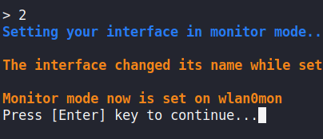

### Task 3:

With the initial setup behind us, we can now begin the attack. Choose option 7 for Evil Twin attacks menu.

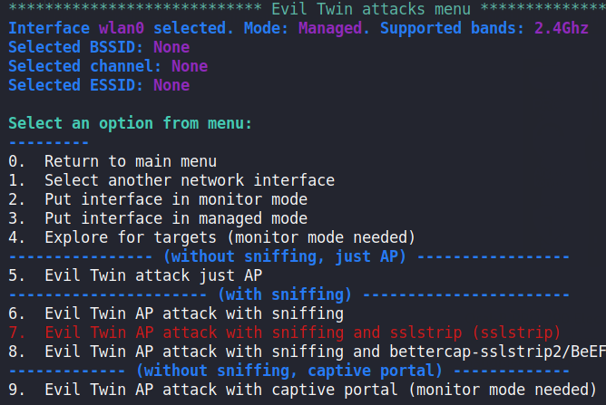

For this lab, we will be creating a captive portal, to capture the Wi-Fi password of our chosen network. Choose option 9.

Airgeddon will then conduct an exploration for any nearby Wi-Fi network. A new window will pop up. Let this run for about a minute. When you have found your target Wi-Fi network, press ctrl + c to end the discovery.

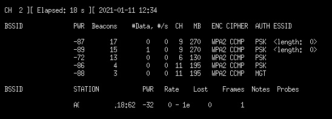

You will then be presented with a screen which displays all discovered Wi-Fi networks. Choose your network by typing the number beside it into the terminal and press enter.

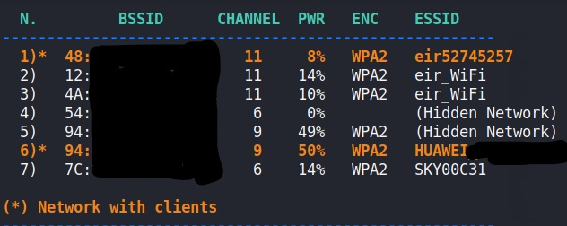

### Task 4:

The next screen will ask you how you want to de-authenticate people from the network. We will be choosing option 1. I did not enable DoS pursuit mode, as the card I am using does not support it.

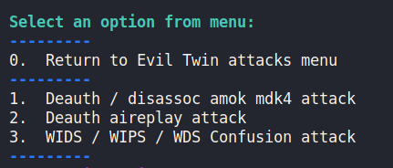

Do spoof your MAC address on the next screen as this is good practice. This will provide a fake MAC address in the router logs.

We do not have a captured handshake file, so choose the “no” option when asked for this. Press enter when asked to provide a value for timeout to accept the default value of 20. Press enter again and airgeddon will begin kicking hosts from the target Wi-Fi network in order to obtain a handshake.

If successful, the handshake will be captured and saved in a default location.

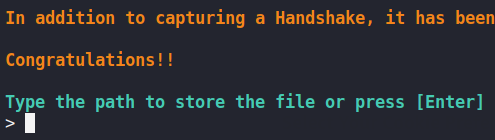

### Task 5:

Press enter a few times on the next few prompts to accept the default settings.

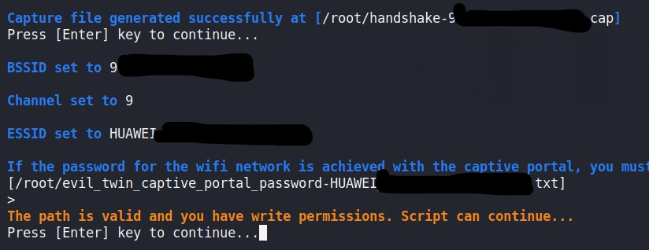

The next screen will then ask you what language you want the captive portal to be in. Choose option 1 for English. Press enter again and the attack will begin.

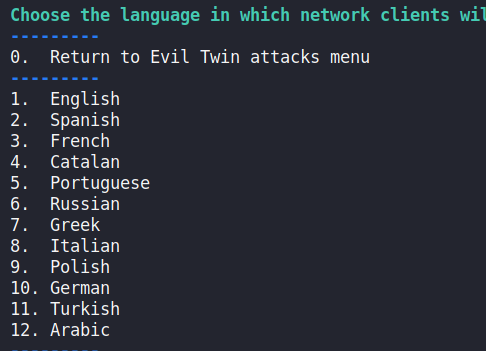

A number of popups will open on your screen, it is important you do not close any of them and let the script do its work.

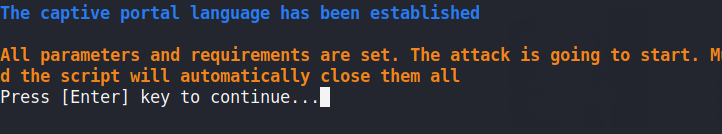

### Task 6:

Now, get another device which is connected to the same network and attempt to connect to the internet. You will notice that you will be unable to do so. If you look for Wi-Fi networks, you may also see two networks with the same name, one with security and one without. Our evil twin is the network with no security. Connect to this network, if your device didn’t automatically do so, and attempt to connect to the internet. You will be presented with a screen asking for your Wi-Fi password in order to gain internet access. Enter your password and return to the script. You will see that the script would have captured the password you entered in plain text. Press enter on the terminal screen to end the attack.

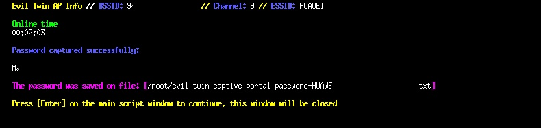