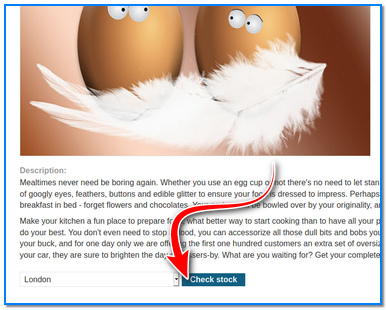
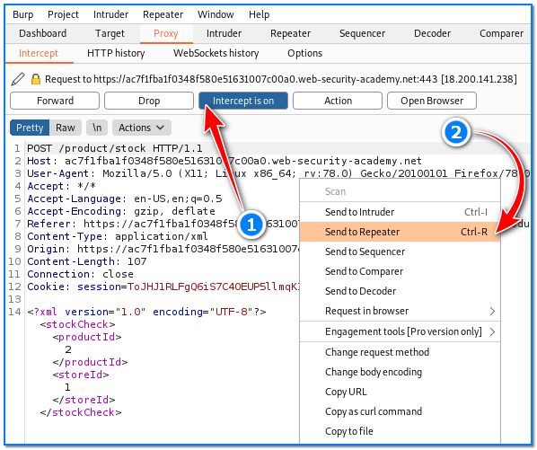
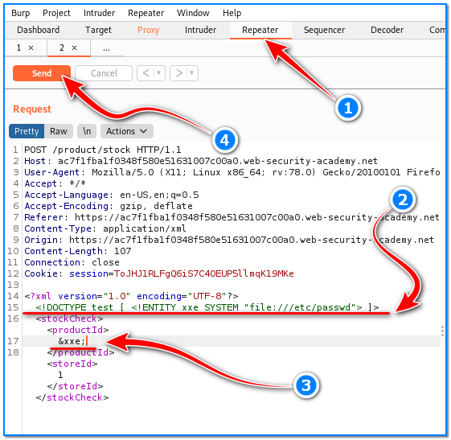
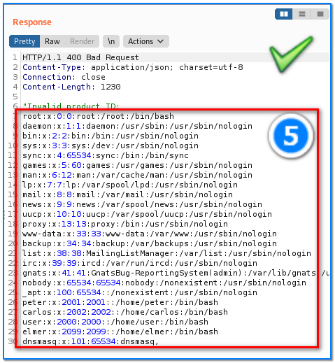

- [ ] Pasitikrinti ar viskas veikia

**Lab Objective:**

Learn how to take advantage of an XML External Entity vulnerability to retrieve files.

**Lab Purpose:**

An XML External Entity vulnerability

**Lab Tool:**

Kali Linux.

**Lab Topology:**

You can use Kali Linux in a VM and Burp Suite for this lab.

**Lab Walkthrough:**

### Task 1:

In this lab, I will be using PortSwiggers web academy to demonstrate an XXE injection attack. You will need to register for an account at the following link to complete this lab:

[https://portswigger.net/web-security/dashboard](https://portswigger.net/web-security/dashboard)

The lab itself can be accessed at the following link once you have created an account:

[https://portswigger.net/web-security/xxe/lab-exploiting-xxe-to-retrieve-files](https://portswigger.net/web-security/xxe/lab-exploiting-xxe-to-retrieve-files)

### Task 2:

Once setup on the site, access the lab. You will be presented with a store webpage. Click “View details” button on any product in the store.

Start Burp Suite and turn intercept on.

You will notice a button at the bottom of the screen called “Check Stock”. Once intercepting mode on, press the “Check stock” button and capture the resulting request in Burp Suite.

With the request captured, right-click and press “Send to Repeater”. Navigate to the Repeater tab where we will continue to edit the request.

The way in which the server serves XML requests is vulnerable in that it parses XML input and returns any unexpected values in the response. This means that we are able to execute commands on the server OS.

To do this, we need to locate the section at the end and create a space between the <?xml version=”1.0″ encoding=”UTF-8″?> and <stockCheck>. In this space, we want to enter the following line of code:

<!DOCTYPE test [ <!ENTITY xxe SYSTEM “file:///etc/passwd”> ]>

We need to make another change before we can submit this request. We need to change the number under the <productId> tag to the following:

&xxe;

The following screenshot shows what the full request should look like:

Once the request has been altered, we can submit the request by pressing the “Send” button on the top left of the Burp Suite Repeater window. You can view the response on the right screen.

You will notice that, while the response returned a Bad Request, it also returned the contents of the /etc/passwd file.

So, what we just did is take an advantage of an XXE vulnerability and pass a command to the OS running on the server.