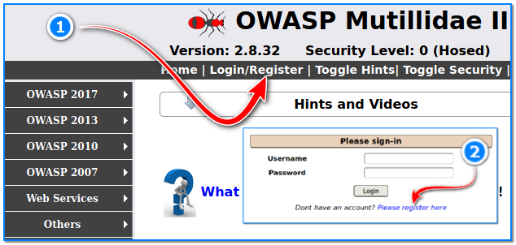

- [ ] Pasitikrinti ar viskas veikia

**Lab Objective:**

Learn how to take advantage of a broken access control vulnerability to log in as another user.

**Lab Purpose:**

Broken Access control is what happens when restrictions on what authenticated users can do are not properly enforced. This vulnerability can be exploited by attackers to access unauthorized functionality and or data such as other users’ accounts, modify other users’ data, change access rights, view sensitive files etc.

**Lab Tool:**

Kali Linux.

**Lab Topology:**

You can use Kali Linux in a VM and Mutillidae 2 Tool for this lab.

**Lab Walkthrough:**

### Task 1:

In this lab, I will be using Mutillidae 2 to demonstrate a broken access control vulnerability. How to install this environment in Kali VM is explained in detail in lab 87.

To begin, we will first need to register an account on the Mutillidae 2 home page. The Login page can be found at the top left of the home page (1).

Once at the login screen, press on “Register an account” (2). From here, enter the following information:

Username: tester

Password: test

Confirm Password: test

Signature: Hacker

Once this information is entered, click the “Create Account” button (4). We will now have created a new user on the site. Click “Login/Register” link again and wait.

Start Burp Suite and turn intercept mode ON. If you are not sure how to do this, please refer to lab 7 which we had done on Burp Suite. It is important to note that, when accessing the local web application, you will need to add a . after localhost in order for Burp Suite to be able to capture requests. This is what the URL for the user login page should look like:

http://localhost./mutillidae/index.php?page=login.php

Essentially, it is the same, just with an added . right after localhost (1). This will force the web application to transmit data through our Burp Suite proxy, allowing us to capture requests.

Return to the Login/Register page and enter the details for the account we just created (2,3,4).

The captured requests should be available for you in Burp Suite. There will be two of them, right- click on the requests and select “Send to Repeater” (1).

Then, forward the requests (2). The following screenshots are what the captured requests should look like:

On this page, select “Send to Repeater” again (3). Then, click Repeater tab (4).

### Task 2:

Here, we can see the two requests we captured. Select the first request and click the “Send” button in the top left (1). Notice the “uid” value that is returned in the response (2). This is the value which we are going to be manipulating.

Now, go to the second request we captured. We can see that the second request is taking the “uid” value from the response the first request received, and including it in the body of the request. This will allow us to manipulate this value.

right-click on this request and select “Send to intruder” (1). Then, navigate to the “Intruder” tab (2).

### Task 3:

You will notice that we have our target available, which is the request we just sent here. Go to the “Positions” tab within the Intruder tab. You will notice some sections highlighted in green. Click on the Clear button to the far right to remove all of these areas (1).

Once this is done, navigate to the “uid” value and place one of those symbols either side of the number by pressing the “Add §” button to the far right (2).

Once this is done, navigate to the Payloads tab (3). Then, go to a terminal screen in Kali and create a text file with numbers from 1 to 50 included in the file. Each number should be on a new line with no spaces. You can easily generate this file by executing the following single line command;

for k in $(seq 1 50);do echo -e $k; done > seq.txt

Then, return to the Payloads tab within the Intruder tab and import this file we just created (1,2,3).

You will notice that our payload now contains the numbers 1-50.

Once this is done, click on the “Start Attack” button on the top right of the screen (4). This will start replacing the “uid” value in our origional request with the list of numbers we imported into the payloads section. We can see in the response that the logged-in user is the admin user.

### Task 4:

We will now analyse the results of our intruder attack. To do this, we will simply click on each of the different numbers to see if they corresponded with any other user. Click on the first request. You will see the request sent on the bottom panel. Click on the “Response” tab in between the top and bottom panels. This will show us the response from the server.

We now know that the uid value for the “admin” user is 1, and 2 for user “adrian”. We will now use this information to log in as the “admin”.

### Task 5:

Go back to Burp Suite and turn intercept mode OFF. Then, navigate to browser where we are logged in as the user tester. right-click on the page and select the “Inspect Element” option (1). Then, navigate to the Storage tab (2).

Click on the Cookies tab. This tab will have stored the cookie for our logged in user, which means we will remain logged-in for the duration of our session on the application. Click on the localhost cookie

and note the uid value here (3).

Double click on the uid value and change it to 1, the admin users uid (4).

Now, return to our browser page and refresh the page. We are now logged-in as the admin user!

