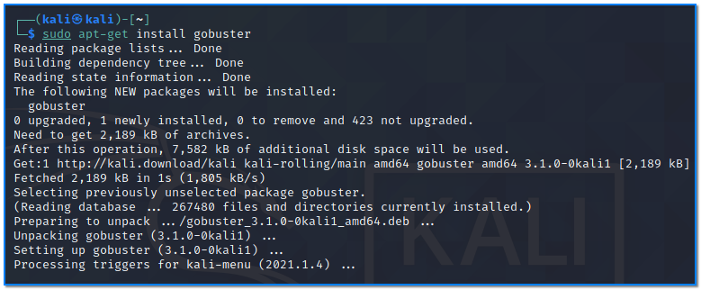
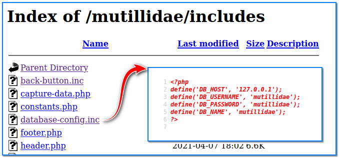

- [ ] Pasitikrinti ar viskas veikia

**Lab Objective:**

Learn how to take advantage of a security misconfiguration vulnerability.

**Lab Purpose:**

Security misconfigurations are one of the most noted vulnerabilities in the wild. This is usually caused by insecure default configurations, incomplete or ad hoc configurations, open cloud storage, misconfigured HTTP headers, and verbose error messages containing sensitive information.

**Lab Tool:**

Kali Linux.

**Lab Topology:**

You can use Kali Linux in a VM for this lab.

**Lab Walkthrough:**

### Task 1:

In this lab, I will be using Mutillidae to demonstrate a security misconfiguration vulnerability. How to install this environment in Kali VM is explained in detail in lab 87.

One of the most common security misconfigurations is relying on hidden directories and files, which are not actually hidden. The only thing keeping the application secure in this scenario is the hope that the attacker will not find the names of the hidden resources. These names can be brute forced or guessed.

The first example of a security misconfiguration can be easily found on Mutillidae 2. Simply go to the URL and type the following:

http://localhost/mutillidae/passwords

As you will see, we can clearly see the accounts.txt file here in this supposedly hidden directory. Click on this file and you will notice all of the usernames and passwords listed for every account on Mutillidae 2. This is a common and severe security misconfiguration, where hidden or sensitive directories are not actually hidden.

### Task 2:

For the next task, we will be using gobuster tool to discover any other potential security misconfigurations in the form of sensitive files or directories. Download gobuster by typing the following in a terminal in Kali:

sudo apt-get install gobuster

Once the tool is installed, type the following command in a single line to scan the mutillidae site for all potential directories:

gobuster dir -u http://localhost/mutillidae -w \  
/usr/share/dirbuster/wordlists/directory-list-1.0.txt -x .txt

This command will search the target site for all directories contained in the directory list text file. It will also search for any files with the .txt extension which are accessible through the URL. Notice

that the only .txt file which turns up is the robots.txt file.

Browse to this file now by typing the following into the URL bar:

localhost/mutillidae/robots.txt

This is another common security misconfiguration whereby the robots.txt file contains sensitive information and is easily accessible. We can see when we open this file, that it contains a list of a number of sensitive directories.

Navigate to a few of these directories by typing them into the URL and notice the range of sensitive information we can uncover.

