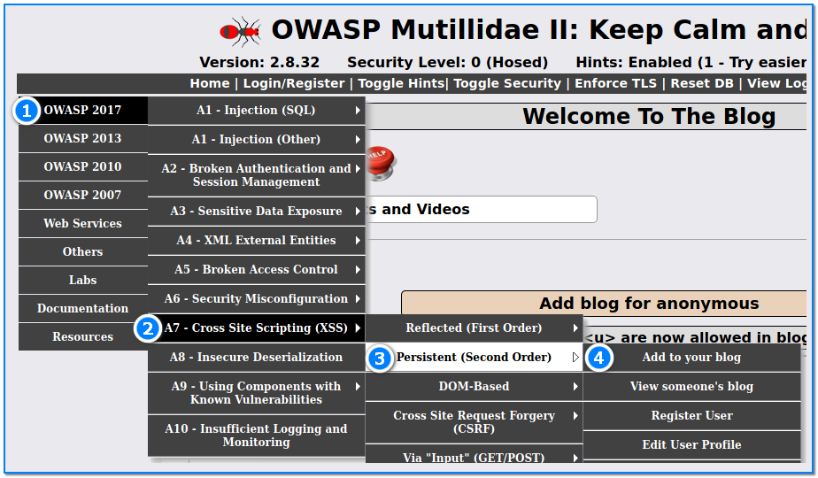
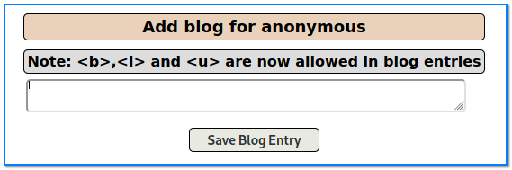
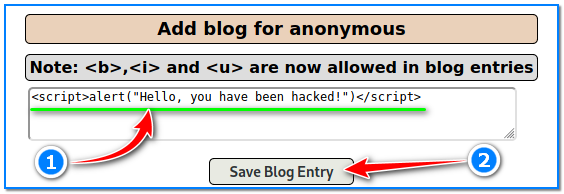
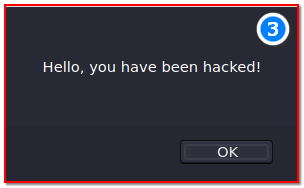
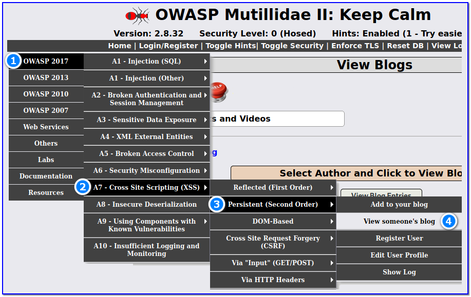
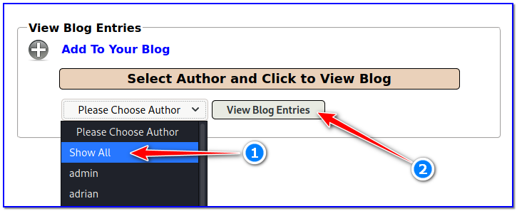
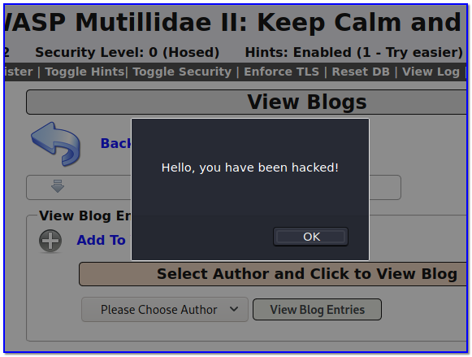

- [ ] Pasitikrinti ar viskas veikia

**  
Lab Objective:**

Learn how to take advantage of a Cross Site Scripting (XSS) vulnerability.

**Lab Purpose:**

Cross Site Scripting (XSS) is a security vulnerability which allows attackers to inject client-side scripts into web pages viewed by other users. Attackers can use this vulnerability to bypass access controls such as the same-origin policy.

**Lab Tool:**

Kali Linux.

**Lab Topology:**

You can use Kali Linux in a VM for this lab.

**Lab Walkthrough:**

### Task 1:

In this lab, we will be using Mutillidae to demonstrate an XSS vulnerability. How to install this environment in Kali VM is explained in detail in lab 87.

Considering that we have already covered reflected XSS in another lab, in this lab, we will be focusing on Persistent XSS. Persistent XSS is a more damaging form of XSS as the injection is permanently stored in the source, such as the comments to a video or blog. In this lab, we will be adding to the blog.php code to store a windows alert popup box.

To begin, navigate to the “Add to your blog” menu which can be found under the following section of the Mutillidae 2 menu:

Once on this page, you will be presented with a text box where you can enter text and add it as an entry to your blog. Our goal here is to add a script to the blog which will create a popup on the users screen every time the page is loaded.

### Task 2:

In order to test the page to see if it is vulnerable to the persistent XSS vulnerability, enter the following script into the textbox (1):

Once you click the “Save Blog Entry” box (2), you will notice that a popup will appear on your screen with the message we entered into the textbox (3).

Click the OK button to close the popup.

### Task 3:

We have executed an XSS attack, but we want to make sure that this attack will occur every time the page is loaded.

Then, navigate to the “View someone’s blog” site from the following location in the menu:

You will be presented with a drop down menu where you can view the blog of any author.

Click on this menu (1) and select the “Show All” option, and then click the “View Blog Entries” option (2).

You will notice that the popup will appear again with the same message we entered earlier. This indicates that any user who visits this page will receive the same popup, meaning we have successfully executed a persistent XSS attack!

