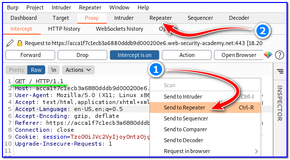

- [ ] Pasitikrinti ar viskas veikia

**Lab Objective:**

Learn how to take advantage of an insecure deserialization vulnerability.

**Lab Purpose:**

Insecure deserialization vulnerabilities often lead to remote code execution, making them very severe vulnerabilities. Even if they do not result in RCE, they can be used to perform attacks including replay attacks, injection attacks, and privilege escalation attacks.

**Lab Tool:**

Kali Linux.

**Lab Topology:**

You can use Kali Linux in a VM for this lab.

**Lab Walkthrough:**

### Task 1:

In this lab, I will be using Portswigger’s Web Academy to demonstrate an XSS vulnerability.

In order to access the lab, you will first need to create an account at the following site:

https://portswigger.net/web-security/dashboard

Once you have created an account, you can access the lab at the following link:

https://portswigger.net/web-security/deserialization/exploiting/lab-deserialization-modifying-serialized-objects

### Task 2:

To begin, access the lab from the link above. You will be presented with a web page which looks like an online shop. Click on the “My account” button at the top right of the screen (1). This will bring you to a login screen. Then, login with the username “wiener” and password “peter” without quotes (2,3,4).

You will then see a screen which allows you to update the email for your account. Start Burp Suite and ensure intercept is turned ON. How to install Burp Suite is explained in detail in lab 7.

Then, enter a random email address into the text box and click update email.

Navigate to Burp where the captured requests should be waiting for you. Forward the first request as we do not need it. The second request is the one we want; it starts with the following header:

GET / HTTP/1.1

Right click on this request and choose the “Send to Repeater” from the option menu (1). Then, navigate to the “Repeater” tab (2).

### Task 3:

On the Repeater tab, notice the cookie session value which is assigned to us. This is the value we are looking to manipulate.

Highlight this value (1) and you will notice the automatic decoder to the right of the screen (2) is able to decode the cookie value and show us in clear text what values it is made up of.

With this cookie value highlighted, right-click on the value and select Send to Decoder (3). Then, navigate to the Decoder tab (4).

### Task 4:

Once in the Decoder tab, you will see the cookie value that we sent here from our request. Select the “Decode as” button to the right of the text box and select “URL” (1). Another text box will appear with the URL decoded value. Do this again for the second value (2) and a third box will appear with the decoded value. For this third value, select “Decode as”, and then select “Base64” (3). Finally, we are able to see our cookie value in clear text, allowing us to manipulate it (4).

Notice the section which has the following code in it:

“admin”;b:0;}

This is the section we are interested in manipulating. The b:0 value is a boolean value which means false. Essentially, this is indicating to the server that we are not the admin user. If we change this value to b:1, this will now indicate to the server that we are the admin user.

Great! We now need to reformat this value to be the same as the original cookie value. To do this, click the “Encode as” option to the right of the value we just manipulated and select “Base64” (2). A new textbox will appear containing the encoded value. For this new textbox, click on the “Encode as” option to the right of the box, and select “URL” (3). A new textbox will appear containing the URL encoded value.

OK, we now have our manipulated value back to the format of the original cookie value. Copy this value (4) and return to our “Repeater” tab, where the request should still be waiting for us (5).

### Task 5:

In the “Repeater” tab, replace the cookie session value with our new value which we copied from the “Decoder” tab (1). Press “Send” in the top left corner and note the response from the server on the right hand side (2). At the bottom of the right hand side panel, there is a search box. In this search box type the word “admin” (3). You should notice 2 results being returned, with a reference to a directory called “/admin”.

Change the header of your request so that it looks like the following (4):

GET /admin HTTP/1.1

Then, “Send” the request again (5). You don’t need to, but if you replace the original GET / request we captured with this new request and new cookie value, whenever you return to the shop, you will notice that you would be logged in as the admin (6).

### Task 6:

Search for the word “admin” in the right hand panel again, and you will notice that there are now 4 matches (1). There are an extra two results with headers which allow us to delete the user account for “carlos” (2). Copy the header which deleted the user account for “carlos”. Replace your request header with this value so that it looks like the following (3):

GET /admin/delete?username=carlos HTTP/1.1

Send this request by hitting the “Send” button in the top left (4). You will notice a result of 302 found, indicating that the user account has been deleted (5).

To finish the lab, select all the text in the left hand panel and copy it to your clipboard (6). Return to your “Proxy” tab, where your request should still be waiting (7). Replace all the text on this screen with the copied text from the “Repeater” tab (8) and “Forward” the request (9). Once this is done, turn off intercept (10) and return to the lab in your browser.

Congratulations! The lab is solved! We have managed to login as the user “carlos” by exploiting an insecure deserialization vulnerability and delete the user account for “carlos”.

