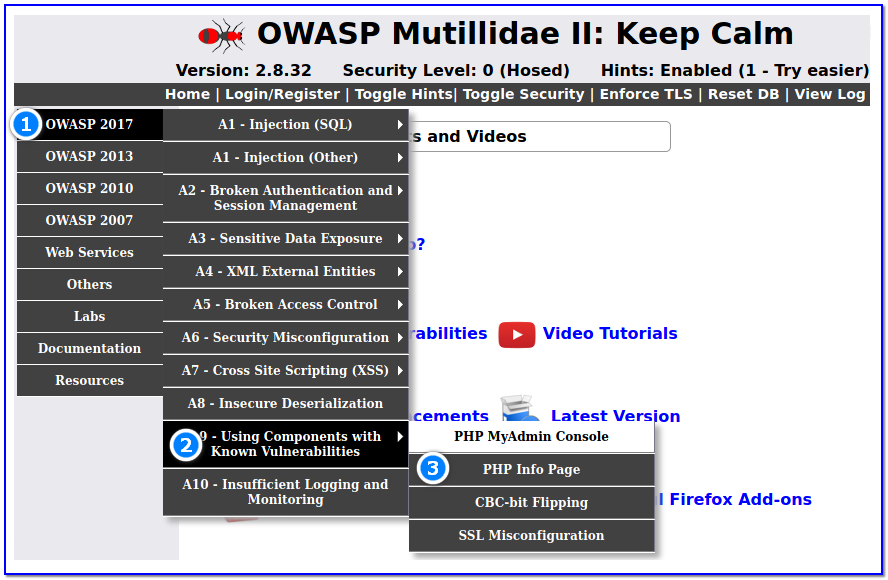
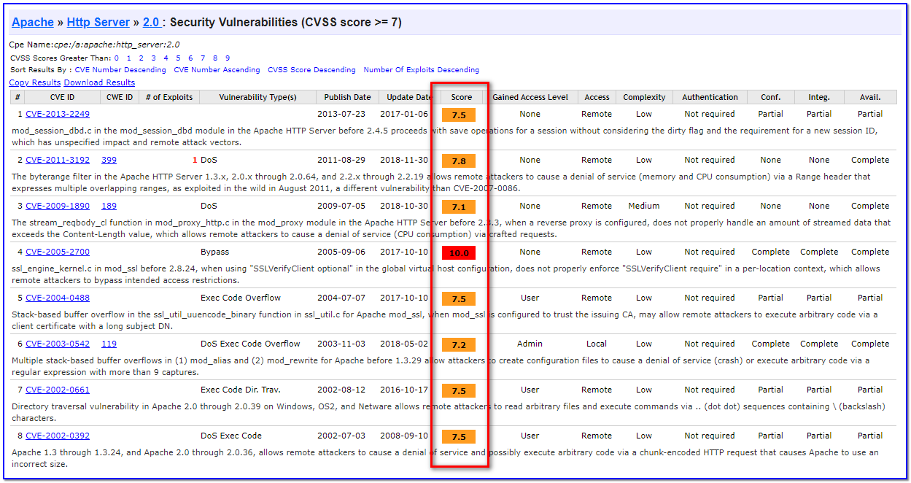

- [ ] Pasitikrinti ar viskas veikia

**Lab Objective:**

Learn how to take advantage of integrated components in a web application with known vulnerabilities.

**Lab Purpose:**

Components—such as libraries, frameworks, and other software modules—run with the same privileges as the application. If a vulnerable component is exploited, such an attack can facilitate serious data loss or server takeover. Applications and APIs using components with known vulnerabilities may undermine application defences and enable various attacks and impacts.

**Lab Tool:**

Kali Linux.

**Lab Topology:**

You can use Kali Linux in a VM for this lab.

**Lab Walkthrough:**

### Task 1:

In this lab, we will be using Mutillidae 2 to demonstrate how to take advantage of a web application using components with known vulnerabilities. How to install this environment in Kali VM is explained in detail in lab 87.

This is a very simple lab. In this lab, we will learn how to uncover whether an application has integrated components with known vulnerabilities.

Navigate to the “Secret PHP Server Configuration Page” which can be found at the following location in the Mutillidae 2 menu:

Once here, you will find that this page contains all the information about the different versions of software and components used withing the configuration of the Mutillidae 2 site. From here, we are able to hone in on specific versions of software, for example the Apache version or PHP version that the site is using, and search exploit databases for any known vulnerabilities.

For example, we can see that the site is using PHP version 7.4. If we run a quick google search for “PHP 7.4 vulnerabilities” we can see the first two links contain the information we are looking for. The link to the tenable site describes some known vulnerabilities for PHP versions under 7.4.11, which include the Mutillidae 2 site as it is using PHP 7.4. An attacker would conduct research such as this to discover any known vulnerabilities and then either search for a working exploit or develop their own.

We can do the same for the Apache version. We can see from this webpage that the server is running Apache 2.0. A quick Google search of “Apache 2.0 vulnerabilities” will lead us to the following site detailing some of the vulnerabilities:

[https://www.cvedetails.com/vulnerability-list/vendor_id-45/product_id-66/version_id-6333/Apache-Http-Server-2.0.html](https://www.cvedetails.com/vulnerability-list/vendor_id-45/product_id-66/version_id-6333/Apache-Http-Server-2.0.html)

As you can see, there are numerous vulnerabilities with varying degrees of severity for the service Apache 2.0. We can use this information to exploit this vulnerable service.

In reality, there will rarely be a web page with all of this information; an attacker will have to manually gather this information by interacting with the server itself and reading its headers as well as the different responses it sends to determine which components are integrated and what their version is.