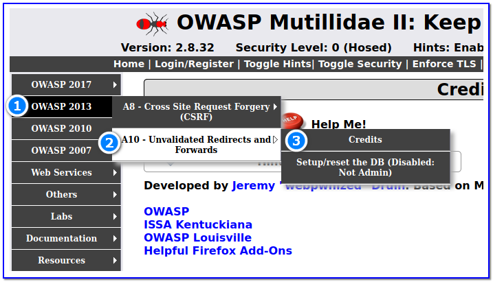
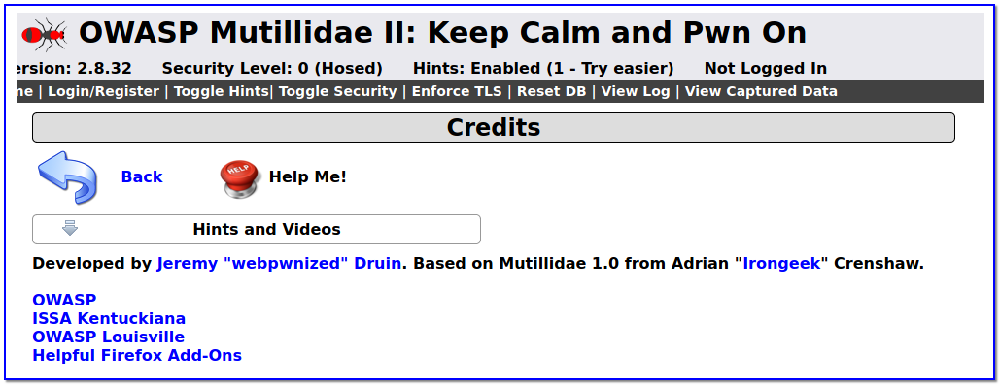
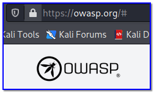

- [ ] Pasitikrinti ar viskas veikia

**Lab Objective:**

Learn how to take advantage of unvalidated redirects and forwards vulnerability.

**Lab Purpose:**

Unvalidated redirects and forwards are possible when a web application accepts untrusted input that could cause the web application to redirect the request to a URL contained within untrusted input. By modifying untrusted URL input to a malicious site, an attacker may successfully launch a phishing scam and steal user credentials.

Unvalidated redirect and forward attacks can also be used to maliciously craft a URL that would pass the application’s access control check and then forward the attacker to privileged functions that they would normally not be able to access.

**Lab Tool:**

Kali Linux.

**Lab Topology:**

You can use Kali Linux in a VM for this lab.

**Lab Walkthrough:**

### Task 1:

In this lab, I will be using Mutillidae 2 to demonstrate how to take advantage of an unvalidated redirects and forwards vulnerability. How to install this environment in Kali VM is explained in detail in lab 87.

To begin, navigate to the Credits page, which can be found at the following location in the Mutillidae 2 menu:

Once here, you will find a very simple page which gives credit to the creators of Mutillidae 2. This page, however, is vulnerable to unvalidated redirects and forwards. It is normal for web application to frequently redirect and forward users to other websites and pages while using untrusted data to determine the destination pages. If, however, this is done without proper validation, attackers are able to redirect users to malware or phishing sites, or use forwards to access unauthorized pages.

### Task 2:

To take advantage of this vulnerability, copy and paste following URL to address bar:

http://localhost/mutillidae/index.php?page=redirectandlog.php&forwardurl=http://www.owasp.org

This URL will send the user to the OWASP web page instead of the Mutillidae 2 site. In this URL, the forwardurl parameter specifies the redirection URL and the attacker can point the user to a malicious webpage.

Unvalidated redirects are often used to increase the success rate of phishing attacks and campaigns. This is due to the fact that the first part of the link looks legitimate as it will include a link to a legitimate site.

Take the URL we just entered for example. Looking at the first half of the link, it looks like the link is taking us to the Mutillidae 2 site, which is where we want to go. Often, users will only check the first half of the link to see if it is leading to a legitimate site. It is the second half of the link which turns out to be malicious as it redirects us to the OWASP site.

If this was a phishing campaign, an attacker could take advantage of the PayPal site for example (if it was vulnerable to unvalidated redirects) and send users a link. Users would think that the link was legitimate as it is coming from PayPal.com, but in reality, the attacker can redirect them to any site they like.

This lab concludes our look at the OWASP Top 10.