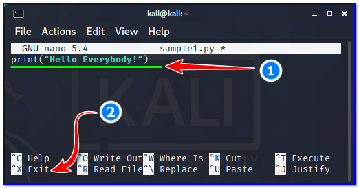
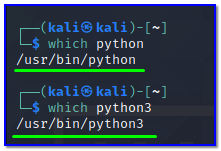
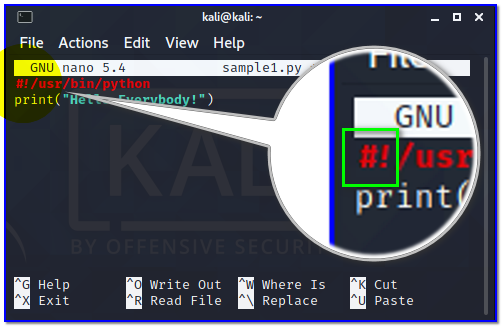
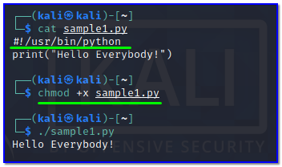
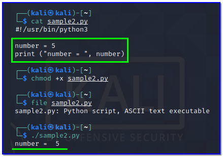
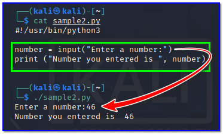
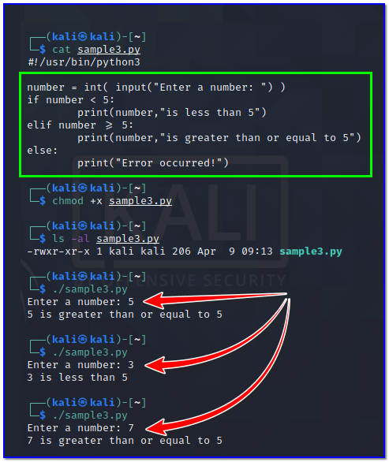

- [ ] Pasitikrinti ar viskas veikia

**Lab Objective:**

Learn some fundamental concepts surrounding the Python language.

**Lab Purpose:**

Python is an interpreted, object-oriented, high-level programming language with dynamic semantics. Its high-level built-in data structures, combined with dynamic typing and dynamic binding, making it incredibly attractive for Rapid Application Development, as well as for use as a scripting or glue language to connect existing components together.

**Lab Tool:**

Kali Linux.

**Lab Topology:**

You can use Kali Linux in a VM for this lab.

**Lab Walkthrough:**

### Task 1:

In this lab, we will be looking at some fundamental concepts around scripting with Python. Python is a good coding language to learn as its syntax is quite simple and straightforward. Python is also very versatile and can import massive amounts of code from libraries, shortening the workload on developers.

To begin, we will make a very simple first script. Open a terminal in Kali and create a new document with nano. Type the following:

nano sample1.py  
print(“Hello Everybody!”)

Save this file and exit.

Finally, execute this script by typing:

python3 sample1.py

If we want to run the script on its own, it is necessary to write the full path of the interpreter with “#!” suffix on the first line of each code and then make the script executable. If you do not know the full path of python interpreter in Kali, type this on the command line:

which python

Copy the path of binary, then open the same script with an editor and add the following to the very first line;

#!/usr/bin/python

Then, make this file executable by typing the following:

chmod +x sample1.py

./sample1.py

This first line we have added has no effect on the actual code, and tells the shell that this script will be run by python.

### Task 2:

Ok, so we are now familiar with how to create and run python scripts. For the rest of the tasks, we can create scripts with different names each time.

We will now look at mathematical operators. These allow us to add, subtract, etc., in our scripts. Here is a list of the different operators available in Python and their syntax:

- Addition
    - +
- Subtraction
    - –
- Multiplication
    - *
- Division
    - /
- Modulus
    - %
- Exponent
    - **
- Floor Division
    - //

So, if we wanted to perform simple multiplication, we could type 5 * 5 and this would multiply 5 by 5 and give us the result of 25.

There are also comparison operators available to us, as in any coding language. These are the following:

- Greater than
    - >
- Less than
    - <
- Equal to
    - ==
- Not Equal to
    - !=
- Greater than or equal to
    - >=
- Less than or equal
    - <=

### Task 3:

Now, we will look at variables. Variables are how Python stores information. There are a number of different variables in Python. They are listed here:

- String – Used to define text
- Integer – Whole numbers e.g 12
- Float – Decimal numbers e.g 3.2
- Boolean – Used to define true or false, it can only be one or the other
- List – Used to store a series of data types in a collection

Variables are created in a very simple way in Python. We can create a variable and print its contents very simply in Python. Create a new script and add Python3 interpreter path on the first line as usual. Then, type the following:

|   |
|---|
|#!/usr/bin/python3  number = 5   print (“number = “, number)|

Make executable this new script then run:

chmod +x sample2.py

./sample2.py

We will see the “number = 5” returned in the console. To receive input from the user when executing a script, we use the following:

input

So, if we want to ask a user to enter a number, compare the number to another number, and then print the answer to the screen. Change the same script to be like this:

Save script and execute it. Enter a number when asked and you will see that it is printed back to you in the console.

### Task 4:

Now that we have some of the basic concepts established, we will look at if statements. This is one of the most useful tools when it comes to Python scripting. An if statement looks like the following:

if x == y

Do this

else:

Do something else

If x is equal to y, the first “Do this” command will run. If it is not equal, the second “Do something else” will be run.

Let’s use this knowledge to create a more comprehensive script. Create a new script file and type the following:

|   |
|---|
|#!/usr/bin/python3  number = int( input(“Enter a number: “) )  if number < 5:  print(number,”is less than 5″)  elif number >= 5:  print(number,”is greater than or equal to 5”)  else:  print(“Error occurred!”)|

Save your new script, make executable, then execute. Notice the different responses printed to the console depending on the number you enter.

