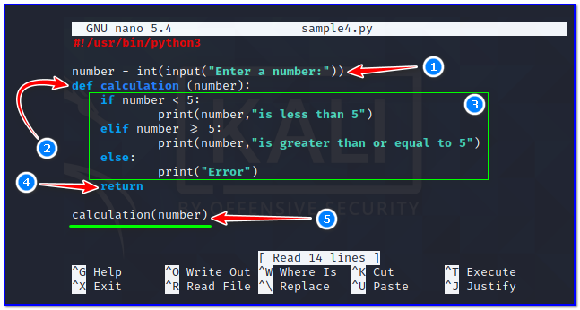
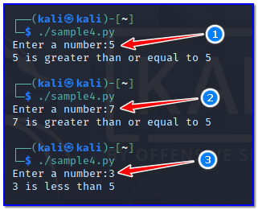
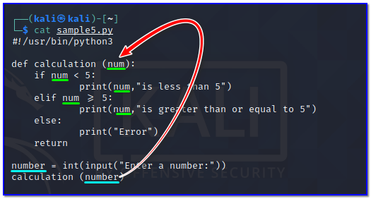
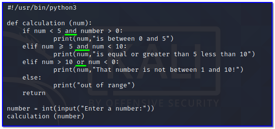
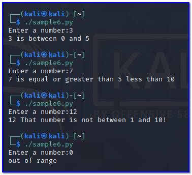

- [ ] Pasitikrinti ar viskas veikia

**Lab Objective:**

Learn some more concepts surrounding the Python language.

**Lab Purpose:**

Python is an interpreted, object-oriented, high-level programming language with dynamic semantics. Its high-level built-in data structures, combined with dynamic typing and dynamic binding, make it very attractive for Rapid Application Development, as well as for use as a scripting or glue language to connect existing components together.

**Lab Tool:**

Kali Linux.

**Lab Topology:**

You can use Kali Linux in a VM for this lab.

**Lab Walkthrough:**

### Task 1:

In this lab, we will be looking at some more concepts around scripting with Python. Python is a good coding language to learn as its syntax is very simple and straightforward. Python is also very versatile and can import massive amounts of code from libraries, shortening the workload on developers.

We will begin by talking about functions. Functions are like blocks of code which are executed together. Functions make it easier to use the output of the function in another statement instead of having to write all of the lines of code again. For example, say we have a complex formula to calculate a sum. If we want to include the output of this complex formula in another sum, we can simply call the function instead of re-writing all of the lines of code again.

In the Python language, functions are known as definitions. Let’s create one now. Create a new script and edit its contents so that the script looks like the following:

|   |
|---|
|!/usr/bin/python3  number = int(input(“Enter a number:”))  def calculation (number):  if number < 5:  print(number,”is less than 5″)  elif number >= 5:  print(number,”is greater than or equal to 5″)  else:  print(“Error”)  return  calculation(number)|

Let’s break down what this script is doing.

- 1) The first line is creating a variable which will store an integer when the user enters one after they are prompted.
- 2) This is our definition (or function) and is using the number variable throughout the definition.
- 3) This section contains simple calculations.
- 4) This line is returning the result of the calculations back to the definition in section 3 and is updating the number variable inside the definition.
- 5) This is printing the “number” variable after the definition has performed some function on it.

Save this script and execute it in the usual fashion. Enter some random numbers when prompted, and note the different responses you receive.

### Task 2:

We will now touch on parameters. Notice how we passed the value of the number variable to the definition calculation? This number variable is called a parameter. Since we passed the parameter to the definition function when we created it, it will be expecting this value when it is called. Note that the number parameter is merely there for accessing the data within the function, and that parameters and variable names don’t have to match.

Have a look at the screenshot below:

In the above screenshot, we are passing number to the definition calculation even though the parameter is named integer. The parameter name is merely there for accessing the data within the definition.

|   |
|---|
|#!/usr/bin/python3  def calculation (num):  if num < 5:  print(num,”is less than 5″)  elif num >= 5:  print(num,”is greater than or equal to 5″)  else:  print(“Error”)  return  number = int(input(“Enter a number:”))  calculation (number)|

Create your script so that it looks like the above, save it, make it executable, then run.

### Task 3:

Let’s look at introducing some of the logic operators we learned about in the previous lab. These are very useful to include in if statements as they can provide much more functionality to the statement. Typical login statements include and, or, not. These can be used in conjunction with if statements to provide the statement with an extra condition which needs to be met in order for the statement to be true. For example, create another script so that it looks like the following:

Each if statement here has now got an added logic statement. When the AND logic operator is used, both statements must be true for the statement to run. If the statement is not true, the code will move on to the next if statement (or elif statement or else statement).

For the second elif statement, the OR logic operator is used. This means that either statement in this line must be true for the code to execute. If neither are true, the code wil move onto the next if statement or else statement.

|   |
|---|
|#!/usr/bin/python3  def calculation (num):  if num < 5 and number > 0:  print(num,”is between 0 and 5″)  elif num >= 5 and num < 10:  print(num,”is equal or greater than 5 less than 10″)  elif num > 10 or num < 0:  print(num,”That number is not between 1 and 10!”)  else:  print(“out of range”)  return  number = int(input(“Enter a number:”))  calculation (number)|

Save this as a new script and execute it. Experiment with entering different numbers when prompted and note the differences.