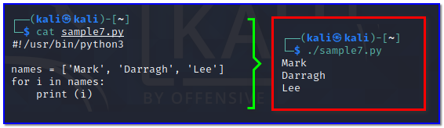
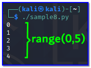
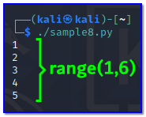
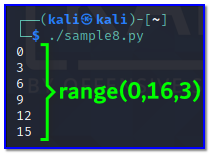
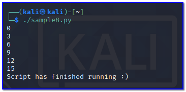
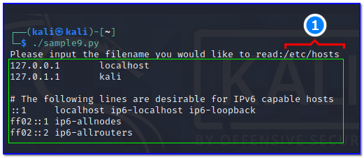
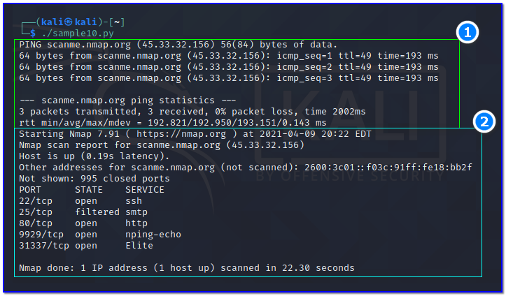

- [ ] Pasitikrinti ar viskas veikia

**Lab Objective:**

Learn some more advanced concepts surrounding the Python language.

**Lab Purpose:**

Python is an interpreted, object-oriented, high-level programming language with dynamic semantics. Its high-level built-in data structures, combined with dynamic typing and dynamic binding, make it attractive for Rapid Application Development, as well as for use as a scripting or glue language to connect existing components together.

**Lab Tool:**

Kali Linux.

**Lab Topology:**

You can use Kali Linux in a VM for this lab.

**Lab Walkthrough:**

### Task 1:

In this lab, we will be looking at some more advanced concepts around scripting with Python. Python is a good coding language to learn as its syntax is quite simple and straightforward. Python is also very versatile and can import massive amounts of code from libraries, shortening the workload on developers.

We will begin by looking at loops. Loops are incredibly useful in scripting languages. There are two types of loops in Python: for loops and while loops.

For loops look like the following:

|   |
|---|
|names = [‘Mark’, ‘Darragh’, ‘Lee’]  for i in names:   print (i)|

This is a very basic for loop. This loop uses the contents of the names array in the loop. The for loop itself will iterate for every entry within the array and print the result. So, in our console, we should be returned with the three names in the array above.

Copy this code and paste it into your script. Save the script, execute it, and note the output.

This script will execute until every name in the array is output to the console and will end when there are no names left. This is how a for loop works.

We can add some more code to this script to make the for look more comprehensive. For loops provide us with the functionality to iterate with datasets. This can be done with the following piece of code:

|   |
|---|
|for i in range(0,10):  print(i)|

This code will iterate through the array, printing the first 10 items to the console. let’s use this in our script so that we can get a better understanding of how it works. Copy and paste this next snippet of code into our script in Kali:

|   |
|---|
|#!/usr/bin/python3  randomNumbers = [1, 2, 3, 4, 5, 6, 7, 8, 9, 10, 11, 12, 13, 14, 15]  for i in range(0,5):  print(i)|

Save this script and execute it.

Notice we receive the output of 0, 1, 2, 3, 4 to the console. This is because of the way indexing works. We specified in the range(0,5) part above that we want to print the first 5 numbers from the array randomNumbers. The first 5 numbers are 0-4.

If we want to print numbers 1-5, we would have to specify range(1,6).

Note that the first parameter supplied to the range function is the start point of the for loop. The second function is the end point where the loop will finish.

We can also add a third parameter which will specify to the loop how much we want it to increment by. For example, if we type range(0, 15, 3) this will increment through our array by 3. Edit your script so it looks like the following:

|   |
|---|
|#!/usr/bin/python3  randomNumbers = [1, 2, 3, 4, 5, 6, 7, 8, 9, 10, 11, 12, 13, 14, 15]  for i in range(0,16,3):  print(i)|

Now, save it and execute. Note that we are incrementing through our dataset of numbers in increments of 3. The second parameter is 16 as we want to display the number at index 16, which is the number 15 (remember the first number in an array has always index 0).

Finally, we will look at adding an else statement to our for loop. This is very simple and is similar to how else statements are added to if statements. Edit your code so that it looks like the following:

|   |
|---|
|#!/usr/bin/python3  randomNumbers = [1, 2, 3, 4, 5, 6, 7, 8, 9, 10, 11, 12, 13, 14, 15]  for i in range(0,16,3):  print(i)  else:  print(“Script has finished running :)”)|

Then, save and execute it. Note how the else statement will execute when the script is finished running. This is a simple implementation of an else statement in a for loop.

### Task 2:

Now, we will briefly touch on how Python can be used to interact with files. Create a new script so that it looks like the following:

|   |
|---|
|#!/usr/bin/python3  fileInput = input (‘Please input the filename you would like to read:’)  file = open(fileInput, ‘r’)  print( file.read() )|

Let’s break down what this script is doing:

- The first line after the “#!” is asking the user to input the name of the file they would like to read and is assigning the value of the users input to the variable fileInput.
- The next line is opening the file specified and reads all of its contents. It stored the contents of the specified file to the variable file.

The final line prints the contents stored in the variable file to the console.

Save this script and execute it. When asked, input the name of the file you would like to read and notice how its contents are printed to the console. This is a brief example of how Python can be used to interact with files.

### Task 3:

In this lab, we will see how we can run system commands from within the python script. In Python, we use the “import” keyword to make the code in one module available in another. Create a new script so that it looks like the following;

|   |
|---|
|#!/usr/bin/python3  import subprocess  subprocess.run([“ping”, “-c 3”, “scanme.nmap.org”])  subprocess.run([“nmap”, “scanme.nmap.org”, “-sT”])|

Let’s break down what this script is doing:

- The first line after the “#!” is declares which module we need to import python runtime environment.
- The next line runs ping command with a “-c 3” parameter against a host.
- The final line starts a nmap scan to same host above. Also we are using another parameter which nmap needs.

Save this script and execute it. As you can see, our python script first executes a 3-count ping command to scanme.nmap.org (1). When first command finishes, it starts a portscan to the same target (2).

Using system commands in Python allows us to perform a smarter security scan within a certain logic pattern, taking into account the results of previous command outputs.